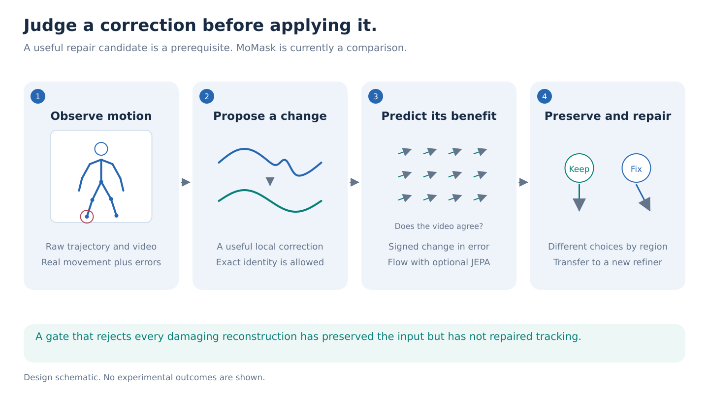
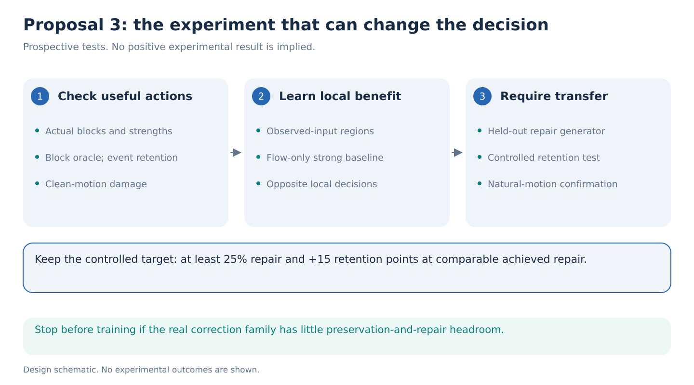

# 03. Learn when a proposed motion correction helps

> **Decision stage: September 14 seven-proposal comparison.** Priority statements describe [that comparison](../proposal-comparison.md). See the [research agenda](../README.md) for the latest recommendation.

**Decision: conditional continuation.** Proceed only after practical repair candidates show enough headroom. MoMask is a documented reconstruction baseline, not a required component.

**One-week question.** Can a small verifier using frozen JEPA features and optical flow preserve at least 15 percentage points more genuine movement while removing at least 25% of tracking error, then transfer to a repair method excluded from verifier training?

Read the [evidence](../references/portfolio-evidence.md) and [reference ledger](../references/portfolio-literature.md) alongside this proposal. These are proposed experiments, not positive findings.

## Step 1: Separate proposing a change from judging it

A tracking system reports a sudden ankle movement. A repair method suggests making it smaller. That suggestion could remove a tracking jump, or erase something the person actually did.

The repair method proposes a trajectory. The verifier answers a different question: **would this particular change improve the measurement?** Its output controls how much of that change is applied to a short body-region interval. Zero means retain the existing input exactly.

This separation could make the verifier reusable across repair methods. That transfer, with useful repair and preservation, is the intended contribution. Rejecting every suggestion is insufficient.

## Step 2: Require useful candidates before training

Notebook 06 found that unprojected MoMask reconstruction raises development event-plus-noise MSE from approximately 0.27 to 20.94 cm². Its truth-informed pointwise mixture removes only 30.0% of error, or 27.4% on calibration. The eight people per role provide limited evidence, and that oracle has more freedom than a practical blockwise verifier. Removing projection alone does not solve this candidate problem. See the [diagnostic report](../../../docs/studies/motion-preservation/results/pilot-01-diagnostics.md).

First compare partial-strength temporal filters and a dedicated refiner. [SmoothNet](https://arxiv.org/abs/2112.13715) was designed for pose refinement, and its [official implementation](https://github.com/cure-lab/SmoothNet) provides checkpoint links and cross-estimator evaluation. Its weights were not loaded for this proposal; usefulness on our data remains unverified. Full-strength Gaussian and median filtering already fail in the pilot.

Use a true identity endpoint, remove the damaging additional projection from the primary repair rule, and evaluate missing-position completion separately. Give MoMask at most half a day of reconstruction diagnosis. A specific correction may reinstate it, but faithful implementation alone does not establish denoising usefulness.

## Step 3: Teach signed repair benefit

Let `x` be the input, `q` a proposed correction, and `y` the independent AMASS reference. For a fixed body/time block and strength `a`, between zero and one, return:

`repaired = x + a(q − x)`.

The training label is the **signed gain**: observed-joint squared error before correction minus error afterward. Positive means improvement; negative means damage. Average over the same fixed observed positions for every strength. This label measures actual utility rather than whether a clip looks unusual.

Start with a small head predicting gain for a short strength grid. Inputs are the raw trajectory, proposed displacement, tracking quality, and local flow support. Add frozen V-JEPA tokens as a matched-capacity comparison. Use the user's available checkpoint with its native encoder interface; [public V-JEPA releases](https://github.com/facebookresearch/vjepa2) supply alternatives. No predictor-to-encoder subtraction or new pretrained skeleton checkpoint is assumed.

Determine regions from fixed anatomical blocks or observable candidate disagreement, never the hidden event mask. Use nonoverlapping blocks initially. The oracle must select from exactly these blocks, candidates, and strengths, with the same final output rule. Measure event retention alongside its minimum MSE and identify permitted settings that achieve both objectives. An error-optimal oracle need not maximize retention; a sampled set of tradeoffs is not a certified Pareto frontier. This prevents a flexible pointwise oracle from overstating learnable headroom. Predicted gain is not a guarantee of safety.

## Step 4: Make the distinction impossible to solve from skeletons alone

Use whole-body AMASS, including arms and trunk. Preserve the existing controlled event-plus-noise comparison for the declared 25% repair and 15-point retention targets. Its bounded motion edits are mechanism tests, not simulated disease. Independently require confirmation on untouched captured motion with added observation errors, measuring observed-joint MSE and reference descriptor error. Natural clips have no known unedited counterfactual for a genuine event, so do not silently reuse the edit-based retention denominator there. The final claim needs both the controlled tradeoff and useful repair on natural motion.

Construct matched videos with identical reported skeletons. One contains genuine movement in region A and tracking error in region B; the other exchanges those roles. The verifier must make opposite local corrections. Match duration, amplitude, support, confidence, camera, and motion-energy summaries so that a trivial signal cannot answer the question.

Split people and original motions before deriving variants. Keep reserved final people and event families untouched. GAVD tests visible image-space behavior where independent annotations exist; its labels do not establish hidden 3D accuracy. Pretraining overlap and adaptation holdout are separate claims.

## Step 5: Test the contribution against its strongest alternatives

Compare raw input, candidate-specific calibration, confidence-weighted filtering, flow propagation, a flow-only verifier, and an equal-capacity coordinate head. [MFTIQ](https://arxiv.org/abs/2411.09551) already separates matching quality from the tracker. [HTD-Refine](https://arxiv.org/abs/2605.26879) already uses video dynamics for motion refinement. [WMReward](https://arxiv.org/abs/2601.10553) already scores candidates with a latent world model. A new gate or JEPA scorer alone is not novel.

The primary result must retain the declared 25% repair requirement and improve retention by 15 percentage points over an **eligible baseline at comparable repair**, selected on calibration. An infeasible baseline or raw identity cannot supply that comparison. Report damage to initially accurate joints and person-level uncertainty. Freeze verifier and calibration before testing a held-out repair family. JEPA earns its role only beyond the flow-only comparison.

## Step 6: Make the decision within 48 hours

By hour 24, calculate the realistic block oracle and practical calibration curves. Stop if useful candidates or substantial oracle margin are absent. By hour 48, require a small practical verifier to improve the preservation-versus-repair tradeoff beyond the strongest simple rule. Otherwise stop adaptation rather than scale it.

If it passes, use days three to five for fixed comparisons, then days six and seven for held families, three paired training seeds, and failure analysis. Cap the selected study at **240 H100-hours**: 50 for pilots/extraction, 90 for heads and comparisons, 70 for held conditions, and 30 contingency. Measure throughput first. Significant cross-method transfer would justify further paper development; current evidence does not promise it.
