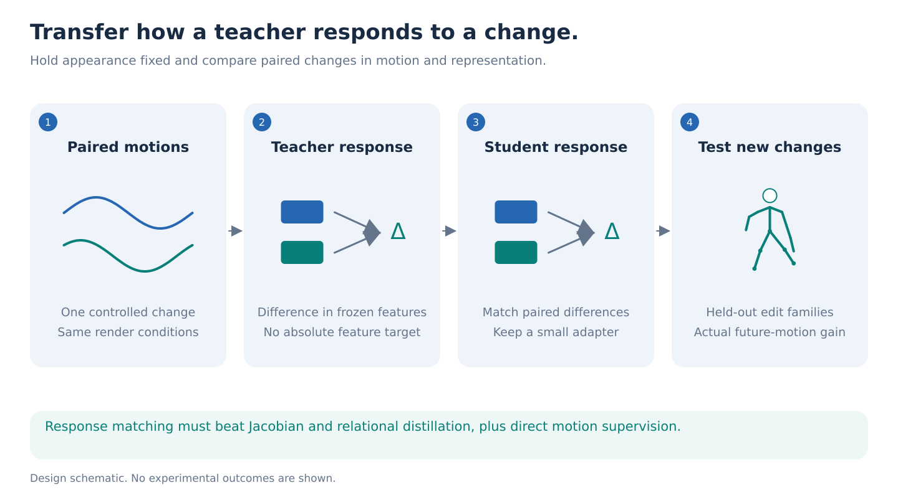
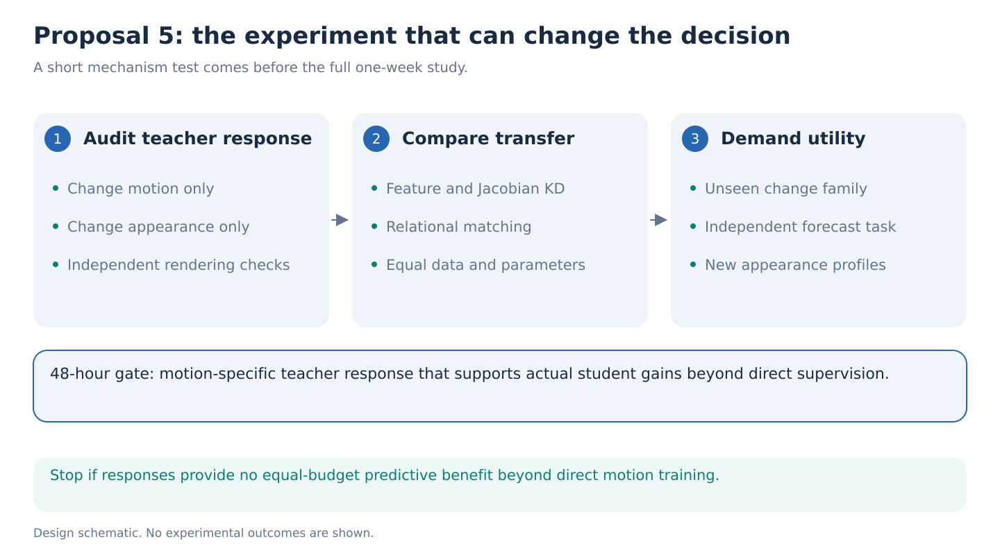

# 05. Transfer a teacher's response to movement

**Decision: conditional methodological reserve.** The question is useful and the experiment is affordable, but derivative and relational distillation are established. This becomes a strong paper only if a response that survives appearance changes predicts real student improvement better than existing distillation methods.

**The one-week question.** Can a small S-JEPA student improve prediction of unseen whole-body motion by learning how a frozen video teacher changes its answer when movement changes? Require an initial answer within 48 hours and a replicated forecasting result by day seven.

## The idea in plain language

A video encoder converts a clip into a list of numbers. Those numbers may describe the room, clothing, camera and movement together. Asking a skeleton model to copy the entire list may waste its limited capacity on information absent from its input.

Instead, show the teacher two movements using the same body, clothes, camera and background. Subtract its answers. Repeat with a different appearance. A useful movement response should remain similar even when the surroundings change. The student learns this response rather than everything the teacher knows about each video.

This is a hypothesis about **what knowledge transfers**, not a claim that subtraction automatically removes appearance. A nonlinear teacher can mix movement and appearance. The first experiment measures that failure directly.

## Why this follows from the latest evidence

The latest retained scaling run reached RGB-only target R² of about 0.663, while adding real skeleton history improved it by only about 0.000357. A mismatched skeleton condition produced a larger mean gain. The predefined development gate stopped. These observations weaken the case for simply increasing regression scale against the same global video target; they do not show that every video feature lacks useful motion information. [Retained analysis](../../../notebook_runs/haic-run-02/ANALYSIS.md), [research strategy](../../../docs/studies/future-feature-prediction/scaling/research-strategy.md).

This proposal changes the transfer object. Earlier future-innovation work subtracts what a conditioning model predicts about one target. Here, controlled pairs ask which teacher responses remain stable under changes to rendering. It is a related extension, not an entirely unrelated invention.

## Data and method

Use AMASS whole-body motion, with a common 22-joint body representation plus explicit foot landmarks where available. Keep shoulders, arms, trunk and pelvis so the experiment can test coordination beyond Core11. Split people and original recordings before producing any views, paired clips or corruptions. AMASS supplies measured motion; it does not supply ready-made paired RGB, so render time belongs in the budget. [AMASS](https://amass.is.tue.mpg.de/).

Use recorded motion pairs with similar current pose but different histories and later movement. Add bounded, continuous kinematic edits only as an interface diagnostic. Such edits are not evidence of how a person's body would respond to an intervention. Every example specifies one second of observed history and futures at 0.2, 0.5 and 1.0 seconds. Pair selection and matching use training data only.

Let `R(q, a)` render motion `q` with appearance `a`, and let `T` be the frozen video encoder. A finite response is:

`response(q0, q1, a) = T(R(q1, a)) - T(R(q0, a))`.

Fit response whitening on training data with shrinkage and a fixed variance floor, then use a fixed-rank, unit-scale projection. Freeze that projection before fitting the student adapter. Require nonzero held-out response variance and prediction of independent future differences; a stable zero vector fails the mechanism. The difference between two student history representations predicts the projected response. Teacher targets may observe later training blocks as privileged supervision, but the deployed student receives only history. Document every contextual frame.

Start with public V-JEPA 2.1 ViT-B, then repeat the surviving result with ViT-L. The official repository lists downloadable 80M and 300M checkpoints and loaders. Freeze both teachers. Use the repo's small S-JEPA implementation with matched initialization across methods; any existing HAIC student checkpoint must be recorded, and a common randomly initialized student is a valid control. No official skeletal S-JEPA checkpoint is assumed. [V-JEPA code and checkpoints](https://github.com/facebookresearch/vjepa2), [skeletal S-JEPA](https://sjepa.github.io/).

GAVD provides the real-video stress test: assess response stability under mild appearance changes and forecasting of later visible joint tracks. Its poses are noisy measurements, so this cannot replace AMASS ground truth. GAVD classification is not an endpoint.

## The experiments that decide the claim

First, measure the same motion-pair response under unseen cameras, body appearances and lighting. Compare within-pair agreement against nuisance-only differences at matched response magnitude. Include optical flow, joint angles and velocities. Equalize clip duration and render extent; keep cameras fixed within each pair. Static-image and single-frame teacher controls test whether posture alone explains the response.

Second, fit equal-size students on the same examples. Compare ordinary feature KD, whitened feature KD, the previous residual-target KD, random target directions, Jacobian KD or its noisy-input version, relational KD, and a CAER-style action-effect weighting adaptation. Include direct ground-truth forecasting without a teacher and direct forecasting plus each transfer loss. Hold total examples, optimization steps and label access fixed. The CAER adaptation must be named as an adaptation because its original formulation uses an action-conditioned world model.

The primary endpoint is **future 3D joint error and relative joint-rotation error on all eligible untouched test motions**, with person-grouped uncertainty where identities are known and three optimization seeds. A secondary test predicts future differences of pairs matched using prefix information only. Any diagnostic enriched by selecting different futures is reported separately, with identical pairs for all methods. Synthetic edit recovery is secondary. Report each horizon and the fixed-horizon average.

The proposed practical threshold is at least a 5% reduction in the primary forecast error against the strongest equal-budget baseline, with a source-bootstrap interval excluding zero and replication on a held-out AMASS collection. This is a decision threshold, not a predicted result. A gain restricted to rendered edit classification does not qualify.

## Closest work and the novelty boundary

Jacobian matching already transfers derivatives, and relational KD already transfers relationships between examples. CAER already contrasts action-conditioned and unconditioned predictions to concentrate learning on action-sensitive regions. None makes ordinary response matching novel. The possible contribution is a **measurable criterion for which cross-modal responses transfer across appearance**, supported by a student intervention and held-out forecasting gains. [Jacobian KD](https://proceedings.mlr.press/v80/srinivas18a.html), [relational KD](https://openaccess.thecvf.com/content_CVPR_2019/html/Park_Relational_Knowledge_Distillation_CVPR_2019_paper.html), [CAER](https://arxiv.org/abs/2608.30897).

## Time, compute and stopping rule

Reserve at most **320 H100-hours**, including 56 for render and teacher-feature pilots, 144 for matched student comparisons, 48 for the second teacher, and 72 for replication and contingency. These are planning caps, not measured runtimes. Benchmark 100 clips and one student epoch before expanding. Parallelize independent students across the eight GPUs; never start eight large teacher trainings.

By hour 48, require motion responses to survive held-out appearances and beat the static, flow and coordinate controls on predicting actual future differences. If they fail, stop before the full student matrix. By day four, stop if response transfer cannot improve a direct-motion baseline. Days five to seven are for independent seeds, a held-out motion collection and the bounded GAVD stress test. This proposal is less likely to produce a novel paper than the portfolio's leading evidence-preservation direction because its closest methodological neighbors are strong.
