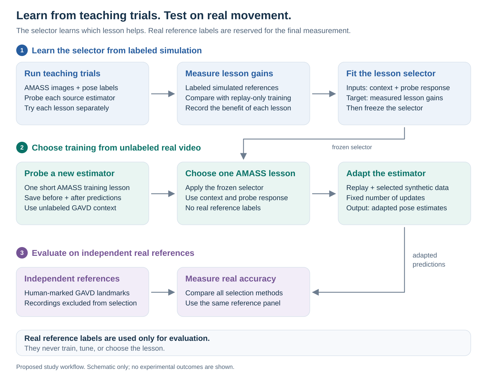
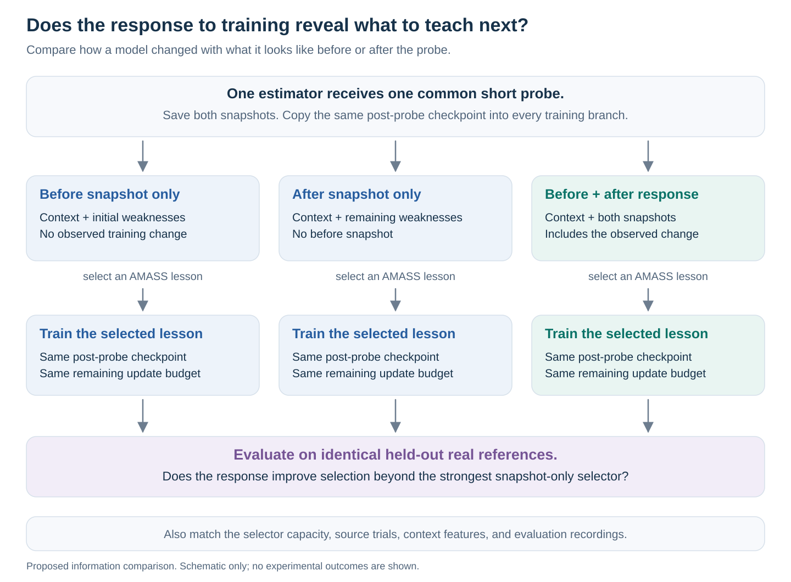

# Teach the estimator from unlabeled video

**Research question:** does a short practice lesson reveal which training examples will help an unfamiliar pose estimator, beyond what its current mistakes and deployment videos already tell us?

The proposed system observes how a pretrained model responds to a small training update. It uses that response to choose the next labeled AMASS lesson for the model. The intended finding is that **prediction changes on unlabeled deployment videos reveal useful information about what to teach**, beyond current errors and ordinary training progress, and that this information transfers to a new model architecture and real GAVD videos.

**Status, 14 September 2026:** this is a proposed experiment, not an established capability. The latest mechanism review weakly favors this idea for a distinctive scientific finding, but its practical dependencies and untested transfer assumptions make it a risky one-week commitment. Begin with the bounded feasibility test in section 8. The full judgment is in [section 9](#9-final-research-judgment).

This tutorial follows the experiment from a concrete example through data preparation, teacher training, real-video evaluation, and interpretation. All example outcomes below are explicitly illustrative.

## 1. Understand the idea with two estimators

A **pose estimator** places body landmarks, such as knees and ankles, in an image. We call it the **student** because we will give it additional supervised training. A **lesson** is a small collection of rendered images with known landmark coordinates. A **teacher**, or selector, chooses a lesson from a fixed library.

Rendered images are pictures generated from recorded 3D body motion. **Source data** means the data used to develop the teacher. **Target data** means the new real videos where it will be used. Here, AMASS supplies the body motion for rendering, and GAVD supplies the real walking videos.

Imagine two competent students looking at the same walking videos. One may benefit most from training on overlapping legs. The other may benefit most from low-resolution people. Their current accuracy alone may not explain the difference: models with similar errors can have different features and respond differently to training.

We first give both students the same short **probe lesson**. We observe how their predictions change on videos without reference labels, the independently established landmark coordinates needed to judge accuracy. We then use a teacher, learned from earlier training trials, to select their next lessons.

### A worked example of the result we want

The following numbers are **invented to explain the experiment**. Lower error is better. A checkpoint is a saved model. Every row starts from the same post-probe checkpoint for that student; the three further-training rows share the same remaining training budget. The first row is the starting reference, with no further updates.

| Training after the common probe | Student A error | Student B error |
| --- | ---: | ---: |
| No further training | 10.0 | 10.0 |
| Replay existing real training examples | 9.8 | 9.8 |
| Replay plus an overlapping-legs lesson | 8.5 | 9.4 |
| Replay plus a low-resolution lesson | 9.5 | 8.4 |

The overlapping-legs lesson adds $9.8 - 8.5 = 1.3$ error units of benefit for A, compared with replay alone. The low-resolution lesson adds only 0.3. For B, those benefits are 0.4 and 1.4, respectively. The best lesson changes between students.

A useful teacher would choose overlapping legs for A and low resolution for B **before seeing their real reference errors**. During deployment, it would run only the selected lesson, rather than trying every lesson and checking the answers.

This table illustrates an opportunity for selection. It does not show that a training probe can predict the right choices. That is the central hypothesis to test. Simply recognizing that one student changes more, or generally learns faster, would not explain these opposite lesson preferences.

### Three stages, with different uses of labels

*Figure 1. The proposed workflow. Reference labels supply training outcomes in simulation and accuracy measurements on real video. Real reference labels never choose the lesson or tune the teacher under the strict protocol. This is a method illustration, not an experimental result.*

| Stage | What happens | Where labels are used |
| --- | --- | --- |
| Learn the teacher | Try lessons on source students and learn which lessons help in different settings. | Rendered labels supervise student training and measure lesson benefit on separate simulated references. |
| Deploy the teacher | Observe a new student's probe response on unlabeled GAVD context; select one lesson and adapt the student. | Labeled synthetic lessons and ordinary real training-data replay are allowed. No GAVD reference coordinates are used. |
| Evaluate the result | Compare predictions on other GAVD recordings with independent human annotations. | Real landmark references measure accuracy. They are withheld from lesson selection. |

“Without target labels” refers to choosing and applying lessons for the new deployment setting. It does not mean the system learns without labels anywhere.

## 2. Explain what the probe can tell us

### Current weakness and ability to learn are different

A diagnostic image with known labels can reveal that a student's ankle estimates are inaccurate. It cannot, by itself, establish which additional images will correct those errors. The answer also depends on which parameters can change and how a training update affects the model's outputs.

The probe makes a small, controlled intervention. Let $M_0$ be the original student and $M_p$ the student after the common probe. On the same context clips $U$, measure

$$
r(U) = f_{M_p}(U) - f_{M_0}(U),
$$

where $f$ denotes predicted landmark coordinates. The response $r$ describes **how predictions changed**, not whether they improved. On real context clips, the correct coordinates are unknown.

For example, a probe might move one student's ankle predictions consistently while barely changing its shoulders. Another student's predictions might change diffusely across the body. The teacher can learn whether such patterns predict the relative usefulness of later lessons. These patterns are possible features, not observations already made here.

### Why this could work, and why it might fail

A small gradient-descent update gives the approximation

$$
\Delta f_U^{(k)} \approx -\eta J_U g_k.
$$

Here $g_k$ is the training-loss gradient, which points toward increasing loss; the minus sign makes the update move toward lower loss. The learning rate $\eta$ controls the step size, and $J_U$ maps small parameter changes to prediction changes on $U$. This is an explanation of the proposed mechanism, not a new theoretical result. Other optimizers change the update direction but preserve the basic reasoning.

The common probe observes the effect of **one** training direction. It may reveal learner behavior that a static prediction misses. It does not reveal every lesson's effect, nor whether a change points toward the unknown correct real prediction. Two students could respond identically to the probe and still benefit from different lessons.

The proposal therefore depends on a testable empirical regularity: across students and settings, some probe-response patterns must predict useful **lesson-ranking differences**. Predicting only the overall amount a model changes is insufficient.

### What existing evidence supports

PoseExaminer provides relevant evidence that synthetic training choices can affect real pose accuracy. Its Table 5 reports the following results for the PARE estimator. The metric is mean per-joint position error, a 3D distance in millimeters; lower is better.

| Training condition | Real 3DPW error | Real cAIST error |
| --- | ---: | ---: |
| Original estimator | 81.81 | 99.15 |
| Easy synthetic curriculum | 74.44 | 105.09 |
| Hard synthetic curriculum | 81.15 | 86.92 |

Easy examples help on one dataset while harming the other. This supports choosing training data for the deployment setting. It does not establish model-specific lesson rankings or a transferable teacher. The study used substantial real-data replay and a different, 3D training objective. [PoseExaminer, CVPR 2023, Table 5](https://arxiv.org/html/2303.07337v2).

Two transfers remain unproven here: rendered lessons must improve real GAVD estimation, and a teacher learned from simulated outcomes must choose useful lessons for real videos and unfamiliar students. Good pretrained video features do not guarantee either transfer.

The earlier [MoMask diagnostics](../../../docs/studies/motion-preservation/results/pilot-01-diagnostics.md) motivate measuring the actual effect of an intervention. They do not provide positive evidence for this teaching mechanism. In this proposal, success is lower reference error after training, not smoother motion, more confidence, or a smaller latent loss.

## 3. Prepare the students, lessons, and references

### Step 1: fix a narrow, measurable task

Start with visible **2D landmark estimation**: left and right shoulders, elbows, wrists, hips, knees, and ankles, for twelve landmarks in total. This supports a direct accuracy measurement on existing GAVD video. It does not establish 3D biomechanics, force estimation, disease recognition, or accurate tracking of hidden joints.

Use competent, pretrained visual estimators with public training code. Start with RTMPose and a COCO-trained HRNet as source families. Reserve ViTPose as the architecture the teacher has never encountered. Public configurations and checkpoints are documented in [MMPose](https://github.com/open-mmlab/mmpose), the [RTMPose project](https://github.com/open-mmlab/mmpose/tree/main/projects/rtmpose), and [ViTPose](https://github.com/ViTAE-Transformer/ViTPose). These are verified release paths, not models loaded during this proposal revision.

First update only the prediction head, the final layers that convert visual features into landmark estimates. Choose the trainable layers, learning rate, probe length, and later update budget using source synthetic development experiments. Different architectures, or model designs, may need different declared recipes, but every comparison for a given student must use the same recipe. For the held architecture, use a recipe fixed from source experiments or public defaults without tuning it against that architecture's lesson outcomes. Checking that its code runs is different from selecting a recipe using its performance.

Fix the detector, person crops, landmark convention, and conversion back to image coordinates across methods. Low-resolution conditions must remove source-image detail before crop resizing. Merely shrinking a perfect render and then resizing it back is not a realistic small-person test.

### Step 2: build eight labeled lessons

[AMASS](https://arxiv.org/abs/1904.03278) represents recorded motion with a common body model, allowing images and projected landmark labels to be generated together. Use natural full-body motions rather than limiting the rendered person to Core11.

Begin with eight equal-size lessons covering balanced combinations of view, source-person resolution, modest blur, partial occlusion, and pose coverage. Keep appearance variation comparable across lessons so an arbitrary background or texture does not identify the answer. Include a balanced curriculum as a baseline. Expand the library only after the initial choices prove useful.

Each lesson supplies images and camera-projected coordinates for ordinary supervised training. Keep a small amount of synthetic training mixed with a fixed subset of labeled real [COCO](https://cocodataset.org/) examples. This **replay** helps retain the estimator's existing task competence. A 90% replay, 10% synthetic mixture is a starting hypothesis, not a validated recipe for our 2D task.

Synthetic-lesson arms should share the same replay examples, replay exposure, batch size, and update count. Replay-only training fills the synthetic slots with additional real examples. It therefore receives more real examples at the same total training budget. Do not claim both identical real-data exposure and equal total updates between these two types of arm.

### Step 3: separate data by its scientific role

| Data partition | Purpose | What the selector can see |
| --- | --- | --- |
| Common AMASS probe and candidate lessons | Update the student. | Lesson identity and the resulting student response. |
| Separate labeled synthetic diagnostic bank | Measure known weaknesses in each lesson family. | Diagnostic error summaries, available at deployment too. |
| Synthetic context clips | Describe each simulated deployment setting. | Videos and student predictions; their reference coordinates are withheld as inputs. |
| Separate synthetic reference clips | Measure the benefit of each training branch. | Error supplies the teacher's training target, never an input for that episode. |
| COCO replay subset | Retain real-image pose competence during adaptation. | Ordinary supervised student training. |
| Unannotated GAVD context recordings | Select a lesson for a real deployment collection. | Videos, predictions, and probe response. |
| Independent GAVD reference recordings | Measure real accuracy after the decision. | No input to the teacher under the strict protocol. |

Use the AMASS subject registry and existing split assignments to keep validation contexts and references on people excluded from teacher-fitting contexts and references. Build the fixed probe, lesson library, and diagnostic bank from source-training data. Keep these clips separate from one another and from context and reference clips. The lesson library remains unchanged during validation and real deployment. Do not reuse the same motion as a reference merely by rendering it with a different background, or use validation references to create student adaptation histories.

The initial asset situation is:

| Asset | Available starting point | Work still required |
| --- | --- | --- |
| AMASS data accounting | [Eligible raw inventory](../../../manifests/amass/amass_raw_inventory_eligible.csv), [subject registry](../../../manifests/amass/amass_subject_registry.csv), and [subject splits](../../../manifests/amass/amass_subject_splits.csv). | Load permitted full-body data and create the lesson, diagnostic, and reference partitions. |
| Motion and rendering code | Existing [motion loading](../../../src/gavd6_sjepa/research_directions/motion_preservation/motion_data.py) and [mesh rendering](../../../src/gavd6_sjepa/research_directions/motion_preservation/rendering.py). | A useful textured RGB training pipeline. Small colored meshes are not established adaptation data. |
| GAVD data accounting | [Sequence manifest](../../../manifests/gavd/gavd_full_sequences.csv) and [video manifest](../../../manifests/gavd/gavd_full_videos.csv); videos are on HAIC. | Choose eligible recording groups and annotate independent visible landmarks. |
| Pretrained models and video features | Public student releases and the V-JEPA checkpoints already downloaded on HAIC. | Load trainable students, fix one encoder checkpoint, and measure actual throughput. |
| Real-data replay | Public COCO training images and annotations. | Confirm access and prepare a fixed subset; local readiness has not been established. |

The public [PoseExaminer renderer](https://github.com/qihao067/PoseExaminer) is a possible starting point, not a ready replacement for the current pipeline. The earlier asset audit found a limited public texture/background set and an unresolved default texture path. Verify a working asset configuration and body-model compatibility before allocating the full experiment budget. Retain the terms attached to body models and borrowed rendering assets.

Resolve the twelve-landmark convention before training. SMPL joint centers and COCO image landmarks need not identify precisely the same anatomical locations. Rendered labels are references for the rendered geometry, not clinical ground truth. An approximate mesh visibility mask is also not an independent real visibility annotation.

## 4. Learn the teacher from measured training outcomes

### Step 4: measure the common probe response

For each source student checkpoint, create the same short supervised probe using fixed source data. Denote its update budget by $P$. Record a **before snapshot** $S_{\mathrm{pre}}$, apply the probe, and record an **after snapshot** $S_{\mathrm{post}}$ on identical context and diagnostic inputs.

Each snapshot contains the student's predicted coordinates on context clips and its errors on the labeled synthetic diagnostic bank. Map predictions into a common coordinate system and normalize using fixed crop dimensions. Start with compact per-joint position and displacement summaries; retain which joints changed rather than only one global magnitude. Fit feature normalization on source training episodes only.

Raw confidence scales from different prediction heads are not directly comparable. Common coordinate summaries are the safer first implementation. Any confidence calibration must use source references, not GAVD outcomes.

The response representation combines the before snapshot with the observed change, $S_{\mathrm{post}} - S_{\mathrm{pre}}$. This contains the same information as both snapshots together. Separately record the scalar update magnitude so we can test whether detailed response patterns add more than “this student changes a lot.”

### Step 5: try each lesson from the same checkpoint

After the probe, every candidate starts from $M_p$. Fork a separate adaptation branch for each lesson and for replay alone:

$$
\begin{aligned}
M_0 &\xrightarrow{\text{common probe, budget }P} M_p, \\
M_p &\xrightarrow{\text{replay plus lesson }k,\;\text{budget }B} M_k.
\end{aligned}
$$

Use the same prescribed optimizer initialization and remaining update budget $B$ for all branches. Do not train lesson 2 on the result of lesson 1: that would measure lesson order and accumulated training rather than lesson choice.

Evaluate every branch on separate synthetic reference clips. Define

$$
\mathrm{gain}(k,B)
=
E_{\mathrm{ref}}\!\left(A_{0,B}(M_p)\right)
-
E_{\mathrm{ref}}\!\left(A_{k,B}(M_p)\right),
$$

where $A_0$ means replay-only adaptation, $A_k$ means replay plus lesson $k$, and $E_{\mathrm{ref}}$ is the reference landmark error. Positive gain means the lesson improves on replay. Negative gain means it is worse. This is the quantity calculated in the example in section 1.

One teacher-training example consists of the student's permitted diagnostic information, context features, update budget, and the measured gains for the available lessons. Include the budget as an input when collecting outcomes at multiple budgets.

**Train each branch once and evaluate it in many settings.** Since the probe and lessons are fixed independently of the deployment context, the adapted student can be reused across synthetic reference collections. This avoids multiplying training jobs by the number of settings.

### Step 6: start with a simple teacher

Use nearest-neighbor lookup first: find source cases with similar permitted features, average their measured lesson gains, and choose the highest-scoring lesson. Give replay alone a gain of zero so the teacher can decline synthetic training when none is predicted to help. Report how often that happens. Always selecting replay does not demonstrate useful synthetic teaching.

A small multilayer perceptron can also predict signed gains or lesson rankings from the same database. It is an optional implementation comparison. If nearest-neighbor lookup uses the response and beats equally informed snapshot-only selectors, it supports the mechanism even if a neural selector adds nothing.

Add context features from a frozen V-JEPA encoder. JEPA learns representations by predicting representations of missing observations; here those features summarize the videos the estimator will encounter. We are not asking its released predictor to simulate parameter updates or treating its latent residual as calibrated pose error. The relevant foundation is [V-JEPA 2](https://arxiv.org/abs/2506.09985); freeze the particular downloaded checkpoint and interface documented in the [local model-access notes](../references/portfolio-literature.md).

Validate lesson choices on excluded source checkpoints, people, and domain combinations. Randomly splitting rows of the outcome table would let almost identical training trials appear in both fitting and validation. The useful outcome is error after the selected lesson, not merely a low regression loss when predicting gains.

## 5. Isolate what the training response contributes

The main comparison asks whether observing change helps choose a lesson beyond knowing either the earlier state or the current state of the student.

*Figure 2. A fair information comparison. All selectors use the same context features, source outcome database, selector capacity, post-probe student, and remaining adaptation budget. Only access to the student's before/after information differs.*

### The three essential information conditions

| Selector | Student information it receives | Question answered |
| --- | --- | --- |
| Before-only | $S_{\mathrm{pre}}$: predictions and synthetic weaknesses before the probe. | Could the original state already predict the lesson? |
| After-only | $S_{\mathrm{post}}$: predictions and synthetic weaknesses after the probe. | Does knowing the current state make the response unnecessary? |
| Before plus change | $S_{\mathrm{pre}}$ and $S_{\mathrm{post}} - S_{\mathrm{pre}}$. | Does observing the transition improve lesson choice? |

All three select a lesson for the **same post-probe student**. Even the before-only selector benefits from the probe's weight update, although it does not receive the resulting snapshot. This separates the information supplied by the probe from the training benefit of the probe itself.

Give each condition the same selector families and source validation budget. Choose both the primary response selector and the strongest snapshot-only comparator using source validation, before opening GAVD outcomes. This includes choosing nearest-neighbor lookup versus a neural selector. Do not call a baseline “without response” if it receives both snapshots: subtraction reconstructs the response. The same rule applies to before/after diagnostic errors and confidence summaries.

### Rule out simpler explanations

| Comparison | Why it is needed |
| --- | --- |
| Original student and probe-only student | Show the starting accuracy and the probe's direct effect. |
| Replay from $M_p$ for $B$ updates | Isolate the extra value of the synthetic lesson after the shared probe. |
| Replay from $M_0$ for $P + B$ updates | Test whether the complete procedure beats spending its training budget on replay. |
| Random lesson, balanced curriculum, and best fixed lesson | Test whether selection adds value over ordinary augmentation. Choose the fixed lesson on source development data. |
| Simple context matching and known synthetic weakness | Test whether view, resolution, blur, pose coverage, and current diagnostic errors already identify useful lessons. |
| After-only features plus scalar response magnitude | Test whether detailed response structure adds more than overall sensitivity to training. |
| Probe training-loss history and both synthetic diagnostic snapshots, with after-only target predictions | Test whether prediction changes on unlabeled target clips add value beyond learning progress on labeled source data. |
| Snapshot controls with available model and optimizer descriptors | Test whether the response merely identifies a source model family or learning-rate setting. Apply a fixed unseen-family encoding at transfer. |
| Matched nearest-neighbor or neural selectors with and without response | Test the information source separately from the choice of selector. |
| Model-specific synthetic hard-example selection | Compare with selecting difficult examples for the current student. Tune it using source references only. |

The total-budget replay comparison measures practical value. The three snapshot comparisons measure the proposed mechanism. A method needs both: beating a damaged post-probe student does not establish net improvement.

The source-progress comparison is also required for novelty. Existing curriculum learning already uses training history to characterize the student. Give this matched pair identical after-probe target predictions, frozen video features, probe loss history, both synthetic diagnostic snapshots, available model/optimizer descriptors, and budget $B$. Use the same source outcome database and equal selector capacity. Only the full teacher additionally receives the target prediction change. The comparator deliberately sees source learning response, so call it **without target prediction change**, rather than “without response.” [Model-Based Meta Automatic Curriculum Learning, §§3.3–4.3](https://proceedings.mlr.press/v232/xu23a/xu23a.pdf).

Use this full version, including source-loss history, as the primary method for the final real evaluation. Freeze it on source validation along with all comparators. The three snapshot conditions above explain the value of observing a transition; this stronger matched pair asks whether observing the transition on unlabeled target video adds something beyond source learning progress. If it does not, the narrowed contribution is unsupported.

JEPA needs a separate comparison. Replace its context features with simple scene descriptors, a frozen image encoder, or no video features, while retaining the response information. If predictive video features help, compare intact and shuffled frame order as a supplementary test. Differences between separately pretrained encoders do not isolate the JEPA objective, and frame shuffling alone does not establish understanding of physical dynamics.

Report deployment time for the probe, context-feature extraction, selection, and adaptation. Report the one-time source-trial and teacher-fitting costs separately. Equal update counts are the basic training-budget control; also show measured wall-clock cost because feature extraction is additional work.

## 6. Test on real GAVD video

### Step 7: freeze the teacher, then introduce the unfamiliar student

Exclude the held ViTPose architecture and its adaptation histories from teacher fitting, feature-normalization fitting, hyperparameter selection, and source outcome collection. Its prescribed deployment probe and labeled synthetic diagnostics remain allowed. Using its exhaustive lesson outcomes to choose the method would invalidate the stronger architecture-transfer claim.

For each real deployment collection:

1. Read the unannotated context recordings and compute frozen context features.
2. Obtain the student's before snapshot, run the fixed probe, and obtain the after snapshot.
3. Let each frozen selector choose its lesson without GAVD reference labels.
4. Adapt separate copies of the same post-probe student using those choices.
5. Measure predictions on different, independently annotated recordings.

This produces one lesson choice per collection per student, not one choice per frame. Keep each choice fixed across early and final evaluation. Every collection uses the same original $M_0$ and post-probe $M_p$ for that student; only its context measurements and selected lesson differ. The fixed probe can be computed once and reused. Do not carry adaptation from one collection into the next.

For the strict claim, freeze the lesson library, teacher, features, adaptation recipes, and analysis choices using source development data **before inspecting any GAVD outcome table**. Early real results can decide whether to continue. If they are used to change the method, explicitly call them labeled GAVD development and preserve an untouched confirmation set. The resulting claim is deployment without additional target labels, rather than development without target labels.

### Step 8: create an independent reference panel

[GAVD](https://arxiv.org/abs/2407.04190) provides real gait video and clinical categories. Those categories do not provide the independent landmark coordinates needed for this experiment. Human reference annotation is new work.

A concrete initial design uses six deployment collections: three coarse views, side, oblique, and approximately frontal/rear, crossed with two source-person resolution ranges. Choose the resolution boundary from eligible metadata before seeing outcomes. Manually check the view groups; they are observation descriptors, not calibrated camera angles or clinical categories.

| Recording role | Per collection | Across six collections |
| --- | ---: | ---: |
| Unannotated context | 3 | 18 |
| Early reference evaluation | 4 | 24 |
| Final untouched confirmation | 6 | 36 |
| Total distinct recordings | 13 | 78 |

Use one clip from each reference recording and four preselected frames per clip. Sixty reference recordings therefore require up to $60 \times 4 \times 12 = 2{,}880$ visible-landmark placements, plus visibility labels, person boxes, and second review. Budget approximately 16–24 human hours initially, then replace this estimate after annotating the first ten frames. It is not measured throughput.

Select recordings and frames independently of model failures. Annotators should work without knowing which method is favored. Flag hidden or ambiguous landmarks instead of guessing them. Keep all recordings from the existing protected feature-study pool excluded. Recording IDs are grouping units, not verified person identities; deduplicate related sources where known and do not claim person-independent evaluation without identity evidence.

If eligible coverage cannot support all cells, reduce the design before seeing results and report its narrower scope. More frames cannot compensate for having fewer independent recordings or fewer lesson-selection settings.

### Step 9: measure accuracy and lesson-selection value

Use visible-landmark Euclidean error in image coordinates. Normalize each frame by a fixed, independently annotated person-box diagonal. This keeps scale independent of each estimator's predictions. Average over visible reference landmarks within a frame, over the preselected frames within a recording, and finally over recordings. Also report the original-pixel error.

The **primary mechanism comparison** is the paired recording-level error difference between the full response selector and the source-selected strongest comparator **without target prediction change**, considering both snapshot selectors and the source-progress selector. Evaluate this on the held architecture's confirmation recordings. Also report the matched source-progress contrast explicitly: an advantage there is required for the main novelty claim, even if another comparator was strongest on source validation. Compare the full method with full-budget replay to establish practical value.

Use identical frames, reference visibility masks, and scale definitions for every method. Fix treatment of missing predictions in advance; do not silently remove a method's failures from scoring.

Report paired intervals clustered by recording and show every deployment collection separately. Thirty-six confirmation recordings provide only six recordings per collection. Their interval describes accuracy under six selected lessons; it is not strong evidence of generalization to arbitrary new settings. Additional source evaluations and repeated training seeds do not create more independent real collections.

Alongside average error, inspect the upper error tail and changes on landmarks the original student estimated accurately. Define any “initially accurate” threshold using source development data. Neither smoothness nor confidence substitutes for reference accuracy. Four sparsely annotated frames also cannot validate cadence or continuous tracking quality.

On synthetic development sets, where all lesson outcomes are available, report **selection regret**: the best available gain minus the selected lesson's gain, including replay with gain zero among the choices. This distinguishes choosing useful lessons from merely predicting average gain magnitudes. An exhaustive search using real evaluation labels is a privileged diagnostic, never a deployable selector or a source of tuning feedback.

### Step 10: test whether students need different lessons

For preselected students A and B in the same setting, let the frozen teacher choose $D_A$ and $D_B$. Evaluate both students with both selected lessons:

| Student | Its own selected lesson | Other student's selected lesson |
| --- | --- | --- |
| A | A adapted with $D_A$ | A adapted with $D_B$ |
| B | B adapted with $D_B$ | B adapted with $D_A$ |

An advantage for each student's own lesson is an informative example of model-specific selection. Include all preselected cases, including identical lesson choices and failures. Do not choose pairs after seeing attractive real outcomes.

This crossover does not by itself establish the probe's value: model identity or static weaknesses could also explain different choices. It becomes evidence for the proposed mechanism only when the response selectors beat the matched snapshot controls. It supplements the primary real-accuracy comparison.

## 7. Identify the contribution the evidence would support

### A sequence of increasingly strong findings

| Observed result | Supported conclusion | What remains unproven |
| --- | --- | --- |
| Synthetic lessons beat equal-budget replay on real references. | Useful synthetic adaptation exists in this setup. | Adaptive selection and response information. |
| A selector beats a fixed or balanced curriculum. | Choosing training data adds value. | Whether current weakness or simple domain matching explains the choice. |
| Response selectors beat strong snapshot, weakness, magnitude, and source-progress controls. | Observed learning behavior on unlabeled context adds useful information about what to teach. | Transfer to a genuinely excluded architecture and independent real settings. |
| A frozen response selector retains that advantage on the held architecture and GAVD confirmation data. | Evidence for transferable teaching from a short probe, without deployment labels. | Broad generality beyond the tested architectures, data, and budgets. |
| Predictive video features add a reliable advantage over practical context alternatives. | Evidence that those video features help this teaching system. | A causal claim that the JEPA objective itself is necessary. |

The desired paper centers on the third and fourth rows. The first two justify continuing the experiment but do not establish its distinctive contribution. A substantial, consistent effect with credible controls matters more than crossing an arbitrary percentage threshold. No effect size is an acceptance criterion for ICLR, ICML, or NeurIPS.

### Closest prior work and the remaining question

| Primary source | What it already establishes or studies | What this proposal must add |
| --- | --- | --- |
| [Task2Sim, CVPR 2022](https://rpand002.github.io/data/CVPR_2022_task2sim.pdf), [supplement §C.1](https://rpand002.github.io/data/CVPR_2022_task2sim_supp.pdf) | Task-conditioned simulation parameters, including transfer across model sizes. | Useful selection from a particular student's response and unlabeled real context, with architecture exclusion. |
| [Meta-Sim](https://arxiv.org/abs/1904.11621) and [Meta-Sim2](https://arxiv.org/abs/2008.09092) | Unsupervised synthetic-to-real distribution matching; Meta-Sim optionally adds labeled downstream validation utility. | Predicting lesson benefit from the particular student's response, beyond matching the target distribution. |
| [Towards Black-box Iterative Machine Teaching, ICML 2018](https://proceedings.mlr.press/v80/liu18b.html) | Examining learners and teaching across feature spaces. | Practical transfer of previously learned teaching decisions to pretrained perception models under real domain shift. |
| [Model-Based Meta Automatic Curriculum Learning, CoLLAs 2023, §§3.3–4.3](https://proceedings.mlr.press/v232/xu23a/xu23a.pdf) | Predicting cross-task training gains from task/return history; deployment already omits online validation. | Additional value from target prediction response beyond snapshot and source-progress controls, transferring to excluded pretrained pose architectures under real visual domain shift. |
| [PoseExaminer, CVPR 2023](https://arxiv.org/abs/2303.07337) | Searching for model-specific synthetic failures and improving real pose estimation. | Selecting useful lessons through a common probe and prior outcome database, rather than repeating full model-specific search. |
| [PoseAug, CVPR 2021](https://arxiv.org/abs/2105.02465) and [AdaptPose, CVPR 2022](https://arxiv.org/html/2112.11593v2) | PoseAug uses estimator-error feedback. AdaptPose combines target matching, estimator feedback, and difficulty-based sample selection. | Transferable lesson-benefit prediction from before/after responses, beyond those feedback and selection mechanisms. |

Automatic teaching, synthetic data, nearest-neighbor selection, and gain prediction are established ideas. The novelty hypothesis is their empirically demonstrated capability here: **a short intervention reveals transferable information about what a model can learn, beyond where it currently makes errors**. The literature review supports testing this narrow distinction; it cannot certify priority against all recent work.

A simple response-based lookup can support that finding. No neural-selector advantage is required. Conversely, if static image features match V-JEPA, a teaching contribution may remain but the paper should not present it as a JEPA-specific advance. A latent simulator of the learner is unnecessary unless direct lesson selection first proves insufficient for a valuable decision.

## 8. Execute in stages, with explicit continuation decisions

### Begin with a bounded feasibility test

Spend at most two days establishing whether the necessary positive foundation exists. This allowance includes rendering assets, trainable students, replay access, a small source outcome table, and independent early GAVD references. Eight H100s do not remove those dependencies.

Use the smallest source-fitted lookup teacher and freeze its choices before opening early GAVD outcomes. The first real comparison should answer two questions: do any candidate lessons improve on equal-budget replay, and do useful lesson choices vary across students or deployment collections enough to leave room for selection?

Answer these feasibility questions by evaluating a small, predeclared candidate set against replay on the early references. Evaluating only the teacher's selected lesson cannot reveal whether alternatives differ. This is a privileged diagnostic: the frozen teacher never receives those real errors, and its deployment cost remains separate from this evaluation search.

If these measurements cannot be completed within the window, the study is not ready for this deadline. If the foundation fails, do not scale the same selector around it. Passing these checks justifies the next stage; it does not establish response-based teaching.

### Conditional experiment sequence

| Stage | Concrete output | Decision before expanding |
| --- | --- | --- |
| First two days | Working adaptation, measured runtime, first source lesson-outcome table, and a frozen minimal method evaluated on early real references. | Require useful real adaptation and meaningful lesson-choice differences. If those remain unmeasured, do not treat them as passed. |
| Days 3–4 | Broader source validation and matched snapshot/response comparisons; held-architecture early evaluation where ready. | Require evidence that response improves selection beyond static weaknesses and domain matching before making a specific mechanism claim in an abstract. |
| Days 5–7 | Finish the declared controls, held-architecture confirmation, crossover, and annotation review. | Judge the contribution from independent real accuracy and the information comparisons, including failures. |
| Additional days, if the paper window permits | Complete analysis, figures, related-work positioning, and writing. | Add another public pose benchmark only if access and integration are already working. |

Under the strict protocol, expansion uses the configurations and teacher weights frozen before the first GAVD outcome table. Later source work validates that existing rule rather than refitting it after real feedback. Any exploratory revision or refit should be disclosed as labeled development, followed by untouched confirmation. Do not describe a second freeze as if the earlier real feedback never occurred.

### Keep the computational plan small

A possible expanded source table uses six student checkpoints, eight lessons, and two update budgets: **96 short candidate adaptations**, plus the shared probe and replay branches. Evaluating those checkpoints in 20–30 synthetic settings gives 1,920–2,880 rows of measured lesson benefits. These are correlated measurements of the same interventions, not thousands of independent learners. If these additional outcomes are used to fit the final teacher, complete that fitting before the first GAVD outcome table or adopt the disclosed labeled-development protocol.

Six checkpoints may provide too little diversity to teach across architectures. Prefer competent source models and ordinary adaptation histories over artificially damaged students. More renderings of the same model do not create new learning behavior. Use excluded source checkpoints and families for validation, with the final architecture kept out entirely.

Parallelize independent adaptation branches across the available GPUs and reuse each branch across reference settings. Cache frozen video features where valid. Let measured rendering, adaptation, and annotation throughput determine the final scope. The earlier 300–600 GPU-hour allowance was a prospective budget, not an established runtime estimate.

The minimum useful report contains the real accuracy table, the three information conditions, full-budget replay, selected lessons by setting, and uncertainty over recordings. It should clearly show which links in the proposed mechanism succeeded. Extra architectures, larger teachers, and more lessons come after that evidence.

## 9. Final research judgment

**This is a plausible and potentially distinctive teaching mechanism, but it is not yet a high-confidence route to a significant paper within one week.** The latest [mechanism comparison](../reviews/significance-first-reassessment.md#9-which-distinctive-mechanism-is-the-stronger-scientific-bet) weakly favors it over the predictive-history alternative for a novel mechanism finding. The history experiment remains easier to execute. Independent reviewers disagreed about that ranking, and no new result settled it.

The strongest reason to investigate is precise: a training intervention may reveal what an estimator can learn beyond what its current errors reveal. The strongest reason for caution is equally precise: useful synthetic adaptation, informative lesson differences, and response-based transfer across models and real videos must all work. Published synthetic-pose results establish none of that chain for this particular system.

Pursue the bounded feasibility test only if its assets and reference annotation fit the two-day allowance. A positive foundation would justify further investigation. The proposed contribution requires the subsequent response controls and held-architecture real result; ordinary augmentation gains alone are insufficient.

The earlier phrase “promising enough to pursue” was too strong when read as an endorsement of the full one-week paper campaign. This revision retains the scientific opportunity while limiting the commitment to what the evidence supports. No numerical success probability is justified. The [historical teaching review](../reviews/synthetic-teaching.md) records the earlier assessment; this section states the current recommendation.
