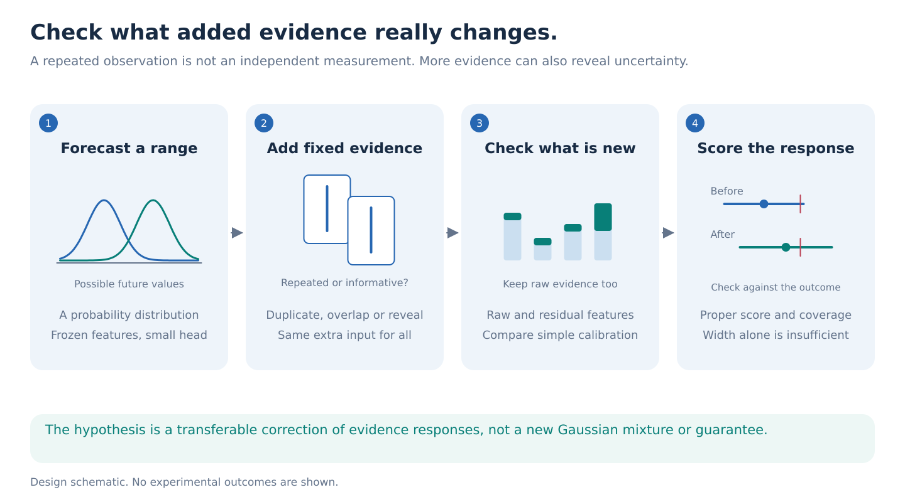
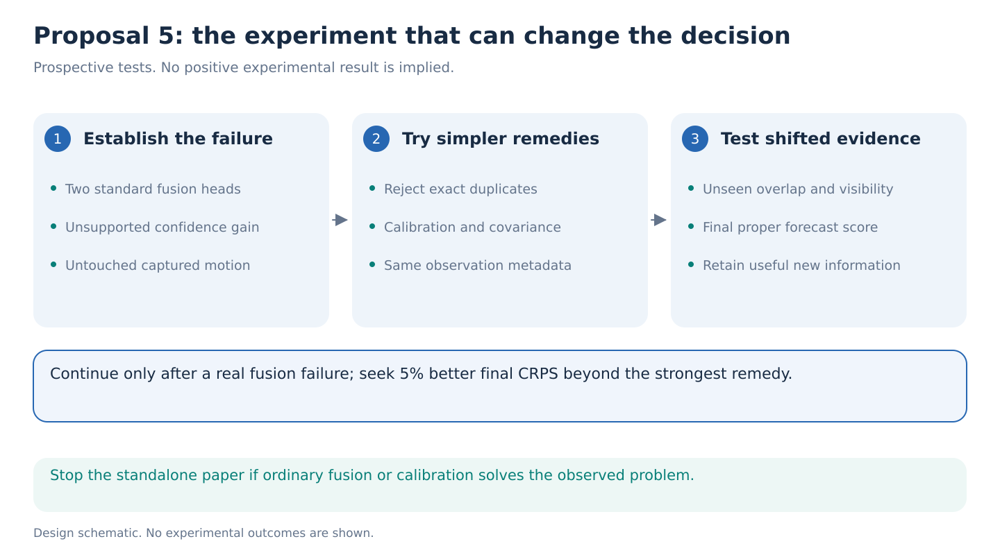

# 05. Does uncertainty respond correctly to added evidence?

> **Decision stage: September 14 seven-proposal comparison.** Priority statements describe [that comparison](../proposal-comparison.md). See the [research agenda](../README.md) for the latest recommendation.

**Decision: a conditional reserve, with provisional novelty of 2–3/5.** A Gaussian mixture attached to JEPA is insufficient. First establish that repeated or strongly overlapping observations make standard fusion models more confident without improving their forecasts. Then test whether a small correction transfers to unseen observation changes. All methods receive the same additional evidence; there is no acquisition policy.

**Hypothesis.** Distinguishing new information from predictable repetition can improve how a forecast distribution responds to added evidence, beyond ordinary fusion and calibration.

Imagine a side view where the feet overlap. Another view may reveal which foot was moving forward. A duplicate supplies no new measurement. Yet a model could become equally confident after either. Conversely, discovering an unusual movement could correctly increase uncertainty. The target is a useful response, not universally narrower intervals.

**Step 1: establish the failure on untouched movement.** Select natural AMASS motion, fix a two-second prefix, and retain its recorded future. Render prefix observations with complementary cameras, overlapping crops, and exact duplicates. Only the observation changes. Every encoder processes the prefix separately, without future frames. Group derived views by person under the [shared splits](../references/portfolio-evidence.md).

Fit two standard fusion heads on frozen V-JEPA features: feature concatenation with an MLP, and attention over observation tokens. Both predict three-component Gaussian mixtures. A component describes a possible value, spread, and probability. Train using likelihood, with training-fixed scale floors and separate calibration.

Use eight scalar targets: forward and lateral displacement of each ankle at 0.5 and 1 second, in the last observed pelvis frame. These marginal distributions do not establish full-body joint uncertainty. Apply ordinary exact-duplicate rejection before the novelty gate. Among the remaining highly overlapping or repeated-view cases, a preliminary failure requires both fusion heads to narrow by provisionally more than 10%, while worsening CRPS by at least 2% or increasing the coverage shortfall below 90% by two percentage points. Report each condition and uncertainty. Overlap does not prove informational redundancy; exact duplicates remain a sanity control that every method should pass, not the paper's claimed discovery.

**Step 2: estimate what the extra features add.** Let `a` describe the initial observation and `b` the extra observation. Fit a small predictor `g(a, s)` of `b` on training people only; `s` records the permitted crop or camera relationship. Freeze it, then calculate:

`residual = extra features − predicted extra features`.

This residual highlights what the predictor failed to anticipate. It is a candidate measure of new evidence, not independent information, an identified causal quantity, or a theorem. Predictable features can remain useful, and residuals can mostly contain viewpoint error.

Keep a frozen initial mixture forecast. A zero-initialized correction head receives `a`, raw `b`, the residual, and observable duplicate, crop-overlap, and estimated visibility signals. It adjusts mixture logits, means, and log-scales. When extra evidence is absent, return the initial distribution exactly. No hidden visibility or future-reference signal enters the head. Train only the small modules against recorded futures.

Keeping raw extra features avoids assuming subtraction preserves everything useful. Compare raw-only, residual-only, and raw-plus-residual versions. Count the feature predictor in the capacity budget. Frozen JEPA features may make this response transferable, but the same experiment with pose-plus-flow and frozen image features can disprove that role.

**Step 3: compare with remedies that could make this unnecessary.** Include ordinary concatenation and attention, a calibrated ensemble of single-view forecasts, variance scaling, and simple covariance or feature-redundancy weighting. Give every method identical observations, duplicate indicators, overlap signals, and tuning budgets. Apply a simple exact-duplicate rejection rule to all methods; fixing literal copies alone earns no contribution. A conformal interval baseline compares coverage against width separately.

Hold out entire crop-overlap ranges, camera angles, and visibility patterns. Fit the correction and calibration once, then test those observation changes without adjustment. The required transfer is across measurement conditions, not merely new examples of the training corruption.

**Step 4: score useful responses.** The primary endpoint is normalized **continuous ranked probability score**, or CRPS, after adding evidence. It rewards probability near the realized outcome while penalizing misplaced spread. Average targets within motions, then equally across people, using training-only normalization.

Provisionally require **5% lower final CRPS** than the strongest calibration-selected comparator, with a positive paired person-level interval on the prespecified held-out observation mixture. Require initial CRPS within 1% of that comparator, preventing a poor initial forecast from manufacturing a large response. Also report before-minus-after CRPS, likelihood, predictive-mean error, 90% coverage, and width separately for duplicate, overlapping, and complementary observations. Complementary-view CRPS must remain within 1% of the strongest comparator, so improvement on repeats cannot come from ignoring useful evidence.

Shifted-view coverage is empirical, not formally guaranteed. One recorded future supports average scoring but cannot uniquely separate hidden-state ambiguity from inherent future variation. Do not interpret residual magnitude as true aleatoric uncertainty.

For real video, use the [shared GAVD annotation panel](../references/portfolio-evidence.md): sixty clips from at least forty eligible recording IDs, four frames and two visible landmarks each, budgeted at 8–12 human hours. Reveal extra crops from already observed frames and forecast later verified 2D ankle displacement. This differs from AMASS multiview evidence. GAVD has no imaginary second camera or measured 3D reference. Without completed annotations, its role remains qualitative.

**Step 5: decide within 48 hours.** Day 1 tests the failure in both standard heads. Day 2 compares calibration, redundancy weighting, and the small residual correction. Stop the standalone proposal if ordinary remedies solve it, or the correction only narrows intervals. Days 3–5 run fixed comparisons and three seeds; days 6–7 evaluate protected people and observation shifts. Allow **150–250 H100 GPU-hours**, revised after timing extraction. These are planning limits and prospective effect thresholds, not measured results.

**The novelty claim remains narrow.** [HumanMAC](https://arxiv.org/abs/2302.03665), [SCDP](https://arxiv.org/abs/2603.09574), [conformal human-motion prediction](https://arxiv.org/abs/2604.15221), and [WRBench](https://arxiv.org/abs/2606.20545) cover nearby capabilities. [Redundancy-adaptive learning](https://arxiv.org/abs/2310.14496) already addresses overlapping information. See the [reference ledger](../references/portfolio-literature.md). The possible contribution is transferable correction of observation responses on real motion, beyond these ordinary tools. The fatal counterexample is calibrated concatenation or redundancy weighting matching both scores and coverage. A residual feature construction cannot rescue that failed claim.
