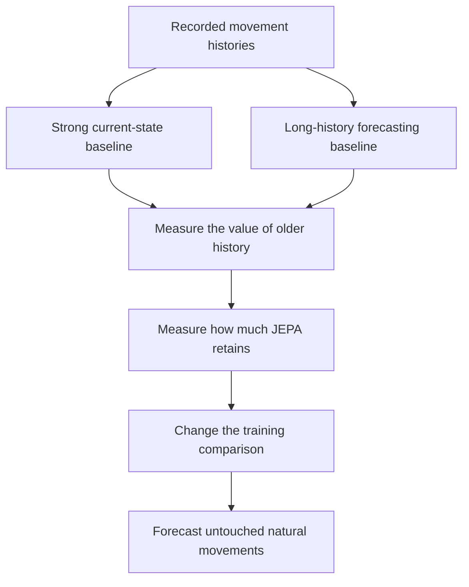

# A sharper scientific bet: preserve predictive history beyond current state

**Assessment, 14 September 2026.** This is the outcome of further evidence review, literature search and three independent reviewers. It proposes a more focused scientific question than synthetic training selection. It does not establish a novel method, report new experiments, or endorse a high probability of a significant paper within one week. The reviewers identified useful mechanisms and substantial objections; they did not jointly endorse a new flagship.

**The question:** does JEPA training discard information from movement history that remains useful after accounting for current posture, velocity and acceleration, and can a targeted change to training recover that information with substantial forecasting benefits?

The potential contribution is an empirical mechanism with a constructive remedy. Training another skeleton model, improving its own latent prediction score, or showing that velocity helps would not establish it.

## 1. The conceptual change

A useful world model must distinguish histories when those histories imply different futures. A representation can vary across people, postures and recordings while failing this requirement. Global feature variance and good prediction of an encoder's own targets do not settle whether the representation preserves the distinctions a physical forecast needs.

Consider someone passing through an upright posture while rising and someone passing through it while lowering. This illustrates why a snapshot is insufficient. It is **not** the proposed discovery: velocity already distinguishes these examples. A serious experiment must condition on a substantially stronger current-state baseline before attributing anything to learned predictive memory.

Write:

- **H:** the observed movement history, initially a fixed two-second window.
- **S:** a strong description of its endpoint: current pose, velocities, accelerations and a short recent window. Derive every quantity from observed frames only.
- **F:** the subsequently recorded movement, initially the following second.
- **z(H):** the representation produced by the motion encoder.

These durations are starting design choices to freeze before comparison, not established optimal settings.

The proposed finding requires three linked results:

1. H predicts F better than S alone on unseen people.
2. Ordinary JEPA loses a substantial part of this advantage under a competent downstream readout.
3. A specific training intervention restores it and improves useful forecasts on ordinary held-out motions.

The first establishes that useful information exists. The second locates a representation or accessibility problem. The third provides the positive contribution. None follows automatically from the others.

## 2. What the existing experiments actually contribute

| Existing evidence | What it motivates | What it does not establish |
| --- | --- | --- |
| The GAVD scaling run reaches RGB-target R² 0.662830, while aligned skeleton history adds approximately 0.000357. | Evaluate physical forecasts separately from contextual feature prediction. | That the teacher lacks temporal information, or that conditional collapse caused this result. |
| The laterality validation gain over correction-first learning is reproduced by the uniform-uncertainty control. | Isolate the proposed ingredient with a matched comparator. | That uncertainty is universally useless, or that the same failure mechanism explains other studies. |
| MoMask reconstruction and projection damage nearly accurate motion in the current repair pipeline. | Avoid requiring a useful repair generator before testing a representation claim. | That generative models intrinsically erase meaningful movement. |

Sources: [scaling analysis](../../../notebook_runs/future-innovation/haic-run-02/ANALYSIS.md), [laterality validation](../../../docs/studies/latent-laterality/results/validation.md), and [repair diagnostics](../../../docs/studies/motion-preservation/results/pilot-01-diagnostics.md).

These are motivations for a new hypothesis. Combining several negative results does not prove a shared causal explanation.

## 3. A concrete training intervention

Construct neighborhoods of natural AMASS histories with similar **observed** state S. Use endpoint pose, prefix-derived velocity and acceleration, body proportions and permitted source descriptors. Begin within people where enough distinct motions exist, then assess whether useful matching survives across people. Exclude overlapping windows from the same short motion segment when constructing informative pairs.

Do not select the primary evaluation pairs because their futures differ. That would create a favorable test after seeing the answer. Similarity thresholds, smoothing and matching inputs are chosen using training data. Report how closely the state variables actually match and how much eligible motion is excluded. If matching produces too little support, do not silently relax the scientific question to posture alone.

Let u(F) be a fixed or independently anchored future representation, computed from the future interval alone. Let p(H) predict it. Alongside ordinary prediction, test a paired loss:

\[
L_{\mathrm{pair}} =
\mathbb E_{(i,j)\,\mathrm{matched\ on}\,S}
\left\|
[p(H_i)-p(H_j)]-[u(F_i)-u(F_j)]
\right\|^2.
\]

This increases attention to differences between examples whose current states are similar. Keep the ordinary prediction term so that learning relative differences does not abandon absolute forecasting. A fixed future target cannot make this loss easy simply by collapsing during adaptation. Its physical information must nevertheless be checked: use existing future-motion coordinates or their fixed temporal basis as a reference-target control against a frozen learned target.

**This equation is a candidate intervention, not a new theorem.** For independent draws within an exact state group, the squared difference of prediction errors measures twice their within-group variance. It is a form of reweighting regression. Approximate matching and reused pairs require more cautious interpretation. Its value must come from a substantial, transferable empirical effect.

Do not require every neighborhood to have nonzero latent variance. If its future variation is unpredictable, such a requirement could reward identity or noise. With a fixed target and squared prediction loss, unpredictable variation remains prediction error rather than an instruction to invent a useful distinction. Even then, finite models can overfit; held-person prediction decides whether the learned differences generalize.

Start by adapting the existing S-JEPA implementation. Give the ordinary-loss control the same initialization, trainable parameters, windows and update budget. Use a modest matched model trained from scratch as an initialization control if the inherited checkpoint or its exposure history prevents a clean held-person claim. Large-model pretraining is not the proposed contribution.

## 4. The comparisons that decide significance

| Comparison | Why it is necessary |
| --- | --- |
| Current pose, velocity, acceleration and short recent history | Rules out rediscovering elementary kinematic state. |
| A competent raw long-history forecaster, including a small temporal network and a training-only nearest-history baseline | Establishes the available forecasting opportunity and a strong practical rival. |
| Ordinary JEPA with the same matched-window sampling | Separates the paired loss from a change in training examples or exposure count. |
| Ordinary within-trajectory future-difference prediction | Tests whether standard temporal supervision explains the gain. |
| Contrastive future prediction with the same matched examples | Tests the simpler hard-negative explanation. |
| Direct future-coordinate prediction with matched architecture and budget | Tests whether ordinary forecasting training already yields the capability. |
| Frozen/random initialization with identical downstream readouts | Separates useful pretraining from architecture and readout capacity. |

Evaluate both linear and modest nonlinear readouts. An improvement confined to a linear probe is improved accessibility under that readout, not proof that the original representation erased information.

Use continuous future-motion error on **all eligible untouched held-person windows** as the principal endpoint. Report body-relative articulated motion and global trajectory separately so that centroid drift cannot dominate the finding. The matched-state comparison explains the mechanism; it must not replace the ordinary-motion result. Do not claim that lower average trajectory error resolves the full distribution of possible futures.

For a stronger result, hold out an AMASS source collection and test more than one encoder configuration. A held-out AMASS collection is source transfer within AMASS, not an independent clinical dataset. Repeat the decisive comparison across training seeds and estimate uncertainty by person, with motions or windows nested within people.

Past-frame shuffling, replacing old history with repeated frames, or exchanging older prefixes can test dependence on model inputs. These manipulations may create unnatural inputs and do not establish biological causality or identify a person's intent. Natural held-out forecasting remains the main evidence.

## 5. The novelty boundary

There is no defensible claim that conditional collapse, temporal prediction or comparison-based learning is new:

- [How JEPA Avoids Noisy Features](https://arxiv.org/abs/2407.03475) analyzes the implicit feature-selection bias of simplified self-distillation models. Its theory motivates investigation, but does not predict this experiment's outcome.
- [When Graph-JEPA Learns the Wrong Thing](https://arxiv.org/abs/2608.20516) reports healthy global diagnostics alongside loss of within-category information. Rediscovering that diagnostic in skeletons would be insufficient.
- [Factorized Latent Dynamics for Video JEPA](https://arxiv.org/abs/2605.17165) studies temporal and factorized auxiliary objectives. A generic motion-difference loss is not a new contribution.
- [Dense Predictive Coding](https://arxiv.org/abs/1909.04656) is a longstanding precedent for learning video representations through future prediction. Matching and contrastive alternatives deserve full comparisons.

The potentially substantial finding is narrower:

> **A measurable part of natural movement history remains useful beyond strong current-state predictors, standard predictive representation learning systematically loses access to it, and a targeted training comparison restores transferable physical forecasting ability.**

This would add knowledge about how predictive representations allocate information. A small gain over a weak JEPA baseline would not establish it. If the result merely rediscovers the value of velocity, withdraw the stronger predictive-history claim. If matched contrastive training also corrects the demonstrated failure, that supports a broader training remedy but not a uniquely effective paired loss. A convincing diagnosis and simple remedy can be a scientific contribution without beating every supervised forecaster; direct forecasting still establishes the available capability and limits any claim of superior practical prediction.

## 6. Data and the one-week constraint

The local [AMASS conversion manifest](../../../manifests/amass/amass_core11_conversion.csv) currently lists 8,854 converted motion records: 7,217 training, 769 validation and 868 test. Those are manifest entries, not a fresh check of HAIC tensor availability. They describe Core11 conversion; they do not establish that full-body caches already exist. Use the identity registry, exposure history and established split assignments rather than treating windows as independent people or repartitioning previously inspected data into a new test set.

The immediate experiment can use the existing skeleton pipeline. Expand to full-body motion from the stored AMASS body parameters if that conversion is ready early enough. Full-body observations strengthen the current-state comparator and reduce the risk of calling information from omitted body parts a novel kind of memory. If the study remains Core11-only, restrict the claim accordingly.

GAVD does not provide the independent dense physical references required for this central test. It can support a later real-video extension with suitable annotations. Rendered AMASS, pseudo-label agreement, or the existing normal/abnormal categories cannot stand in for that validation. V-JEPA 2 may be an eventual video model comparison; making it a prerequisite would add the unverified video-to-physical-measurement problem again.

| Time | Scientific output |
| --- | --- |
| First day | Measure whether older history adds useful prediction beyond S, whether the existing representation retains it, and whether state matching has enough natural support. Measure actual model throughput. |
| Days 2–3 | Compare the paired intervention with ordinary prediction, matched sampling, contrastive prediction and direct future-coordinate training. This is the first opportunity for a positive mechanism result. |
| Days 4–5 | Repeat the decisive arms and evaluate source transfer, stronger current-state controls and the full eligible motion population. |
| Days 6–7 | Complete the explanatory analysis and write only the claims supported by those comparisons. |

This is a conditional allocation of the available week, not a runtime guarantee. Eight H100s permit independent small-model comparisons, but no throughput or new effect size was measured during this review. If the first comparison finds no useful history beyond S, there is no supported target capability for the proposed intervention. If the simpler training methods match it, there is no supported distinctive method advantage. Neither result should be presented as the positive breakthrough requested.

## 7. How independent review changed the direction

Three reviewers separately examined local evidence, alternative mechanisms and scientific failure modes. Their feedback changed the candidate rather than merely polishing its wording:

| Initial possibility | Decisive objection | Outcome |
| --- | --- | --- |
| Decode many future-event probabilities from a single lifted JEPA prediction | Kernel predictive states, neural conditional mean embeddings and weighted trajectory distributions already supply the core capability; finite feature readouts also have sufficiency and probability-coherence limits. | Retain only as a compression question, not a newly invented inference rule. See [kernel predictive states](https://arxiv.org/abs/1309.6819), [neural CME](https://proceedings.mlr.press/v235/shimizu24a.html), and [distributional random forests](https://www.jmlr.org/papers/v23/21-0585.html). |
| Mask physical degrees of freedom instead of redundant joints | Body-part, temporal and whole-future masks are strong existing remedies; a quantitative observability result would need evidence beyond a new mask heuristic. | Do not add another masking method to the primary experiment. [SLiM](https://arxiv.org/abs/2603.10648) is a close predecessor. |
| Distinguish histories ending at the same posture | This can merely rediscover velocity. | Strengthen S to include velocity, acceleration and a short recent history. |
| Force features to vary within each matched neighborhood | This can preserve unpredictable variation or noise. | Use anchored prediction targets; do not impose an unconditional local variance floor. |
| Use the paired prediction equation as the novelty claim | The equation reweights regression and has strong contrastive and temporal alternatives. | Make the proposed contribution a measured, corrected information-allocation failure with natural forecasting transfer. |

**Final judgment:** this is a more concrete mechanism study with fewer new dependencies than synthetic training selection. It is the most focused remaining question from this review, but its significance and novelty remain empirical requirements. There is still no evidence-based basis for calling it a high-probability main-track result in one week. No experiments, checkpoint inference or HAIC submissions were performed in this ideation round.

## 8. Direct comparison with synthetic training selection

For a one-week experiment, the predictive-history study is the more executable choice. This is a judgment about access to decisive evidence, not an estimate that its novel mechanism is more likely to succeed. Synthetic training selection retains broader potential practical impact over a longer research window.

| Dimension | Predictive history beyond current state | Synthetic training selection |
| --- | --- | --- |
| Intended contribution | Explain and correct a loss of useful temporal information during predictive representation learning. | Learn transferable judgment about which synthetic training data will help an unfamiliar estimator. |
| Main quantitative reference | Subsequently recorded AMASS motion. | Independently annotated landmarks in real GAVD video. |
| New prerequisites | State-matched comparisons and a training-loss intervention; full-body conversion if not already ready. | Useful textured rendering, trainable estimators, replay data, adaptation outcomes and real annotations. |
| Scientific links requiring evidence | Older history helps beyond strong current-state controls; JEPA loses some of that benefit; the remedy restores it beyond existing alternatives. | Synthetic adaptation helps real estimation; useful lessons vary; cheap diagnosis predicts those choices across architectures and real deployment settings. |
| Strongest simple rival | Direct future-coordinate training or matched contrastive prediction. | A fixed curriculum or synthetic-error selection combined with simple domain matching. |
| Novelty failure | The result is explained by velocity, known conditional collapse, or ordinary temporal supervision. | The result is ordinary synthetic augmentation or an existing selection heuristic. |
| Potential reach | General lessons for how predictive representations retain useful history, if replicated beyond one setup. | Better deployment of many perception models without deployment labels, if teaching transfer is demonstrated. |

The new study is more directly about JEPA. In synthetic teaching, JEPA is a source of context features and could be replaced by an image encoder without invalidating the broader teaching idea. Conversely, the new study has a narrower contribution: demonstrating that motion history matters is already familiar, so the work must isolate information beyond a strong kinematic state and explain a repair that survives competent forecasting baselines.

The immediate preference is therefore the new study for a constrained experiment, while keeping the distinction between an executable comparison and a significant positive result explicit. Neither proposal is currently an established best bet for the requested novel paper outcome.

## 9. Which distinctive mechanism is the stronger scientific bet?

**Lead judgment after a further mechanism review:** weakly favor response-conditioned synthetic teaching for a substantive new mechanism finding; favor the predictive-history study for ease of obtaining a decisive measurement. This is a qualitative judgment, not a measured probability or reinstatement of the earlier one-week endorsement. Two independent reviewers disagreed on the mechanism ranking. One preferred the direct supervision available to the history intervention; the other preferred the additional information exposed by an actual training intervention. No new experiments were performed.

### The paired loss changes error allocation

For a fixed target Y = u(F), define e = p(H) - Y. For two conditionally independent examples exactly matched on S,

\[
L_{\mathrm{pair}} = 2\mathbb E[\operatorname{Var}(e\mid S)],
\]

where variance denotes the sum of coordinate variances for a vector target. Let m(H) = E[Y | H]. Assuming finite second moments, S is a function of the observed history, and the predictor is unrestricted, ordinary regression and ordinary regression plus this paired term have the same optimal prediction m(H). More explicitly, the combined objective's excess over that optimum is

\[
\mathbb E\|p-m\|^2 +
2\lambda\mathbb E\operatorname{Var}(p-m\mid S).
\]

This is an algebraic observation, not new theory. A matching graph gives the finite-sample interpretation: the paired term is regression-error variation across graph edges. It can improve finite-model allocation, optimization or generalization. Sharing a population optimum does not make an empirical improvement impossible or scientifically uninteresting. However, the equation does not specifically guarantee recovery of additional physical information.

Use the **same fixed future target** in the ordinary and paired-loss arms. Comparing paired training with a fixed teacher against ordinary JEPA with a changing EMA teacher would confound the intervention with target anchoring. Include an established long-history forecaster: [History Repeats Itself](https://arxiv.org/abs/2007.11755) already reports benefits on AMASS and other motion datasets. That precedent does not answer the proposed conditional-state question, but it rules out treating the general usefulness of history as new.

### A training probe can expose additional learner behavior

For a small gradient update from lesson k, the change in predictions on deployment inputs U is approximately

\[
\Delta f_U^{(k)}\approx-\eta J_U g_k.
\]

Here g_k is the lesson gradient and J_U maps parameter changes to prediction changes; optimizer preconditioning can be included in the update direction. The observed probe measures the action of this map on one particular update. That can distinguish learners with similar current predictions or weaknesses. This additional behavioral information is the stronger reason to investigate the mechanism.

The limitation is equally concrete. Real improvement depends on the lesson update's alignment with the unknown real prediction error. A response to one probe does not identify the effects of every other lesson. Two learners can have identical probe responses and different best lessons. Empirical transfer therefore requires regularities across learners and domains that have not been demonstrated here.

Probe responses must predict **lesson-ranking differences beyond static weaknesses and domain matching**, not merely the overall amount a model improves. A response that measures a common learning-rate multiplier could predict gain magnitude while leaving the best lesson unchanged. [Black-box machine teaching](https://proceedings.mlr.press/v80/liu18b.html) and [model-based meta curriculum learning](https://proceedings.mlr.press/v232/xu23a.html) support the broader examination and teaching ideas, but do not establish the proposed target-label-free real-video transfer.

### Judge the information source separately from the selector

A nearest-neighbor selector that uses the actual probe response can validate response-conditioned teaching. Requiring an MLP to beat it adds an unnecessary architectural requirement. The decisive comparison is between selectors with and without response information, given the same outcome database, static predictions, synthetic weakness profiles, model-family or learning-rate proxies where available, post-probe starting checkpoint and remaining adaptation budget. Original-model and full-budget replay comparisons establish net practical benefit.

The scientific opportunity is that a short intervention reveals transferable information about **what this model can learn**, beyond **where it currently makes errors**. A large, reproducible advantage on unfamiliar architectures and real videos would be substantial even with a simple selector. That is why the lead weakly prefers this mechanism under the novelty criterion. Whether that advantage exists remains unresolved, and the practical dependencies still make the complete synthetic-teaching campaign a risky one-week commitment.
