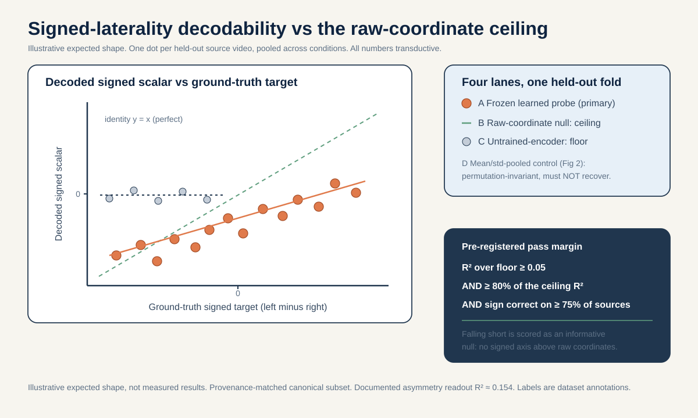
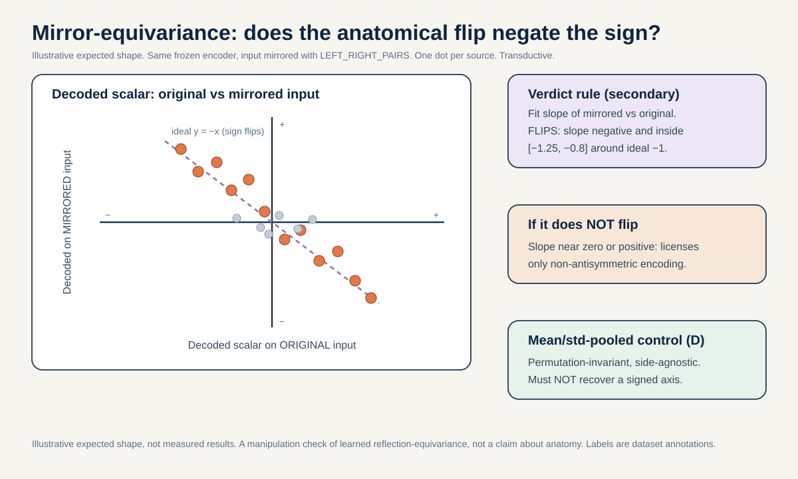
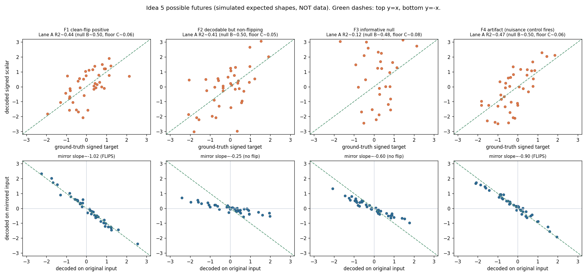

# Signed laterality decodability: is left-minus-right asymmetry a linear axis, and does an anatomical mirror flip the decoded sign?

> On source-video-disjoint folds, is a signed left-minus-right laterality axis linearly decodable from the frozen S-JEPA token tensor above a raw-coordinate null by a pre-registered margin, and does the anatomical mirror that swaps left and right landmarks negate the decoded scalar?

## The question in plain words

Walking is nearly symmetric in healthy people. The left leg and the right leg do almost the same thing, just half a stride apart. Many gait conditions break that symmetry. A stroke can weaken one side. Parkinson's disease often starts on one side and stays asymmetric. So a natural and clinically central number to ask a gait model for is this: how different are the two sides, and which side is affected. We do not just want "how big is the asymmetry" as a size with no direction. We want the SIGNED difference, left minus right, which also tells you which way it leans.

This project trained a skeleton model (S-JEPA) on gait videos. Stage 0 is self-supervised with
respect to condition labels; Stages 1–4 are label-aware through the group loss. The old claims
that notebook 05 decoded step amplitude at R-squared 0.719 and asymmetry at 0.154 are
**unreproducible legacy claims**: the archived target, split, checkpoint state, and predictions
are not available. They are motivation, not evidence. The repaired notebook 05 now writes a
versioned, source-video-grouped scalar-readout audit bound to the exact checkpoint state.

**Reading the math (R-squared).** R-squared is the fraction of a target's variation that a readout explains.
- R-squared runs from 0 to 1 (higher is better). 0 means the readout explains none of the variation. 1 means it explains all of it.
- The legacy numbers must not be interpreted as explaining a fraction of variation in the current
  model. That interpretation becomes available only after the new audit is run.
- If R-squared were 0, dropping the features entirely and just guessing the average every time would do just as well.

That is a striking gap for the one quantity that most distinguishes the conditions this project cares about.

This proposal makes that weak number the object of study. First principles: I ask whether a signed left-minus-right laterality value is present in the features at all, as a straight-line (linear) axis I can read with a simple linear regression, and whether it clears a fair baseline. The fair baseline is what you can already decode from the raw joint coordinates before any neural network touches them. If the learned features cannot beat that, the model added nothing on this axis.

Second, I run a mechanism test. If the features truly encode a SIGNED left-versus-right quantity, then physically swapping the left and right body landmarks (an anatomical mirror) should flip the sign of whatever I decode: a plus becomes a minus of the same size. I test that directly. That sign-flipping behavior has a name: an ANTISYMMETRIC encoding. In plain words, antisymmetric means that mirroring the input negates the output: if you feed in a mirrored body and the decoded number just changes sign (same size, opposite direction), the encoding is antisymmetric. Testing this is the same as testing whether the encoder learned reflection-equivariance, which is a fancy way of saying a mirrored input produces a mirrored output. It is NOT an assumption that the encoder "understands anatomy." If the decoded value does not flip, that rules out a clean antisymmetric encoding. It tells us the asymmetry information, where it exists, is stored in some other way that a simple mirror does not neatly reverse.

## Why this matters

A positive result would show a usable signed, direction-carrying representation of gait asymmetry
under the preregistered audit. It cannot be compared to the legacy 0.154 claim until both use a
documented common target and split.

A null result only says that this transductive encoder and the specified readout do not clear the
raw-coordinate comparator on the evaluated source videos. It does not diagnose why the legacy
claim differed or establish an independent clinical representation limit.

The mirror arm adds a second, independent bit of knowledge. A decodable-and-flipping outcome licenses the strong claim that the encoder represents laterality antisymmetrically, that is, mirroring the input cleanly negates the decoded number. A decodable-but-NOT-flipping outcome licenses only the weaker claim that the encoding is non-antisymmetric, that is, mirroring the input does not cleanly negate the decoded number. It does not by itself prove the signal is a camera or source artifact, and I pre-register that limit so I do not overclaim.

## Conference-level augmentation

This section lifts the probe from an internal audit of one small cohort to a mechanism-grounded study with a claim that travels. It does three things: it ties the signed axis to the clinical literature that defines it, it states what generalizes beyond gavd5, and it is honest about what an external cohort can and cannot confirm. It also names the probe's recast role: this item is the empirical measurement instrument for the reflection-equivariance question raised in item 09 (see the cross-reference at the end).

### Neuroscience source, mechanism, skeleton-measurable feature

The signed left-minus-right axis is not a dataset convenience. It is the literature's own discriminant between conditions whose brain injury is one-sided and conditions whose muscle disease is diffuse. There is one chain per side of the axis this probe measures.

Lateralized arm (what the signed axis SHOULD detect):

- Stroke. The corticospinal (pyramidal) tract crosses to the other side at the pyramidal decussation, so one hemisphere controls the opposite half of the body. A one-hemisphere lesion therefore produces a one-sided (contralateral) motor deficit, hemiparesis (Natali and Javed, StatPearls corticospinal-tract anatomy, PMID 30571044). The skeleton-measurable feature is the signed left-minus-right excursion difference, which is the validated clinical Symmetry Ratio computed on step length, swing time, and stance time (Patterson et al. 2010, Gait Posture, PMID 19932621). This is the validated biomarker that anchors the whole axis.
- Parkinson's disease. Nigrostriatal dopaminergic degeneration is asymmetric at onset, hitting one side first (Riederer and Sian-Hulsmann 2012, J Neural Transm, PMID 22367437). Early PD therefore loads the same signed per-side asymmetry axis before it becomes bilateral.
- Hemiplegic cerebral palsy. A unilateral periventricular white-matter lesion of the leg corticospinal fibers gives a one-sided deficit (Volpe 2009, Lancet Neurol, PMID 19081519). Unilateral versus bilateral periventricular leukomalacia is the within-CP lateralized-versus-symmetric split (hemiplegia versus diplegia), read as the same signed left-minus-right quantity.

Symmetric negative-control arm (what the signed axis should NOT detect):

- Myopathy. Primary muscle disease produces diffuse, symmetric, proximal (limb-girdle) weakness, and symmetry is the characteristic distribution that separates it from a one-sided upper-motor-neuron lesion (Barohn et al. 2014, Neurol Clin, PMID 25037080). Concretely, Duchenne muscular dystrophy spatiotemporal parameters show NO significant left-right asymmetry versus controls (Xiong et al. 2023, Biomed Eng Online, PMID 37525241). Near-zero signed left-minus-right is therefore a built-in negative control: the axis should read close to zero for myopathy even when other gait features are abnormal.

Skeleton recoverability of the signed feature. Markerless sagittal-plane pose recovers the ingredients of this signed feature well: temporal mean absolute error 0.02 s/step and sagittal hip, knee, ankle angle mean absolute errors of 4.0, 5.6, and 7.4 degrees against marker-based motion capture (Stenum et al. 2021, PLoS Comput Biol, PMID 33891585). So a Symmetry-Ratio-style signed difference is skeleton-recoverable in the sagittal plane, which is exactly the plane this probe reads.

**Reading the math (why these degrees matter).** These are the sizes of the pose-estimation errors, in the same units as the quantity being measured.

- 0.02 s/step is the timing error per step: two hundredths of a second. Stroke and PD asymmetries in swing and stance time are much larger than this, so the timing side of the signed feature is recoverable.
- 4.0, 5.6, 7.4 degrees are the per-joint angle errors for hip, knee, ankle. The reduced-swing-knee-flexion (stiff-knee) pattern that the stroke literature flags on the paretic side (Chen et al. 2005, Gait Posture, PMID 15996592, cited for the pattern, not an exact degree) is an order-of-magnitude mechanism prior of roughly 17 degrees, not a full-text-verified clinical measurement here. That order of magnitude is well above these pose errors, so a signed angle difference of that size would not be swamped by pose noise. I treat the 17 degrees as a mechanism prior only, not a grounded number.
- Smaller error is better. These errors bound how fine a signed difference the skeleton can honestly resolve; they do not license reading differences smaller than the error.

The probe's own operationalization is the `signed_left_minus_right()` function over the `LEFT_RIGHT_PAIRS` list (11/12, 23/24, 25/26, 27/28, 29/30, 31/32) defined in the Method section, and the mirror flip (negate x, swap left with right) is the equivariance probe. In other words, the neuroscience above tells us the axis exists and is clinically validated; the code tells us how we read it off the skeleton.

### The generalizable claim (what transfers beyond gavd5)

The transferable contribution is a measurement method, not a gavd5 number. Stated plainly: a signed, mechanism-defined left-minus-right laterality axis, validated by the clinical Symmetry Ratio biomarker, is a directly probeable representation target. Its linear decodability above a raw-coordinate null and its sign-flip under an anatomical mirror JOINTLY measure whether a skeleton encoder has learned reflection-equivariant laterality. That pairing (a decodability read against a fair raw-coordinate ceiling, plus a mirror sign-flip test) is a transferable instrument for auditing side-aware gait representations in any skeleton encoder, on any cohort, not just this one. The claim that generalizes is the instrument and the principle behind it; the specific R-squared and slope numbers on gavd5 are illustrations of the instrument in use.

### Biomarker-specific external-cohort note (honest scope)

I state the scope honestly for this specific signed feature. No participant-disjoint public SKELETON cohort with signed left-right stroke or CP laterality labels exists. Cross-cohort confirmation of the signed clinical axis at the skeleton level is therefore NOT available, and I mark that as a limitation rather than papering over it.

The nearest legitimate external anchors are viewpoint- and laterality-bearing multi-view pose cohorts: CASIA-B (Yu et al. 2006), OU-MVLP-Pose (Takemura et al. 2018), GREW (arXiv:2205.02692), and Gait3D (arXiv:2204.02569). These are NON-clinical. They can stress the mirror and equivariance instrument out of cohort (does the sign-flip behavior hold when the camera viewpoint changes), but they cannot confirm a clinical laterality claim, because they carry no stroke or CP labels. Pose validity of the signed sagittal feature is anchored to Human3.6M against motion capture (Ionescu et al. 2014, DOI 10.1109/tpami.2013.248) and to Stenum et al. 2021 (PMID 33891585).

The hard boundary: any clinical-accuracy reading of the signed axis is external-cohort reach-tier only, and the n=18 source videos here cannot be upgraded into a clinical claim. The neuroscience defines the target and the falsifiable prediction; it never turns a transductive cohort of 18 sources into a clinical-accuracy statement.

### Feasibility delta versus the original

The core arm does not change the original three-week plan and stays fast. There is no encoder retraining anywhere in the core. Every lane is a test-time-only linear read of already-cached frozen `d0acc262` target-encoder tokens plus a random-init floor. Week 1 is caching plus freezing the deterministic signed-laterality target function, the Day-5 gate is the single-fingerprint and provenance-matched canonical-subset check, Week 2 fits Lanes A through D and runs the mirror pass, the Day-14 gate is the verdict check, and Week 3 is figures. Retrain scale for the core: zero encoder retrains.

The reach arm is optional and is NOT part of the three core weeks. It runs the mirror and equivariance instrument against a non-clinical multi-view pose cohort (CASIA-B or OU-MVLP-Pose) to stress reflection-equivariance out of cohort. It needs new-data ingestion but still no retrain of the gavd5 encoder. Retrain scale for the reach: still zero gavd5 encoder retrains; the only new cost is ingesting and posing an external cohort. So the honest delta is: core weeks unchanged (three weeks, zero retrain); reach adds one external-data ingestion track with no gavd5 retraining.

### Cross-reference to item 09

This item is the empirical probe layer for item 09 (reflection-equivariance). Item 09 makes the architectural claim; the signed-decodability-versus-raw-null probe and the `LEFT_RIGHT_PAIRS` mirror test defined here are the measurement instrument that item 09's claim is evaluated with. The mechanism framing above (Patterson 2010 Symmetry Ratio as the validated discriminant, PD asymmetric onset per Riederer 2012, hemiplegic-versus-diplegic CP via PVL laterality per Volpe 2009, and myopathy's absence of left-right asymmetry per Xiong 2023 as the built-in negative control) is what gives item 09's equivariance result a clinical meaning rather than a purely geometric one.

## Background and related work

S-JEPA is a Joint-Embedding Predictive Architecture for skeletons (Abdelfattah and Alahi, S-JEPA, ECCV 2024, DOI 10.1007/978-3-031-73411-3_21). The idea family comes from image and video JEPAs (Assran et al., I-JEPA, CVPR 2023, arXiv:2301.08243; Bardes et al., V-JEPA "Revisiting Feature Prediction for Learning Visual Representations from Video", 2024, arXiv:2404.08471). Here are the moving parts from scratch.

A TOKEN is the model's smallest input unit. In this project a token is one BlazePose joint (Grishchenko et al., BlazePose GHUM, 2022, arXiv:2206.11678) watched over a short 4-frame window. Each sequence is resized to 64 frames. Then 4 next-door frames form one time patch, which gives 16 time positions. With 33 joints that is 33 x 16 = 528 possible joint-time tokens.

**Reading the math (token count).** This says the total number of joint-time tokens is joints times time positions.
- 33 is the number of BlazePose joints.
- 16 is the number of time positions (64 frames split into groups of 4).
- "x" means multiply. 33 x 16 = 528, so there are 528 tokens.
- If you used fewer frames per patch, you would get more time positions and a larger token count.

Each token turns a 4-frame by 3-coordinate (x, y, relative z) 12-vector into a 64-number embedding through a linear layer. A "12-vector" is just a list of 12 numbers: 4 frames times 3 coordinates each. A "64-dimensional embedding" is a list of 64 numbers the model uses to describe that token.

MASKING means hiding some tokens from one encoder and asking the model to predict what a second encoder computed for those hidden positions. There are two encoders. The VIEW (online) encoder sees only the visible tokens and is trained by gradient descent (small steps that reduce error). The TARGET encoder sees all 528 tokens and is NOT updated by backpropagation. Its weights are an exponential moving average (EMA) of the view encoder. After each step the target weights move a tiny fraction toward the view weights (momentum schedule cosine, from 0.999 toward 1.0). An EMA teacher is like a slow-moving average that ignores day-to-day noise: it is a slowly-updated copy that gives stable prediction targets. A PREDICTOR takes the visible features and predicts the target encoder's hidden features, returning outputs only at the masked positions. The predictor is a small 2-layer Transformer, which is the standard neural network that lets every token look at every other token to decide what the hidden tokens should be, "2-layer" meaning it does this looking twice in a row. It also uses a learned mask token, which is a single stand-in vector the model places at each hidden spot to mean "something goes here, guess it," and the model tunes that stand-in during training.

In this project only 12 lower-body-and-shoulder landmarks are ever maskable prediction targets (left/right shoulder, hip, knee, ankle, heel, foot index). Face and arm joints are context but never targets. The loss is:

`L = L_JEPA + 0.05 * L_VICReg + 0.25 * L_group`

**Reading the math (total training loss).** This says the total training loss is a weighted sum of three parts. "Loss" is the error the model tries to make small during training.
- `L` is the total loss the optimizer minimizes (smaller is better).
- `L_JEPA` is the main prediction error: how badly the predictor guessed the hidden target features. Its weight is 1 (it is the biggest term).
- `L_VICReg` is an anti-collapse penalty; its weight is `0.05`.
- `L_group` is a label-aware term; its weight is `0.25`.
- `*` means multiply (scale a term by its weight) and `+` means add the terms together.
- The weights `0.05` and `0.25` are both smaller than 1, so both extra terms are gentle nudges, not the main goal. `0.25` is five times larger than `0.05`, so the label-aware term pushes harder than the anti-collapse term, but both stay under the main prediction term.
- If you set `0.05` to zero you remove the anti-collapse guard and the model could collapse all tokens toward one vector. If you set `0.25` to zero you remove the label-aware pull and Stages 1 to 4 stop being supervised fine-tuning.

VICReg (Bardes, Ponce, LeCun, VICReg, ICLR 2022, arXiv:2105.04906) adds a variance floor and a covariance penalty that stop the model from collapsing all tokens to one vector. Its variance term keeps the features spread out so they use many independent directions instead of piling onto a few. The word for "how many independent directions the features actually use" is effective rank, and higher is better here: it means the features are not all echoing the same one or two numbers. L_group is a label-aware term active only in Stages 1 to 4, which is why those stages are supervised fine-tuning, not pure self-supervised learning.

Two facts about laterality are load-bearing here. The training-time geometric augmentation includes a small y-axis rotation (max 8 degrees), but laterality FLIP is OFF by default (flip_probability 0.0), precisely because left-right identity matters for stroke.

**Reading the math (flip_probability 0.0).** This says how often the training pipeline mirrors an input left-to-right.
- flip_probability is a chance, so it runs from 0 to 1 (0 means never, 1 means always).
- 0.0 means the pipeline never flipped left and right during training.
- If this were set above 0, the model would be taught to treat left and right as interchangeable, which would erase exactly the signed asymmetry this proposal studies.

The code defines the anatomical mirror I will use as the exact `LEFT_RIGHT_PAIRS` list (shoulder 11/12, hip 23/24, knee 25/26, ankle 27/28, heel 29/30, foot index 31/32, plus face and arm pairs), which negates the x coordinate and swaps each left landmark with its right partner. My mirror test reuses this exact operation.

TRANSDUCTIVE means the encoder saw the evaluation rows during training. In this project all readout numbers are transductive: even a held-out probe split is still transductive if the encoder saw that video's clips. SOURCE-VIDEO-DISJOINT means no clip from a held-out YouTube source video appears in the fold used to fit the probe. The independent unit is the source video, not the extracted clip (Kapoor and Narayanan, "Leakage and the Reproducibility Crisis in ML-based Science", 2022, arXiv:2207.07048; Varoquaux, NeuroImage 2018, on why small samples give large error bars). Data provenance: the canonical cohort is 96 sequences from 18 source videos, and the wider curriculum is 159 sequences from 35 source videos.

## Method

Everything reuses existing artifacts. There is no encoder retraining in the primary arm. The laterality probe is a test-time-only linear read of already-computed tokens.

1. Bind to one checkpoint. Use the curriculum-final target-encoder checkpoint with fingerprint prefix `d0acc262`. A canonical lineage prefix `dba24a` has also been observed locally. Every number in this study is bound to the single `d0acc262` fingerprint before any comparison. Where a source-video-disjoint fold-local encoder checkpoint already exists, use it as a test-time-only pass and label honestly how much the encoder had already seen: if the encoder was trained on every row, mark the number as transductive with nothing truly held out from the encoder; if the encoder was trained without that fold's videos, mark the number as transductive only for that fold. Either way the label tells a reader exactly which rows the encoder had seen before the number was produced.

2. Reuse the 528-token target-encoder tensors. For each of the 96 canonical sequences, run the frozen target encoder on all 528 tokens (it always sees the full set) and cache the 64-dimensional per-token features, tagged with source video id, condition label, provenance (canonical vs augmented), checkpoint fingerprint, and encoder-exposure flag. These are the frozen artifacts every lane reads.

3. Define the signed laterality target before any fitting. From the raw cached coordinates (not the model), compute a signed left-minus-right gait scalar using the same `LEFT_RIGHT_PAIRS` anatomy. For the maskable lower-limb joints, take a per-side motion or excursion summary and subtract right from left, in the normalized 64-frame time base only (no seconds, no cadence). This deterministic function is frozen before results and is the regression target y. It is a representation diagnostic derived from cached skeleton coordinates, not a diagnosis.

4. Fit the primary probe. Stick the per-token features together into one long laterality-structured feature vector and fit a ridge linear regression to predict signed y. A linear regression draws the best straight-line rule from features to the target. "Ridge" just adds a penalty that keeps the rule's weights small so it does not overreact to any one feature, which matters a lot with few sequences; the size of that penalty is the ridge penalty, and I choose it using only the training sources so held-out sources never influence it. Report R-squared and mean absolute error on held-out source videos. Mean absolute error is the average size of the miss: take the gap between the predicted number and the true number for each held-out sequence, drop the sign, and average, so smaller is better and it is in the same units as the target.

5. Fit the two reference bounds. The RAW-COORDINATE NULL (ceiling for a fair comparison) is the same ridge fit on handcrafted signed left-minus-right coordinate features, no neural network. The UNTRAINED-ENCODER FLOOR is the same probe on features from a randomly initialized encoder of identical architecture. The learned encoder must sit above the floor and is only interesting if it approaches or beats the raw-coordinate null.

6. Run the mirror-equivariance test. Apply the exact `LEFT_RIGHT_PAIRS` mirror (negate x, swap left/right landmarks) to each input, re-embed through the same frozen `d0acc262` encoder, decode with the already-fit probe, and compare the decoded scalar on original vs mirrored input against the line y = -x.

**Reading the math (the mirror line y = -x).** This says the ideal mirror response is: the mirrored output equals the negative of the original output.
- x here is the decoded scalar on the original input.
- y here is the decoded scalar on the mirrored input.
- The minus sign means a perfect flip: whatever value you got, a mirror should give the same size with the opposite sign.
- If mirroring changed nothing, the points would fall on y = x (no flip) instead of y = -x (a clean flip).

**Worked example (illustrative numbers only, not grounded facts).** Suppose we hold out 4 source videos and, on them, the learned probe (Lane A) scores R-squared 0.42, the untrained-encoder floor (Lane C) scores 0.05, and the raw-coordinate null (Lane B) scores 0.50. Step through the two margin checks:
- Beat the floor by at least 0.05: 0.42 minus 0.05 = 0.37, which is far above 0.05. Pass.
- Reach at least 80 percent of the null: 0.80 times 0.50 = 0.40, and 0.42 is above 0.40. Pass.
- Sign consistency: say the decoded sign matched the true side on 3 of 4 held-out sources, so 3 / 4 = 0.75, which meets the 75 percent bar. Pass.
- All three pass together, so this illustrative run would clear the pre-registered margin and support the "signed axis is linearly present above raw coordinates" claim. Note that this pass does NOT mean the learned encoder beat the raw-coordinate ceiling: here Lane A (0.42) sits below Lane B (0.50), so raw coordinates still decode the signed axis better. The pass reflects only the pre-registered 80-percent-of-null bar (reaching at least 0.40), which asks whether the learned features are competitive with the non-neural ceiling, not whether they exceed it. If instead Lane A had scored 0.39, then 0.39 is below the 0.40 needed for 80 percent of the null, and the run would be scored as an informative null.

Here is the core operation, the signed left-minus-right axis and the mirror flip, in short readable pseudo-code:

```python
import numpy as np

# LEFT_RIGHT_PAIRS: each row is (left_joint_index, right_joint_index).
# These are the exact anatomical pairs used to build the mirror.
LEFT_RIGHT_PAIRS = [(11, 12), (23, 24), (25, 26),
                    (27, 28), (29, 30), (31, 32)]

def signed_left_minus_right(coords):
    # coords has shape (num_frames, num_joints, 3) for x, y, relative z.
    # For each pair, summarize per-side motion, then subtract right from left.
    total = 0.0
    for left_idx, right_idx in LEFT_RIGHT_PAIRS:
        left_excursion = coords[:, left_idx, :].std(axis=0).sum()
        right_excursion = coords[:, right_idx, :].std(axis=0).sum()
        total += left_excursion - right_excursion   # signed: left minus right
    return total   # positive leans left, negative leans right

def anatomical_mirror(coords):
    mirrored = coords.copy()
    mirrored[:, :, 0] = -mirrored[:, :, 0]           # negate x (flip horizontally)
    for left_idx, right_idx in LEFT_RIGHT_PAIRS:     # swap left with right
        mirrored[:, [left_idx, right_idx], :] = mirrored[:, [right_idx, left_idx], :]
    return mirrored

# A clean signed encoding should flip sign under the mirror (target line y = -x).
original_axis = signed_left_minus_right(coords)
mirrored_axis = signed_left_minus_right(anatomical_mirror(coords))
print(original_axis, mirrored_axis)   # expect roughly equal size, opposite sign
```

## The decisive experiment

The split is stated before any fitting. Folds are SOURCE-VIDEO-DISJOINT: I pool signed laterality across all conditions and hold out whole source videos, never clips. Because per-condition source counts are tiny (normal 1 source, Parkinson's 2, stroke 3, myopathic 10, cerebral palsy 2), I do NOT report per-class leave-one-source-out R-squared on n=1 held-out sources. Instead the primary endpoint is pooled across conditions, every source video is shown as its own dot, and a source-level permutation null is used only where the number of held-out sources makes it meaningful. The primary comparison runs on a PROVENANCE-MATCHED subset (all canonical-path sequences) so that a decoded axis cannot be an augmented-vs-canonical acquisition artifact.

Primary endpoint: held-out-source R-squared of the signed laterality probe, pooled across conditions.

Pre-registered margin: the learned-encoder probe must exceed the untrained-encoder floor by at least 0.05 R-squared AND reach at least 80 percent of the raw-coordinate-null R-squared, with the sign of the decoded scalar consistent on at least 75 percent of held-out sources. Falling short is scored as an informative null: the signed axis is not linearly present above raw coordinates.

**Reading the math (the three margin numbers).** This says a positive result needs all three thresholds at once.
- 0.05 R-squared is the smallest gap over the floor that counts as beating chance; below it the learned features add nothing meaningful.
- 80 percent (a fraction of 0.80, between 0 and 1) is the share of the raw-coordinate ceiling the probe must reach to count as competitive with the non-neural baseline.
- 75 percent (a fraction of 0.75) is the share of held-out sources whose decoded sign must point the correct way; below it the sign is not reliable.
- If any one of the three is missed, the run is scored as an informative null, not a positive.

Mirror endpoint (secondary, mechanism): the slope of decoded-mirrored vs decoded-original must be negative and fall inside the band from -1.25 to -0.8, a band placed around the ideal -1, for a "flips" verdict. A positive or near-zero slope is a "does not flip" verdict, which licenses only the weaker claim that the encoding is non-antisymmetric, meaning mirroring the input does not cleanly negate the decoded number.

**Reading the math (the mirror slope band).** This says how close the mirror response must be to a perfect flip.
- The slope is how much the mirrored decoded scalar changes when the original decoded scalar changes by 1. A perfect flip has slope -1.
- The band [-1.25, -0.8] means any slope from -1.25 up to -0.8 counts as a flip; it must be negative (opposite direction) and reasonably close to -1.
- -1.25 is a bit steeper than a perfect flip and -0.8 is a bit shallower; both stay clearly negative.
- A slope near 0 (mirror barely changes the output) or a positive slope (mirror does not reverse it) is a "does not flip" verdict.

Simple non-neural / nuisance baseline: the raw-coordinate null above is the non-neural baseline. The mean/std-pooled negative control is the nuisance baseline: a mean-and-standard-deviation pooling of tokens is permutation-invariant and side-agnostic by construction, so it must NOT recover a signed axis. If it does, the "signed" claim is an artifact.

| Lane | Feature source | Retrain? | Role | Expected on signed axis |
|---|---|---|---|---|
| A Learned probe | Frozen `d0acc262` per-token features | No | Primary | Above floor by >= 0.05 R-squared, >= 80% of null |
| B Raw-coordinate null | Handcrafted signed left-minus-right coords | No | Non-neural ceiling | Reference target |
| C Untrained-encoder floor | Random-init encoder features | No | Floor | Near chance |
| D Mean/std-pooled control | Permutation-invariant pooled tokens | No | Nuisance | Must NOT recover a signed axis |

## Controls and incorporated repairs

Every repair from the selection record is folded in.

- Drop the rotation-invariance arm as a finding. The y-axis rotation (max 8 degrees) was a training augmentation, so invariance is expected by construction and cannot be a falsifiable result. If reported at all, it appears only as a manipulation check, never as a claim.
- Reframe the mirror test honestly. It asks whether the encoder exhibits learned reflection-equivariance, not whether it represents anatomy. I pre-register that a decodable-but-non-flipping outcome licenses only the conclusion that the encoding is non-antisymmetric, meaning a mirror of the input does not cleanly negate the decoded number, not automatically a camera or source artifact.
- Establish distinctness from plan-07 and plan-05 (see next section) by keeping the clean Panel-1 signed-decodability-versus-raw-null probe as the primary targeted extension, and NOT re-deriving plan-05's signed ankle phase-lag targets.
- No per-class LOSO R-squared margins on n=1 held-out sources. Signed laterality is pooled across conditions, every source is a dot, and source-level permutation is used only where meaningful.
- Reuse an existing fold-local encoder checkpoint as a test-time-only pass and state the transductive caveat next to every number: all readouts are transductive; a held-out probe split is still transductive if the encoder saw that video's clips.
- Run the primary comparison on a provenance-matched (canonical-path) subset, because most normal rows use the augmented extraction path while every abnormal row uses the canonical path, and a naive contrast could learn acquisition differences rather than gait.
- Include the mean/std-pooled negative control (Lane D) that must NOT recover a signed axis, since a mean and a standard deviation are permutation-invariant and discard token order and side identity by construction.
- Bind to ONE fingerprint (`d0acc262`) before any comparison, avoiding the `dba24a`-vs-`d0acc262` lineage confound.
- Responsible use: folder labels (stroke, parkinsons) are dataset annotations, not diagnoses.

## How this differs from the existing plan

The nearest neighbors are plan/05 (temporal READOUT diagnostic: mean/std vs a temporal head) and plan/07 (viewpoint / selective-invariance stress test). This proposal is distinct on both counts, as stated in the shared facts: ideas/05 makes SIGNED asymmetry a decodable axis and tests learned reflection-equivariance. Plan/05 varies the pooling operator and, in its own targets, defines a signed ankle phase-lag; I deliberately avoid re-deriving those targets and instead keep a single clean signed-laterality-vs-raw-null probe. Plan/07 stresses viewpoint invariance broadly; I isolate one specific equivariance (the anatomical left-right mirror) as a mechanism check rather than a general robustness sweep. No existing plan item makes signed asymmetry the object.

## Three-week timeline

Week 1 (16 to 22 Aug 2026): bind to `d0acc262`, verify the canonical parquet carries source, condition, and provenance columns before any join, cache the frozen 528-token target-encoder features for all 96 canonical sequences, freeze the deterministic signed-laterality target function, and build the source-video-disjoint fold manifest.

Day-5 gate (20 Aug 2026): continue only if the single fingerprint is confirmed, the frozen target function passes a small-noise reliability check, the provenance-matched canonical subset is assembled, and no held-out source's clips leaked into the fold-local encoder being read.

Week 2 (23 to 29 Aug 2026): fit Lanes A, B, C, D across all source holdouts; run the raw-coordinate null and untrained-encoder floor; run the mirror-equivariance pass through the frozen encoder; assemble per-source dots and the source-level permutation null where meaningful.

Day-14 gate (29 Aug 2026): continue to confirmation only if the primary endpoint has a clean verdict, either clearing the pre-registered margin or producing an interpretable null against the raw-coordinate null, and if Lane D correctly fails to recover a signed axis.

Week 3 (30 Aug to 5 Sep 2026): produce the two figures, finalize the signed-decodability table and the mirror slope, write the transductive caveats next to every number, and package the target function, fold manifest, and per-source results.

## Figures



Fig 1: Decoded signed-laterality scalar vs ground-truth signed target scatter, with R-squared, the raw-coordinate ceiling and untrained-encoder floor overlaid, one dot per held-out source.



Fig 2: Mirror-equivariance scatter of original vs mirrored decoded scalar against the y = -x line, with the mean/std-pooled negative-control cloud as reference.

## Reification: notebooks and methodology

This proposal is reified as two runnable notebooks plus a full methodology document, so the question above is not just described but executable. Nothing retrains the encoder; the primary arm is a test-time-only linear read of the frozen `d0acc262` tokens.

- [METHODOLOGY.md](./METHODOLOGY.md): the scientific specification. It states the question, the mechanism chain with citations (Patterson 2010 PMID 19932621 symmetry biomarker; Xiong 2023 PMID 37525241 myopathy near-zero negative class; the parkinsonian rhythm biomarker deferred to Idea 4), the datasets, the four-lane measurement instrument, the pre-registered decision rule, every control, the possible futures, and the threats to validity. Every number is kept consistent with [../../_shared_facts.md](../../_shared_facts.md) and [../../_neuro_facts.md](../../_neuro_facts.md).

- [01_probe.ipynb](../../../../notebooks/experiments/idea05_signed_laterality/01_probe.ipynb): the decisive probe. It copies the S-JEPA model classes verbatim so the state dict matches key for key, loads the `d0acc262` checkpoint under the same guards as notebook 05, caches the frozen target-encoder features, fits Lanes A through D with source-video-disjoint GroupKFold ridge probes (inner alpha chosen on training sources only), runs the anatomical-mirror equivariance pass, applies the pre-registered margins (beat the floor by at least 0.05 R-squared, reach at least 80 percent of the raw-coordinate null, decoded sign correct on at least 75 percent of held-out sources, mirror slope inside minus 1.25 to minus 0.8), and writes `idea5_signed_laterality_result.json`. It runs in `GAVD_MODE=real` exactly as notebook 05 does and degrades gracefully to `GAVD_MODE=smoke`, which reuses the project synthetic fixtures plus one clearly-labelled signed lean overlay so the plumbing runs end to end. Smoke numbers are illustrative plumbing checks only.

- [02_futures_and_reach.ipynb](../../../../notebooks/experiments/idea05_signed_laterality/02_futures_and_reach.ipynb): the pre-registration aid and reach scaffold. It deterministically simulates the four canonical possible futures against the same margins and draws their expected shapes (`images/idea5_possible_futures.png`), renders one decision table mapping each future to its licensed claim, writes `idea5_futures_bundle.json`, and lays down an honestly-stubbed loader interface for the non-clinical external multi-view reach arm (CASIA-B, OU-MVLP-Pose), exercised on a synthetic multi-view fixture. Wiring the real, large, licensed downloads is a marked TODO and is not done in this pass.

The four possible futures and exactly what each one licenses:



Fig 3: The four canonical futures as simulated expected shapes (not data). Top row is the decodability scatter (Lane A against the y = x identity); bottom row is the mirror scatter (against the y = -x reflection line). F1 clean-flip positive licenses both the decodability and the reflection-equivariance claim; F2 decodable-but-non-flipping licenses decodability but withholds equivariance; F3 informative null overturns the belief that the checkpoint organized a laterality axis; F4 artifact withdraws the signed claim because the side-agnostic mean/std control fired. Given that asymmetry is the project's weakest-decoded scalar (R-squared about 0.154), F2 or F3 are the a priori more likely futures, and both are publishable.

## Responsible use

The condition folder labels (normal, parkinsons, stroke, myopathic, cerebralpalsy) are dataset annotations from GAVD, not diagnoses made by this project. The signed laterality scalar is a representation diagnostic computed from cached skeleton coordinates; it is not a validated clinical biomarker and must not be read as a measurement of any individual's health. All results are transductive and small-sample, with the source video as the independent unit.

## References

- Abdelfattah and Alahi, S-JEPA, ECCV 2024, DOI 10.1007/978-3-031-73411-3_21.
- Assran et al., I-JEPA, CVPR 2023, arXiv:2301.08243.
- Bardes et al., V-JEPA "Revisiting Feature Prediction for Learning Visual Representations from Video", 2024, arXiv:2404.08471.
- Bardes, Ponce, LeCun, VICReg, ICLR 2022, arXiv:2105.04906.
- Grishchenko et al., BlazePose GHUM, 2022, arXiv:2206.11678.
- Ranjan et al., GAVD, IEEE Access 2025, DOI 10.1109/ACCESS.2025.3545787.
- Kapoor and Narayanan, "Leakage and the Reproducibility Crisis in ML-based Science", 2022, arXiv:2207.07048.
- Varoquaux, "Cross-validation failure: small sample sizes lead to large error bars", NeuroImage 2018.
- Patterson, Gage, Brooks, Black, McIlroy, "Evaluation of gait symmetry after stroke" (Symmetry Ratio methods), Gait Posture 2010, PMID 19932621.
- Natali and Javed, StatPearls, Neuroanatomy, Corticospinal Cord Tract, PMID 30571044.
- Riederer and Sian-Hulsmann, "The significance of neuronal lateralisation in Parkinson's disease" (asymmetric nigrostriatal onset), J Neural Transm 2012, PMID 22367437.
- Volpe, "Brain injury in premature infants" (periventricular leukomalacia, corticospinal fibers), Lancet Neurol 2009, PMID 19081519.
- Xiong et al., gait analysis in Duchenne muscular dystrophy (no significant left-right asymmetry vs controls), Biomed Eng Online 2023, PMID 37525241.
- Barohn et al., "Approach to peripheral neuropathy and myopathy" (symmetric proximal weakness distribution), Neurol Clin 2014, PMID 25037080.
- Stenum et al., "Two-dimensional video-based analysis of human gait using pose estimation", PLoS Comput Biol 2021, PMID 33891585.
- Ionescu et al., "Human3.6M: Large Scale Datasets and Predictive Methods for 3D Human Sensing in Natural Environments", IEEE TPAMI 2014, DOI 10.1109/tpami.2013.248.
- Yu, Tan, Tan, "A Framework for Evaluating the Effect of View Angle, Clothing and Carrying Condition on Gait Recognition" (CASIA-B), ICPR 2006.
- Takemura et al., "Multi-view large population gait dataset and its performance evaluation for cross-view gait recognition" (OU-MVLP-Pose), IPSJ Trans CVA 2018.
- Zhu et al., "Gait Recognition in the Wild: A Benchmark" (GREW), 2022, arXiv:2205.02692.
- Zheng et al., "Gait Recognition in the Wild with Dense 3D Representations and a Benchmark" (Gait3D), 2022, arXiv:2204.02569.
