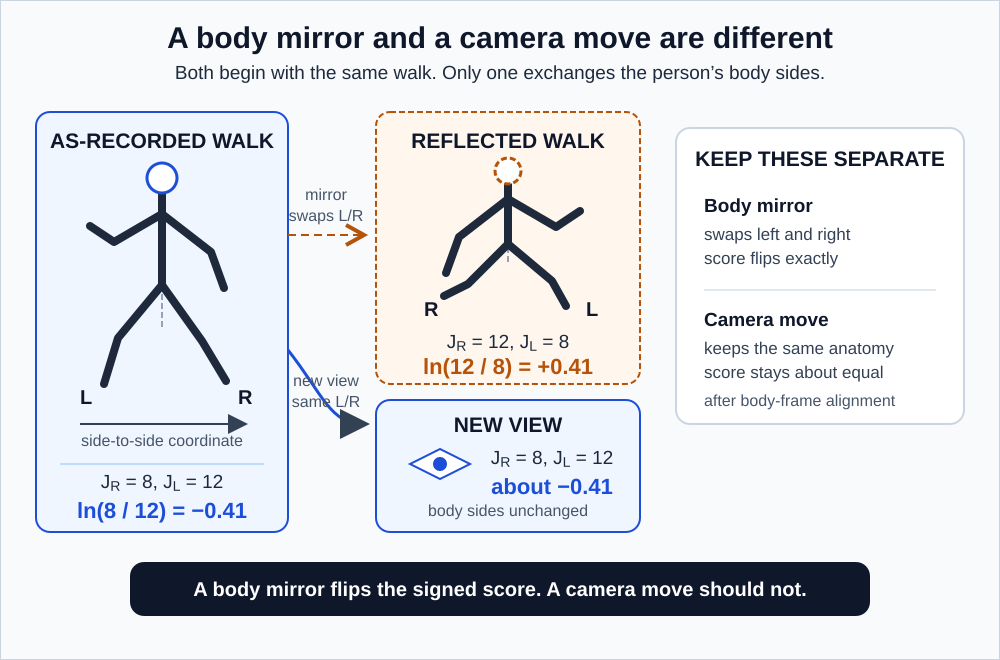
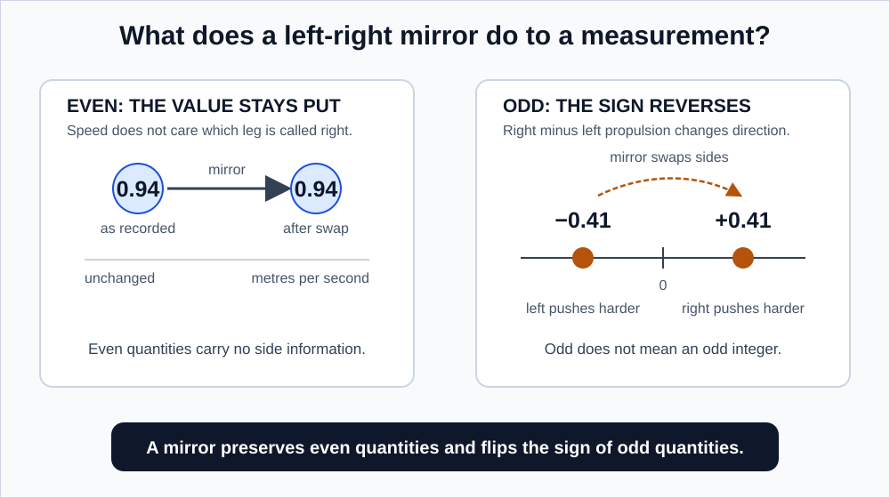
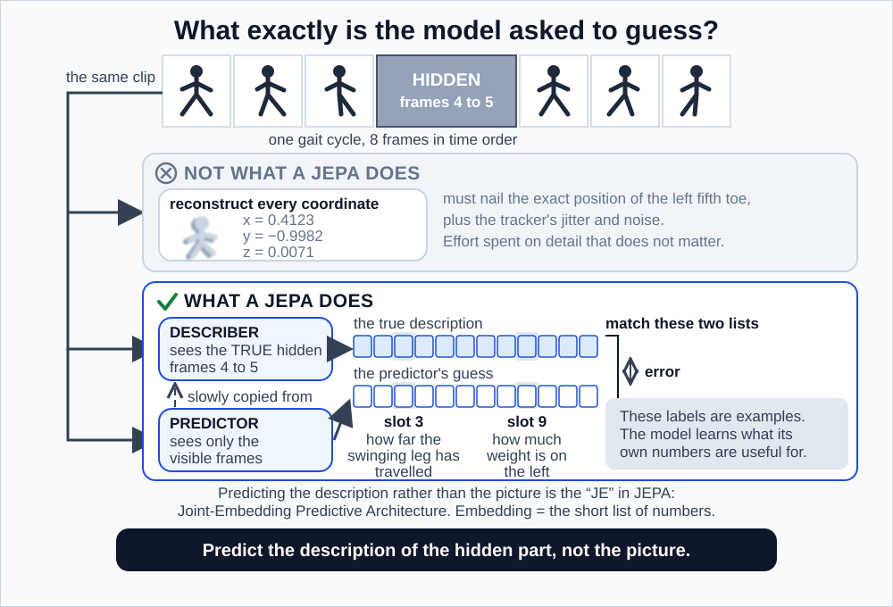
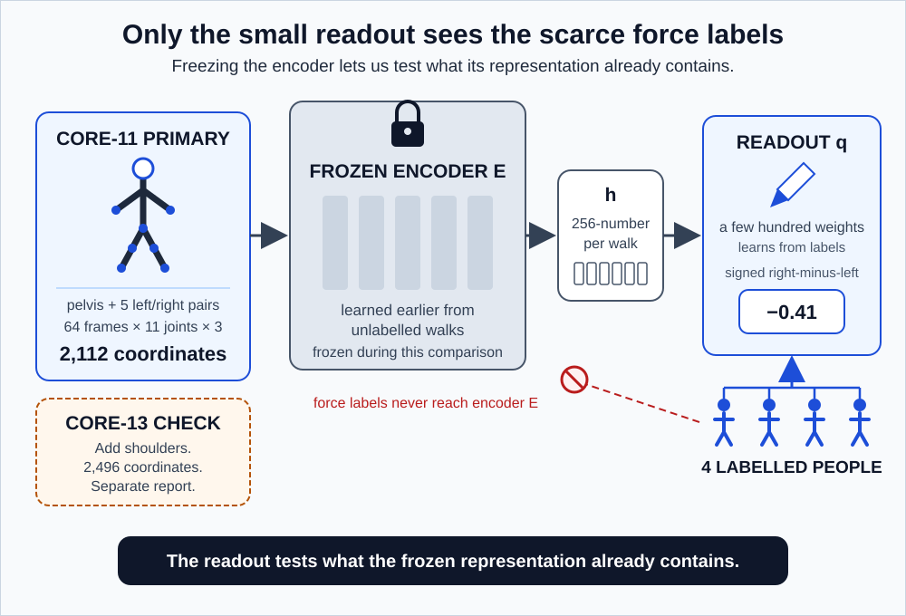
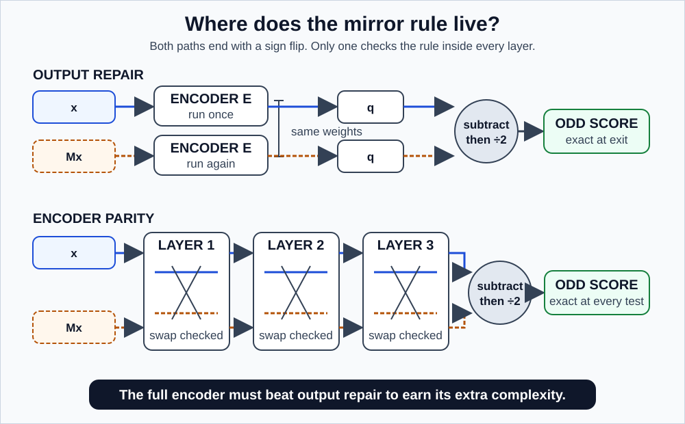
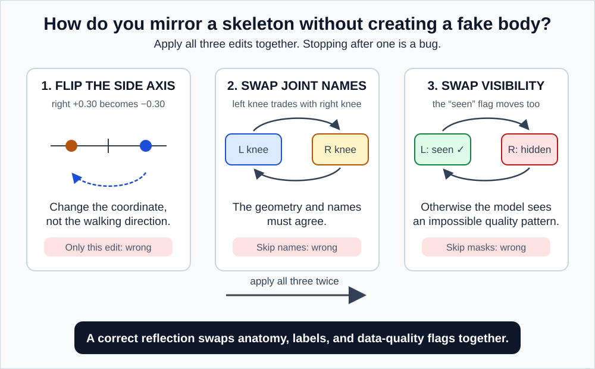
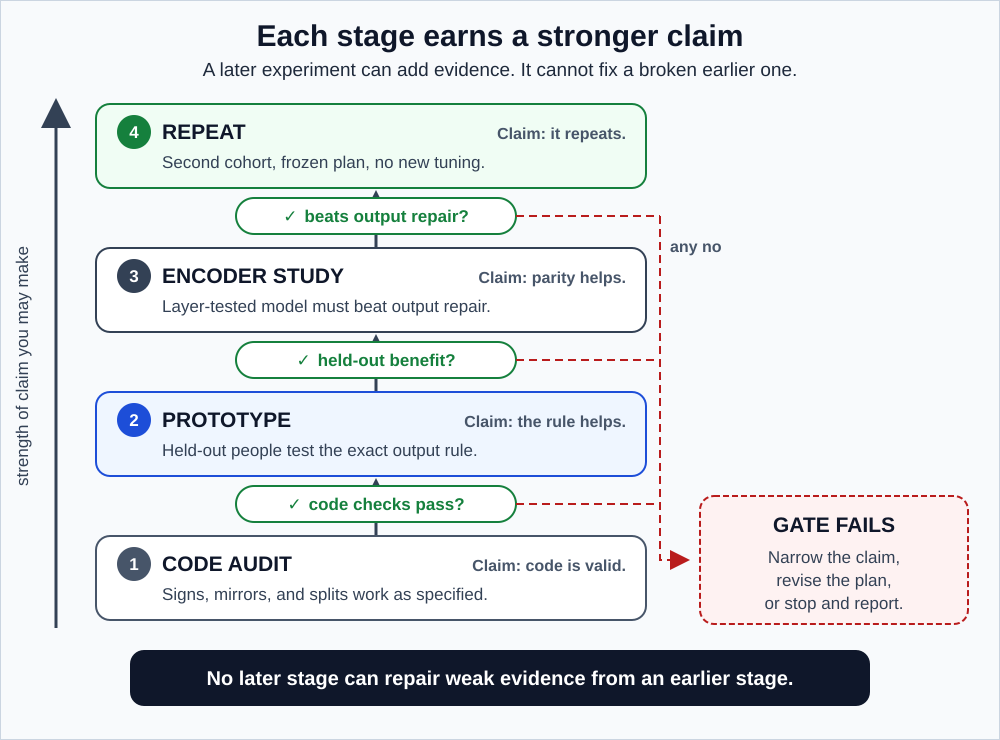

# GaitParity research program

GaitParity studies what a motion representation can legitimately say about
left/right anatomy, sensor coordinates, and biomechanics. It is not a
diagnostic system.

## Program map

| Study | Role | Status |
| --- | --- | --- |
| [01: fixed-reflection JEPA baselines](./studies/01-reflection-equivariant-baselines/) | Correctness, fair controls, and known-symmetry feasibility | Active baseline work |
| [02: semantic-gauge predictive representations](./studies/02-semantic-gauge-predictive-representations/) | Identifiability-aware representation-learning contribution | Proposed main direction; gated |
| [03: biomechanics validation](./studies/03-biomechanics-validation/) | Force, stability, and balance usefulness tests | Secondary validation |

Read the [shared contracts](./shared/) before comparing studies. The Study 02
[proposal and related-work audit](./studies/02-semantic-gauge-predictive-representations/proposal.md)
define which ideas are prior art and which specific claim remains available.
The [tutorial guide](./tutorials/README.md) separates fixed-reflection
runbooks from future semantic-gauge tutorials.

> **Current evidence boundary.** `outputs/repaired-jepa-seed7-v2` establishes
> AMASS pretraining and baseline readiness, not downstream transfer,
> biomechanics, or semantic-gauge performance.

---

## Legacy fixed-reflection background

The remaining sections are retained plain-language background for Study 01.
They explain the fixed anatomical-reflection formulation and must not be read
as the current main-paper claim. Study 02 distinguishes an anatomical-side
action from a sensor-frame action and models an uncertain semantic gauge; see
its [proposal](./studies/02-semantic-gauge-predictive-representations/).

## 1. Start with a person, not an equation

Imagine a fictional woman in her sixties who had a stroke eight months ago. The damage was on the left side of her brain, which can affect the right side of her body. She can walk without a cane now, and if you passed her on the street you might not notice anything.

Her physical therapist notices. In the lab, she walks across a floor with force sensors built into it. The sensors measure how hard each foot pushes against the ground. The numbers come back like this:

| | Forward push from that leg (newton-seconds) |
|---|---|
| Right leg | 8 |
| Left leg | 12 |

During the forward-push part of the step, her left leg produces more propulsive impulse. This one number does not tell us why, or how much body weight either leg supported. It does show a side-to-side difference that is almost invisible at a glance and obvious to the sensors.

Now here is the practical problem. Force plates cost tens of thousands of dollars, live in laboratories, and require someone to walk across them in exactly the right way. There are millions of stroke survivors and very few force plates. Meanwhile almost everyone has a phone camera.

So the question that starts this whole project is:

> **Can a model that only sees body movement from ordinary video or motion capture estimate a side-to-side force difference measured independently by a force plate?**

And once you start asking that, a second question follows immediately, and it turns out to be the more interesting one scientifically. It is about mirrors.

---

## 2. The mirror question

Take that woman's numbers and imagine a **synthetic anatomy-swap test**. It is a mathematical operation on the recorded skeleton and labels, not a real procedure, not a person turning around, and not a camera moving. In the test, every left and right body part and measurement exchanges sides.

What happens to our numbers?

Before the swap, we summarize her asymmetry as right minus left:

$$
8 - 12 = -4
$$

After the swap:

$$
12 - 8 = +4
$$

The size did not change. It is 4 either way. The **sign** flipped, from negative to positive.

That is not a coincidence or a quirk of this example. It is forced by what the quantity means. Any quantity built as "right side minus left side" has to flip sign when you exchange the sides, in the same way that $5 - 3$ and $3 - 5$ have to come out as $+2$ and $-2$. There is no arrangement of the data where this fails.

*Figure 1. Mirroring the body flips the sign of a right-minus-left quantity but keeps its size. Moving the camera changes nothing about the body, so, once both recordings are expressed in the same body-centred coordinates, the answer should stay put. The rest of this document is largely about keeping these two operations from getting confused.*

Now compare that to a different quantity: her walking speed, say 0.94 metres per second. Swap her left and right anatomy and the speed is still 0.94. Speed does not care which side is which.

So we have two categories of quantity:

| Category | What a mirror does to it | Examples |
|---|---|---|
| **Even** | Nothing. Same value. | walking speed, total distance covered, total energy used, height |
| **Odd** | Same size, opposite sign. | right-minus-left push, right-minus-left step length, right-minus-left time spent on each foot |

> **Keep this convention in view.** Every signed score in GaitParity is **right minus left**. Positive means the measured right-side value is larger. Negative means the measured left-side value is larger. A negative score does not by itself identify an impaired side or explain why the difference occurred.

These two words come from function terminology in math class. $f(x) = x^2$ is called an even function because $f(-x) = f(x)$, and $f(x) = x^3$ is odd because $f(-x) = -f(x)$. Same structure, applied to mirroring a body instead of negating a number. **The words have nothing to do with even and odd integers.** That collision of terms is unfortunate and permanent, so it is worth fixing in your head now.

*Figure 2. Two quantities measured on the same walk. Speed is even, so the mirror leaves it alone. Right-minus-left propulsion is odd, so the mirror sends $-4$ to $+4$. Every number in this project is one or the other, and knowing which is not optional.*

### One refinement before we go on: ratio, not difference

The actual protocol does not use the plain difference $8 - 12 = -4$. It uses the log of the ratio:

$$
y = \log\left(\frac{8}{12}\right) = \log(0.667) = -0.41
$$

Same sign, same information about which side is doing more, but two problems get fixed.

**A difference carries body size inside it.** A large athletic adult with a mild 5 percent asymmetry might show a difference of 3 newton-seconds. A small frail adult with a severe 30 percent asymmetry might also show 3. A ratio is scale-free: 8 versus 12 and 80 versus 120 give the same answer, which is what "asymmetry" ought to mean.

**And the logarithm makes the two directions symmetric.** Raw ratios are lopsided: right-double-left gives 2.0, left-double-right gives 0.5. Those are equal degrees of asymmetry in opposite directions, but 2.0 sits 1.0 away from symmetric while 0.5 sits only 0.5 away. Taking the log fixes it, since $\log(2) = +0.69$ and $\log(0.5) = -0.69$. Symmetric, and exactly odd, which raw ratios are not.

So from here on, our participant's target is $-0.41$, and its mirror is $+0.41$. Those two numbers recur throughout this folder.

### Why we care

Here is the leap that makes this a research project rather than a definition.

We want to build a model that reads movement and estimates that signed right-minus-left number. That model is a big pile of learned parameters. Nothing about it automatically knows the rule "mirror the input, flip the output." It has to either learn that rule from examples or be built so that the rule is impossible to violate.

Those are two genuinely different engineering strategies, and which one is better is the legacy **fixed-reflection baseline question**.

---

## 3. Legacy fixed-reflection material

This retained background originally described one immediate fixed-reflection
study and one later force study. They are now both parts of Study 01/Study 03,
while Study 02 is the program's proposed representation-learning direction.

- **Proposal 05 asked a measurement question.** Given a representation that some model already learned, can we read a signed right-versus-left signal out of it at all?
- **Proposal 09 asked a design question.** If we build the mirror rule into the model's architecture, does the model get better?

The clinical question remains deliberately harder: it asks whether an equivariant encoder beats both output repair and unconstrained paired fusion. The immediate public-data study first establishes whether the repaired architecture transfers under strict video grouping. The programme therefore has one active and one future study:

| Study | What it is for | Proposal | Protocol |
|---|---|---|---|
| **Study 01: GAVD fixed-reflection baseline** | Repair the paired JEPA and test video-disjoint gait-pattern transfer on a uniformly re-extracted public cohort | [legacy proposal](./proposals/README_GAVD_ICLR.md) | [legacy method](./methods/METHODS_GAVD_ICLR.md) |
| **Study 03: fixed-reflection force validation** | Test whether the fixed equivariant encoder improves signed force estimation beyond output repair and unconstrained fusion | [legacy proposal](./proposals/README_FORCE_FUTURE.md) | [legacy method](./methods/METHODS_FORCE_FUTURE.md) |

The active GAVD study uses an even, source-video-grouped protocol. The future force study uses an odd, participant-grouped protocol. Their outputs and independent units differ, so their results must stay separate.

The two tracks are separated by **evidence, not by calendar time**. GAVD does not become clinical evidence by producing a good score; force data do not become credible without a participant-safe audit.

---

## 4. What a model actually does here, step by step

If you already know what an encoder and a readout are, skip to section 5.

### 4.1 The input

We do not feed the model video. We feed it a **skeleton sequence**: a list of labelled joint positions over time.

In this repository, a sequence is 64 frames long. Each frame carries 33 body landmarks (nose, shoulders, hips, knees, ankles, heels, toes, and so on), and each landmark has 3 coordinates. So one input is roughly:

$$
64 \times 33 \times 3 \approx 6{,}300 \text{ numbers.}
$$

That is the raw pose-estimator output. The primary **core-11 schema** keeps the pelvis plus the left and right hip, knee, ankle, heel, and toe: $1 + 5 + 5 = 11$ joints, or about $64 \times 11 \times 3 \approx 2{,}100$ coordinates. A prespecified **core-13 sensitivity version** adds the two shoulders when they can be mapped reliably, giving about 2,500 coordinates. The two schemas are not mixed inside one result. The primary comparison uses core-11 so every dataset can contribute; core-13 is reported separately.

Alongside those coordinates we keep a **visibility mask**: a record of which joints were actually seen versus guessed. This matters more than it sounds. In this project's video data, shoulders and hips are visible about 99 percent of the time, but heels are visible only about 68 to 70 percent of the time, because feet get occluded by the other leg, by clothing, and by camera angle. A model that ignores which values are real is partly learning from fabricated numbers.

### 4.2 The encoder

Six thousand numbers is too many, and most of them are redundant. The **encoder** compresses the sequence into a much shorter summary, maybe 256 numbers, called a **representation**.

$$
h = E(x)
$$

Read that as: apply the encoder $E$ to the input $x$, and call the result $h$. A good representation throws away what does not matter (the exact pixel-level jitter of the ankle marker) and keeps what does (that this person spends noticeably longer on their left foot).

### 4.3 How the encoder gets trained: the JEPA idea

Here is the problem with training an encoder for clinical gait. You need labelled examples, and clinical labels are extremely expensive. Every force-plate measurement requires a laboratory, an operator, and a patient willing to come in. A study with 50 stroke survivors is a substantial study.

Fifty examples is nowhere near enough to train a large model from scratch.

**Self-supervised learning** is the workaround. Instead of needing labels, you hide part of the input and make the model **say something about** the hidden part using only the rest. Nobody has to annotate anything, so you can do this on thousands of hours of ordinary movement.

*What* the model has to say about the hidden part is the design choice, and it is where JEPAs differ from most alternatives.

A **JEPA**, which stands for Joint Embedding Predictive Architecture, is one particular way of doing that. Here is its full loop:

1. Hide part of a motion sequence.
2. Turn the visible motion into a compact summary.
3. Predict the hidden part's compact summary, not its exact coordinates.
4. Compare that prediction with a **slow teacher**, an older copy of the model that is updated only a little at a time.
5. Check that the summaries did not collapse into the same answer for every walk.

The important twist is step 3. A JEPA does not ask the model to predict the hidden joint *coordinates*. It asks the model to predict the hidden joints' *representation*.

Why does that twist matter? Because exact coordinates contain a lot of genuinely unpredictable noise. If you hide the left ankle at frame 30 and demand the exact coordinates back, the model burns capacity trying to predict sensor jitter it cannot possibly know. Predicting the representation instead lets the model say "the left ankle is somewhere in mid-swing, moving forward, roughly here" without committing to noise. It learns structure instead of memorizing detail.

*Figure 3. The JEPA training loop. Part of the skeleton sequence is hidden. The model predicts what the hidden part's compact description should be, and is scored against a description produced by a slowly-updated copy of itself. No human labels are involved anywhere in this picture.*

**You should have an objection right about now.** If the model produces both the answer and the grading key, why doesn't it cheat by outputting the same thing for every input? Zero for everything would match zero for everything, and the score would be perfect.

That is exactly right, and that failure has a name: **collapse**. It is the central engineering problem in this whole family of models. The slowly-updated copy is one defence against it; extra penalty terms that force the representation to stay varied are another. Collapse remains a real risk in the fixed-reflection baseline because a channel built by subtraction is unusually easy to collapse to zero; see [Study 01](./studies/01-reflection-equivariant-baselines/).

### 4.4 The readout

Once the encoder is trained, we freeze it. **Frozen** means its parameters are locked and will not change.

We freeze it so that when two readouts differ in performance, the difference was caused by the readouts and nothing else, because both were fed identical representations. Freezing is a controlled-comparison device, not a way to save compute.

Then we attach a small model, called a **readout** or a **probe**, which turns the representation into the number we actually want:

$$
\text{ordinary score} = r(x) = q(E(x))
$$

Readouts are kept deliberately simple, usually a single linear layer. That is on purpose. If we allowed a large, powerful readout, a good score would only prove that a sufficiently determined model can eventually dig *something* out. Keeping the readout simple means a good score tells us the information was sitting there in an accessible form, which is the actual claim we want to make about the representation.

*Figure 4. The division of labour. The encoder learns from large amounts of unlabelled movement and is then frozen. The readout is small, is fitted using the scarce labelled clinical data, and is the only part that ever sees a force measurement.*

---

## 5. Two ways to enforce the mirror rule

Now we can state the actual research question precisely. We want our prediction to be odd: mirror the input, flip the output. There are two ways to make that happen, and they are very different in ambition.

### Way 1: fix the output (easy, and it always works)

Take any ordinary score $r(x)$ you like. It does not have to respect mirrors at all. Then define a new predictor:

$$
r_{\text{odd}}(x) = \frac{r(x) - r(Mx)}{2}
$$

where $Mx$ means "the mirrored version of $x$." In words: run the model on the walk, run it again on the mirrored walk, subtract, halve.

**This is guaranteed to be odd.** Here is the proof, which is three lines and worth following.

Feed it a mirrored input:

$$
r_{\text{odd}}(Mx) = \frac{r(Mx) - r(M(Mx))}{2}
$$

Mirroring twice returns the original, so $M(Mx) = x$:

$$
= \frac{r(Mx) - r(x)}{2} = -\frac{r(x) - r(Mx)}{2} = -r_{\text{odd}}(x)
$$

Done. Whatever $r$ was, $r_{\text{odd}}$ flips sign under mirroring, exactly, every time, with no training required.

A worked example with numbers. Suppose the raw model gives:

- on the original walk: $r(x) = +0.7$
- on the mirrored walk: $r(Mx) = +0.1$

Notice how badly behaved that is. A properly odd model would have returned $-0.7$ on the mirrored input. This one returned $+0.1$, which is not even the right sign. The model has clearly not learned the rule.

The odd construction fixes it anyway:

$$
r_{\text{odd}}(x) = \frac{0.7 - 0.1}{2} = +0.3
$$

$$
r_{\text{odd}}(Mx) = \frac{0.1 - 0.7}{2} = -0.3
$$

Perfect sign flip. Note carefully what this does and does not buy you. It buys a guarantee about the final number. It buys nothing about what is happening inside the encoder, which is still mixing left and right in whatever tangled way it learned. And whether $+0.3$ is a *good estimate* of her actual asymmetry is a completely separate question that only held-out data can answer.

### Way 2: build the rule into the encoder (hard, and it might be better)

The second approach keeps the mirror structure alive through every layer of the network, not just at the end.

The idea: instead of one internal state, carry two, one for the body as recorded and one for the mirrored body. Every layer is built so that mirroring the input simply *swaps* those two channels. At the very end you combine them:

$$
h_{\text{even}} = \frac{h_{\text{orig}} + h_{\text{mirr}}}{2}, \qquad h_{\text{odd}} = \frac{h_{\text{orig}} - h_{\text{mirr}}}{2}
$$

where $h_{\text{orig}}$ is the channel carrying the body as recorded and $h_{\text{mirr}}$ the channel carrying the mirrored body.

Adding gives you the part that ignores side. Subtracting gives you the part that flips with side. Here it is with actual numbers, in a two-dimensional feature space:

$$
h_{\text{orig}} = (2, 5), \qquad h_{\text{mirr}} = (2, -5)
$$

$$
h_{\text{even}} = \left(\tfrac{2+2}{2}, \tfrac{5-5}{2}\right) = (2, 0), \qquad
h_{\text{odd}} = \left(\tfrac{2-2}{2}, \tfrac{5+5}{2}\right) = (0, 5)
$$

The first feature was side-blind and lands entirely in the even channel. The second was side-flipping and lands entirely in the odd channel. Real feature vectors are hundreds of dimensions and most components are mixtures, but the arithmetic is exactly this.

The model now has even and odd information cleanly separated by construction, at every depth, rather than tangled together and patched at the exit.

*Figure 5. Two strategies. On top, an ordinary encoder with a corrective rule bolted onto the output. On the bottom, paired channels maintained all the way through. Both produce an exactly odd final answer. Only one has an organized interior.*

### Why Way 2 might win, and why it might not

The honest case **for** it: clinical datasets have very few people. A standard model has to *infer* the mirror rule from those few people, and with 50 participants it may simply not have enough evidence to get it right. A model with the rule built in gets it for free and can spend all its learning capacity on things it actually has to learn. When data is scarce, built-in structure is usually where the wins come from.

The honest case **against** it: maybe the standard encoder already picks up enough mirror structure on its own. Maybe patching the output captures the entire benefit and the interior organization adds nothing measurable. Maybe the constraint removes flexibility the model needed. Maybe the real bottleneck is not symmetry at all but the quality of the force measurements.

All of those are real possibilities, and several of them would be genuinely useful findings. A clean, well-controlled negative result here saves other researchers from building the same thing.

**This is the pivot of the whole program:** the full study is only worth doing if it can beat the four-symbol output fix, $r_{\text{odd}}(x) = [r(x) - r(Mx)]/2$. Any paper claiming an equivariant architecture helps, without comparing against that trivial baseline, has not actually shown what it thinks it has shown.

There is a name for what Way 2 is trying to be. An **inductive bias** is any assumption built into a model's structure rather than learned from data. Way 1 is a correction applied after the fact; Way 2 is an inductive bias. Good inductive biases help most when data is scarce, because they supply for free what the model would otherwise have to work out from examples. Bad ones cost you, because they forbid solutions that were actually correct. Which kind this one is happens to be the research question.

---

## 6. The trap that makes this hard: mirrors versus cameras

There is one confusion that would quietly destroy this project, and it deserves its own section.

**A mirror is not a camera move.**

Suppose we film the same woman from her left side and then from her right side. In the raw video, these two recordings look roughly like mirror images of each other. The leg nearer the camera changes, the direction of travel across the frame flips.

But nothing about *her* changed. Her right leg is still her right leg. Her stroke is still on the same side. The measurement we care about is still $-3.3$.

If a model treats "filmed from the other side" as equivalent to "mirrored body," it will confidently report that her weak side switched when the camera operator walked around her. In a clinical setting that is not a small error; it is the error that makes the whole system useless.

So the two operations are kept rigorously separate:

**Anatomical reflection $M$** does three things at once, and all three are required:

1. Negate the side-to-side coordinate.
2. Swap every left joint with its right twin. Left knee becomes right knee, left heel becomes right heel, and so on for all bilateral joints. Midline joints such as the pelvis centre stay where they are.
3. Swap the corresponding visibility masks and confidence values too. If the left heel was poorly seen, then after mirroring it is the *right* heel that is poorly seen.

Step 3 is the one people forget. If you flip the coordinates but not the masks, you have created an impossible body: right-side geometry paired with left-side data quality. A model can detect that inconsistency and use it as a shortcut, and your "mirror test" is then measuring nothing.

*Figure 6. All three steps of an anatomical reflection. Getting two of three right produces a body that could not exist, which models are very good at noticing and exploiting.*

**A viewpoint change $V$**, by contrast, rotates or reprojects the same person without touching which limb is which. After both recordings have been converted into the same body-centred coordinate system, we want:

$$
s(Vx) \approx s(x)
$$

The prediction should stay put. Note the $\approx$ rather than $=$. Real camera changes bring real differences in what is visible and how much pose-estimation error creeps in, so exact equality is not achievable or expected.

Compare this to the reflection requirement, which *is* exact:

$$
s(Mx) = -s(x)
$$

Two operations, two different expected behaviours, two separate tests. Never one combined "symmetry check."

---

## 7. The central research question

Putting it all together:

> Across held-out clinical and non-clinical participants, do learned skeleton representations still contain the right-minus-left signal, in a form that flips sign when you mirror the body, and does explicitly building in the mirror rule make that signal more accurate, more robust, and easier to learn from a small number of labelled people?

("Laterality" is the technical word for side-ness: which of the two body sides something belongs to or favours. "Signed laterality" is therefore just a right-minus-left number with its direction kept.)

That single sentence hides four separate questions, which need four separate kinds of evidence:

1. **Is the signal there at all?** Does the representation contain side-specific information? *(Evidence: can a simple readout recover a signed target from held-out people?)*
2. **Is the geometry right?** Does the prediction flip under an anatomical mirror while staying stable under a camera change? *(Evidence: separate mirror tests and separate view tests.)*
3. **Does the rule help you learn?** With only 4, 8, or 16 labelled people, does building in the rule beat not building it in? *(Evidence: learning curves over label budgets.)*
4. **Does it mean anything physically?** Does the skeleton-based estimate agree with an independent instrument? *(Evidence: force-plate measurements the model never saw.)*

No single score answers all four, and a system can pass some and fail others in informative ways. A model could be geometrically flawless and clinically worthless. That combination is a real result, not a failure of the study.

---

## 8. The research ladder

*Figure 7. Each rung earns a stronger claim than the one below. Climbing higher does not repair weak evidence lower down.*

| Milestone | What it runs on | What you are then allowed to say |
|---|---|---|
| **1. Code and representation audit** | GAVD, grouped by source video | "The existing pipeline is wired correctly, and the historical representation does retain a coordinate-derived side signal." |
| **2. Output-parity prototype** | Held-out stroke participants | "An exactly odd readout does, or does not, beat a matched readout that gets the same information without the rule." |
| **3. Equivariant encoder study** | Matched standard, paired-unconstrained, and equivariant JEPAs | "Encoder-wide mirror structure does, or does not, add value beyond output repair and ordinary two-branch fusion." |
| **4. Locked replication** | A second clinical cohort | "The effect reappears under a frozen protocol, or it does not." |

A **cohort** is a specific named group of people recorded under one protocol, such as the 50 stroke survivors from one published study. **Locked** and **frozen** are not metaphors: in practice they mean the analysis plan is committed to version control with a timestamp, and the second cohort's outcome data sits in a separate archive nobody on the modelling side can open until the earlier analysis is written up.

A note on GAVD, since it is the dataset already sitting in this repository and the temptation to over-claim from it is strong. GAVD is genuinely useful at rung 1 because it will expose a sign error, a broken mirror, or a leaky split quickly and cheaply. It cannot support rungs 2 through 4, for three specific reasons:

- The existing model was trained on the very recordings you would evaluate on. Results are **transductive**: the encoder has already seen the test inputs, so a good score does not tell you it works on new people.
- Participant identities are unavailable. Multiple clips cut from one YouTube video are not independent observations, so the best available grouping is by source video, which is coarser than by person.
- The signed target is computed from the same coordinates the model receives. Recovering it is a code check, not independent biomechanical evidence. The force plate is independent. A number derived from the input is not.

---

## 9. What would count as a real result

A useful outcome here is not the same as a win. Here is the full outcome table, written down *in advance*, which is the point. Deciding what counts as success after seeing your results is how researchers fool themselves and each other.

| What we observe | What we are allowed to conclude |
|---|---|
| The exact odd readout beats a matched unconstrained readout | The mirror rule helps at the output. Worth building the harder version. |
| A fully equivariant encoder then beats the exact odd readout | Organizing the whole representation adds real value. This is the headline result. |
| The equivariant encoder ties the odd readout | The cheap fix captures everything available. Useful, and it saves other people work. |
| Mirror behaviour improves but force prediction does not | Cleaner geometry, no added clinical meaning. Interesting and limited. |
| Plain hand-computed kinematic features win | The learned representation added nothing for this task. A genuinely useful negative result. |
| The effect vanishes in a second cohort | The first result did not generalize. Report it. |
| Confidence intervals are wide | Inconclusive. Not "trending positive." |

That last row deserves emphasis. A favourable average with an interval spanning zero is an inconclusive result, and describing it as a promising trend is the most common way honest people overstate their findings.

---

## 10. What this program does not claim

GaitParity is a study of representations and biomechanics. It is not a diagnostic system, and there are specific reasons for each boundary.

- **An asymmetry score computed from coordinates is not a clinical biomarker.** Establishing a biomarker requires three kinds of evidence this project does not attempt to gather: *reliability* (does it give the same number twice on the same person?), *responsiveness* (does it move when the patient actually gets better?), and *outcome relationship* (does it predict anything that happens to them later?).
- **The sign does not automatically identify the affected side.** Compensation can reverse the direction of a measured difference. Someone with a weak right leg may show a movement pattern that reads as left-dominant on one particular measure.
- **Exact mirror behaviour does not imply medical usefulness.** A model can be perfectly, provably odd and predict nothing worth knowing. Section 9 lists this as an expected possible outcome.
- **Agreement with force is concurrent evidence, not causal evidence.** Two things measured at the same time that correlate do not establish that one causes the other, or that changing one changes the other.
- **Many walking cycles from one person are not many participants.** Thirty cycles from one woman tell you about one woman. This sounds obvious and is violated constantly, which is why an entire section of the shared methodology exists to prevent it.

---

## 11. Reading order

1. **This page**, for what is being asked and why.
2. **[GLOSSARY.md](./GLOSSARY.md)**, when a word stops you. Keep it open in a second tab.
3. **[Study 01](./studies/01-reflection-equivariant-baselines/)** and its retained [GAVD runbook](./methods/METHODS_GAVD_ICLR.md) for fixed-reflection baseline work.
4. **[Study 02](./studies/02-semantic-gauge-predictive-representations/)** for the proposed representation-learning contribution and its gates.
5. **[Study 03](./studies/03-biomechanics-validation/)** only when a participant-safe biomechanics study is ready.

---

## Core references

1. Abdelfattah and Alahi, S-JEPA, ECCV 2024. [DOI](https://doi.org/10.1007/978-3-031-73411-3_21).
2. Assran et al., I-JEPA, CVPR 2023. [arXiv](https://arxiv.org/abs/2301.08243).
3. Bardes et al., V-JEPA, 2024. [arXiv](https://arxiv.org/abs/2404.08471).
4. Cohen and Welling, group-equivariant convolutional networks, ICML 2016. [Paper](https://proceedings.mlr.press/v48/cohenc16.html).
5. Van Criekinge et al., full-body gait data from 138 able-bodied adults and 50 stroke survivors, *Scientific Data* 2023. [DOI](https://doi.org/10.1038/s41597-023-02767-y).
6. Bowden et al., paretic-limb propulsion after stroke, *Stroke* 2006. [DOI](https://doi.org/10.1161/01.STR.0000204063.75779.8d).
7. Patterson et al., gait symmetry after stroke, *Gait & Posture* 2010. [DOI](https://doi.org/10.1016/j.gaitpost.2009.10.014).
8. Kapoor and Narayanan, leakage in machine-learning science. [arXiv](https://arxiv.org/abs/2207.07048).
