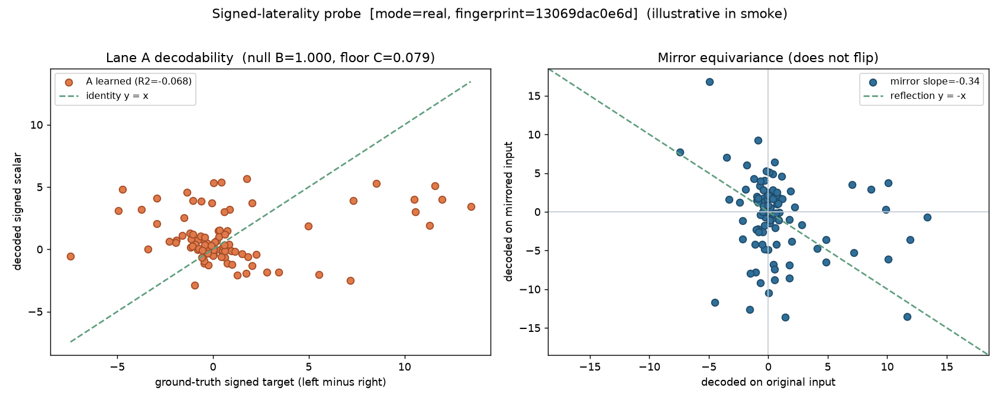
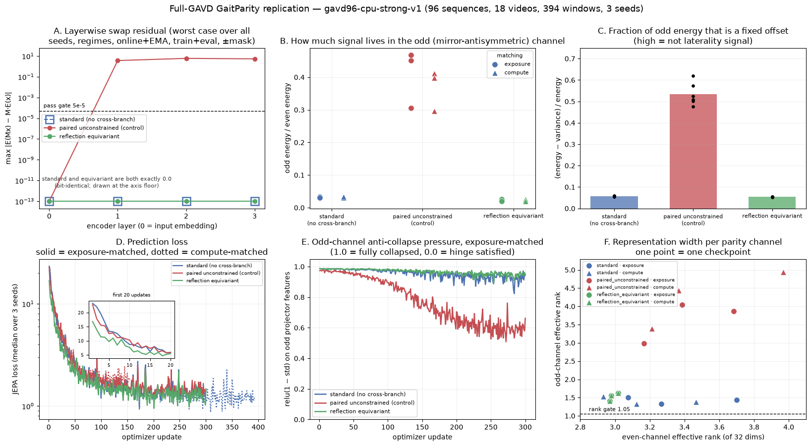

# What the GaitParity experiments currently show

> **Study 01 evidence only.** These results concern fixed known reflection and
> baseline readiness. They do not test the semantic-gauge contribution; see
> [Study 02](../studies/02-semantic-gauge-predictive-representations/).

## The new question

GaitParity asks whether a movement model preserves which side of the body is which. To test this, the researchers make an **anatomical mirror** of a walking skeleton. This swaps the body's paired landmarks and reverses the body-centred left-right direction. It is not the same as moving a camera or asking a person to turn around.

Some features of a walk should stay the same in a mirror. For example, a description of overall pace should not suddenly become its opposite. A right-versus-left difference should reverse. This gives the research a clear rule: mirror the body, and a signed left-right answer must change direction.

## Looking at the earlier movement model

The first test asked whether an existing movement model contained a usable left-right direction. The answer was no. A simple reader trained on the model's internal features did not recover the constructed left-right movement score in a useful way. Its answer also failed the mirror check.

That is an **informative null result**. It does not mean that left-right gait information is impossible to learn. It means this particular saved model, combined with this particular simple reader, did not provide it. Knowing that early is valuable: it stops the project from presenting a weak signal as a discovery.

*Figure. This is the original graph saved by the notebook, not a redrawn summary. The left plot asks whether the model's estimates follow the constructed left-right movement score. The right plot asks whether its estimates reverse under an anatomical mirror. Neither plot supports a useful signed readout from this older model.*

The graph is an audit of recordings the model had already encountered. It is not a test on new people, and its constructed target is not a force-plate measurement. It tells us where this route failed, not how well a future clinical system will work.

## Building and checking the mirror rule

The next set of notebooks builds models that can be tested directly for left-right consistency. One version handles an ordinary walk and its mirror separately. Another lets the two views interact without forcing them to follow a mirror rule. The final version ties the two views together so that swapping left and right has a predictable effect throughout the model.

This work revealed an important trap. A model can obey the mirror rule in a useless way by putting nothing meaningful in the part of its representation that is supposed to change. It is a little like a sign that always says “turn left” because the sign has no information at all. The project therefore checks both the mirror rule and whether the changing part of the model contains varied, non-empty activity.

## What the controlled feasibility work shows

The saved audit below comes from the later notebook pipeline. It shows that the mirror-aware version can follow its intended rule in the tested code, while the deliberately unrestricted comparison can fail the same check. That is good evidence that the audit can notice a real geometry mistake.

*Figure. This is the complete graph saved by the notebook. It checks mirror consistency, the activity of the left-right-sensitive channel, learning behaviour, and feature variety. It is a local feasibility audit on known recordings, not a force-prediction or clinical result.*

The checks also show why restraint is needed. Passing a basic health check does not prove that a model has learned a rich or useful notion of laterality. The recordings do not contain the independent force measurement needed for the main GaitParity question, and the same collection supports both model development and auditing.

## What can be concluded now

The earlier model did not provide a useful signed left-right readout. The new mirror-aware design can be implemented, checked, and distinguished from a version that breaks the rule. Those are real engineering and research milestones.

They do not yet show that the design improves a meaningful gait measurement, works for new people, or has clinical value. The strongest honest description is: the project has a working way to test left-right geometry and a reason to take that test to an independent force-plate study.
