# Wrench-JEPA

## Seven concrete research directions for physically grounded human and object world models

**Research design, 2 September 2026**

This document is a research agenda, not a report of new experimental results. It is grounded in the current repository, the two project writeups, the requested papers and tools, and a broader primary-source literature review. Every proposed claim has a measurable failure condition. The central recommendation is to stop treating plausible-looking skeleton motion as evidence of physics understanding. Instead, make contact, force exchange, uncertainty, and controlled intervention observable parts of the learning problem.

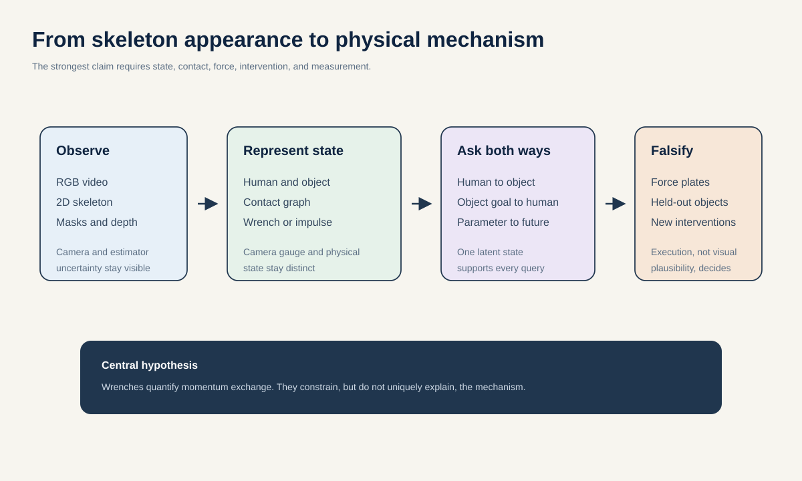

## Executive decision

The best single paper direction is:

> **Wrench-JEPA: learn one latent world state that can predict object motion from human action, infer multiple physically valid human actions from a desired object motion, and change its prediction correctly when mass, friction, support, or strength changes.**

The latent state should not be only a skeleton embedding. It should contain four typed token families:

1. human state tokens, such as SMPL or release-safe joint positions, velocities, and body parameters;
2. object state tokens, such as object keypoints, pose, velocity, and geometry;
3. contact tokens, specifying which surfaces touch, when they touch, and the contact mode;
4. wrench tokens, specifying force, torque, or impulse exchanged at each contact.

This turns the analogy to Masked Visual Actions into a biomechanics question. If the human is visible and the object future is hidden, the model performs forward dynamics. If the desired object path is visible and the human is hidden, the model performs inverse action inference. If a physical parameter is changed while appearance is held fixed, the model must predict the counterfactual consequence.

The seven ranked ideas are:

| Rank | Direction | Core contribution | Best use |
|---:|---|---|---|
| 1 | Wrench-JEPA | Bidirectional human-object prediction through contact and wrench tokens | Flagship world-model paper |
| 2 | Paired Counterfactual Mechanics | Paired interventions that force the latent to encode causal physical parameters | Mechanism paper and training substrate |
| 3 | Force-Calibrated Feasibility Energy | A decomposable and calibrated probability of physical acceptability | Fastest rigorous biomechanics paper |
| 4 | Contact-Mode Generative S-JEPA | Multiple SMPL and object futures generated through discrete contact modes | Generative extension |
| 5 | Cross-Embodiment Action Alphabet | A shared contact and impulse language for humans, robots, and sensors | High-risk, high-upside transfer paper |
| 6 | Gauge-Aware 4D Biomechanics | Metric scene lifting with explicit uncertainty and scale identifiability | Perception foundation |
| 7 | Value-of-Information Biomechanics Agent | Qwen learns when a tool is worth its cost, not merely how to call it | Agentic systems paper |

With the stated eight-H100 compute budget and rapid agentic implementation, run ideas 2 and 3 in parallel first, then idea 1. Idea 3 supplies the measurement instrument. Idea 2 supplies controlled causal training data. Idea 1 uses both to make the broad world-model claim. Ideas 4 through 7 are fast follow-ons after the core result, not prerequisites.

## What the current project actually establishes

The repository contains valuable engineering and unusually careful negative evidence. It does not yet establish a physically grounded or clinically generalizable world model.

### Assets worth preserving

- The AmbientPose stack already provides modular video ingestion, multiple pose estimators, temporal analysis, caching, exports, and provenance-aware processing. This is a useful front end for building a richer 4D state.
- The GAVD6 S-JEPA work provides an implemented skeleton tokenization pattern, EMA target encoder, masked predictor, validity masks, anti-collapse regularization, and extensive shortcut controls. See the [GAVD6 technical report](../docs/history/urtc-2026/staged_sjepa_gait.md).
- The AMASS Core11 conversion schema and manifest record metric and world-frame metadata, identity-separated splits, content hashes, lazy loading, fixed update plans, and anatomically correct reflection operations. No converted Core11 tensor archives are committed here. The current trainer validates several metric fields but returns normalized coordinates to the model, so those fields are an opportunity rather than an existing capability. See [amass_core11_training_pipeline.py](../../src/gavd6_sjepa/research_directions/reflection_equivariance/amass_core11_training_pipeline.py) and [jepa_model_architecture.py](../../src/gavd6_sjepa/research_directions/reflection_equivariance/jepa_model_architecture.py).
- The existing research portfolio from the analyzed experimental workspace proposes controls and studies for masking geometry, target design, laterality, viewpoint, label leakage, and provenance. The new agenda should execute and extend those controls rather than present them as completed evidence.
- The analyzed GaitParity decks already sketch the broader Biomech-JEPA vision: body, scene, objects, contact, dynamics, uncertainty, depth, simulation correction, generative keypoints, and a Qwen tool policy. The contribution of this document is not inventing those ingredients. It operationalizes them into seven novelty-bounded questions, measurable endpoints, matched controls, data contracts, and stopping rules.

### What the two project writeups contribute

The 2025 internship writeup documents the bridge from raw older-adult video to structured gait analysis. It compares several pose estimators, selects OpenPose for temporal coverage and consistency in that archive, and records 14 annotated source videos. Its Gemini 2.5 Pro experiments also show that video-only, pose-only, and combined prompting can sound plausible while disagreeing with ground truth. That result directly motivates three choices here: never use a VLM as the physics judge, expose structured tool outputs to Qwen, and reward the agent from hidden measurements rather than prose similarity.

The S-JEPA writeup contributes a stronger experimental discipline: 64-frame windows, 16 temporal blocks, Core11 anatomy, identity-separated AMASS evaluation, explicit laterality limits, matched controls, artifact fingerprints, and a predeclared stopping rule. Its central result is informative because it is negative: the probability-aware SG-JEPA mechanism did not beat a uniform control. The next paper should keep that falsification culture while changing the scientific target from masked-skeleton completion to contact mechanics.

The same writeup reports two further null results that constrain every proposal below. On the strict 90-frame GAVD cohort, frozen S-JEPA variants underperformed raw Core11 features and some random controls. On the 24-participant StrokePIG cohort, every tested representation had negative held-out $R^2$. There is therefore no current evidence that S-JEPA improves a meaningful downstream target.

### Evidence boundaries that must remain visible

1. **The clinical-video result is transductive.** The final encoder saw every evaluated GAVD sequence, and only 18 source videos support the canonical five-class analysis. A source-grouped downstream classifier cannot undo encoder exposure.
2. **Every recorded five-class geometry is weak, but the lineages must not be mixed.** The legacy `d0acc262`/`dba24a` documentation reports a silhouette near 0.009, minimum centroid distance near 0.037, and within-condition distance near 0.120. Embedded `13069dac` notebook output instead reports about 0.028, 0.027, and 0.118. Neither set shows clean separation, and neither should be called the current result until a state-hash-bound rerun is complete.
3. **Detector missingness is informative.** The legacy missingness-only control is about 0.448 accuracy, while embedded `13069dac` output is about 0.414. Pose-estimator behavior therefore carries condition-related signal and can become a shortcut. These values remain lineage-tagged diagnostics, not interchangeable headline results.
4. **The configured 60 percent target mask was not realized per sample.** The batch-minimum rule produced mean eligible fractions of 0.551 at Stage 0 and 0.423 at Stage 4. The sampler is uniform and does not inspect motion.
5. **Laterality has an identifiability limit.** A global left-right label swap cannot be detected from internally consistent skeleton coordinates alone. An external anatomical or image-space anchor is required.
6. **The attached AMASS study reports a negative mechanism result, not a negative prediction result.** For lower-is-better error, SG-JEPA improved over correction-first: 0.8671 versus 0.9300 on the side-sensitive task and 0.6696 versus 0.7472 on the side-insensitive task. The matched uniform control was fractionally better than SG-JEPA at 0.8668 and 0.6690. The intended probability-aware mechanism is therefore unsupported, so the pre-set stopping rule correctly withheld confirmatory seeds and the sealed test.
7. **That attached AMASS benchmark is not fully reconstructable from committed run artifacts in this checkout.** The committed Core11 manifest and trainer are a different follow-on pipeline, not the reconstruction assets for the writeup's 3,076-motion laterality benchmark. Treat the benchmark as a reported pilot until its exact tensors, checkpoint, evaluation bundle, and fingerprints are bound.
8. **Several GAVD lineages coexist.** Documentation, tracked artifacts, and embedded notebook outputs refer to different fingerprints and feature widths. Before extending GAVD, reconcile the experiment contract, state hashes, and the 256 versus 384 dimensional pooling descriptions.
9. **No current pipeline contains force, object contact, metric depth, a simulator, an RL agent, or a generative motion likelihood.** Each is a genuine new research component. None may be implied by the current S-JEPA loss.
10. **The current parity controls need precise language.** The `standard` OrbitEncoder already applies the same tokenizer and Transformer independently to both reflection branches, so branch-swap equivariance is expected. The `reflection_equivariant` variant adds symmetric cross-branch fusion; `paired_unconstrained` is the actual geometry-violating control. A zero standard commutation residual is therefore not evidence of learned reflection structure.

These are not reasons to abandon the project. They identify the precise shift needed: move from small-cohort label separation toward causal, force-validated prediction on identity-separated data.

## First principles: what would count as understanding physics?

Let the image observation at time $t$ be $o_t$. A useful physical state is richer than pixels:

$$
s_t = \{q_t, \dot q_t, x_t^{obj}, \dot x_t^{obj}, c_t, w_t, \theta, \beta, g_t\}.
$$

Here, $q$ is human configuration, $x^{obj}$ is object state, $c$ is contact topology, $w$ is a contact wrench, $\theta$ contains environment parameters such as mass and friction, $\beta$ contains body parameters, and $g$ contains camera and geometric gauge variables. Dynamics relate consecutive states:

$$
s_{t+1} = F(s_t, a_t; \theta, \beta), \qquad o_t = H(s_t; g_t) + \epsilon_t.
$$

The action $a_t$ may be a joint torque, muscle activation, robot command, or an unobserved human motor command. The observation function $H$ projects the physical state through a camera and an imperfect estimator.

This decomposition explains five recurring confusions.

### 1. Kinematic plausibility is not dynamic feasibility

A smooth skeleton can still require impossible ground forces or joint torques. Conversely, an unusual pathological gait can be dynamically valid. Smoothness and resemblance are weak tests. A stronger test asks whether some physically admissible forces, contacts, body parameters, and camera geometry can jointly explain the observation within uncertainty.

### 2. Prediction is not enough

A model can predict the next frame from texture or dataset frequency. Physics understanding requires correct response to intervention. If an otherwise identical object becomes heavier, or friction falls, the predicted motion and required human action should change in the right direction and by a reasonable amount.

### 3. The inverse problem is a distribution

One object trajectory can be produced by different grasps, limbs, contact schedules, and compensatory motions. A single least-squares answer averages incompatible solutions. The correct output is a calibrated distribution over contact modes and continuous motions.

### 4. Metric depth is partly unidentifiable from one camera

Monocular video often admits a family of scaled 3D explanations. Body-height priors, focal length, floor geometry, known objects, motion, and multiple views reduce the ambiguity but do not erase it. A model should carry scale uncertainty forward instead of silently choosing one scale.

### 5. A simulator is a model, not nature

MuJoCo and OpenSim enforce specified equations and assumptions. They can generate counterfactuals and fit latent variables, but their residual is not automatically physical truth. Real force plates, calibrated depth, marker trajectories, and instrumented sensors remain the validation anchors.

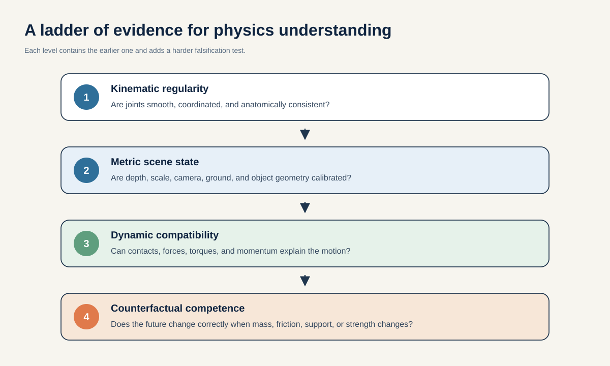

### A measurable definition of physical groundedness

For an observed clip $o$, define the feasible-set distance as the best joint fit of hidden state and dynamics:

$$
D(o) = \min_{s,a,\theta,\beta,g}
\left[
L_{obs}(H(s;g),o) +
\lambda_{dyn}L_{dyn}(s,a;\theta,\beta) +
\lambda_{contact}L_{contact}(s) +
\lambda_{prior}L_{prior}(\theta,\beta,g)
\right].
$$

Low distance means that at least one physical explanation fits the evidence. It does not prove that the explanation is unique. The proposed feasibility model converts a vector of residuals and uncertainties into a calibrated probability, not an arbitrary aesthetic score.

### How S-JEPA can be both discriminative and generative

The existing S-JEPA encoder can remain a discriminative representation learner. Frozen probes can read action, contact, force, or impairment-relevant axes from its tokens. Generation needs extra machinery:

- a stochastic latent variable or discrete contact-mode code;
- a decoder into SMPL or release-safe joint trajectories plus object keypoints;
- a proper probabilistic objective such as diffusion, flow matching, or autoregressive likelihood;
- physical ranking or projection that preserves diversity;
- calibration tests over repeated or simulated outcomes.

A deterministic JEPA predictor alone is not a motion generator. A video renderer such as Wan2.2 can make outputs viewable, but visual realism is never the physics metric.

## What the requested work contributes

| Work | Reliable lesson for this project | Important limit |
|---|---|---|
| [GoalForce](https://arxiv.org/abs/2601.05848) | Explicit spatial tokens for direct force, goal force, and mass can make control variables visible to a video model. | Its force and mass labels are relative synthetic controls, not calibrated human biomechanics. |
| [Masked Visual Actions](https://arxiv.org/abs/2607.19343) | Entity masking can turn one model into a forward or inverse model. Dense entity masks generalized better than sparse robot skeletons. | The authors explicitly distinguish learned correlation from causality. Human inverse dynamics is more multimodal than the demonstrated robot setting. |
| [ControlNet](https://arxiv.org/abs/2302.05543) | A frozen pretrained path plus a trainable copy connected by zero-initialized adapters can add new conditions without immediately destroying old features. | Conditioning improves control, not physical validity by itself. |
| [S-JEPA](https://sjepa.github.io/) | Joint-level latent prediction and motion-aware masking are strong skeleton-specific pretext ideas. | Action-recognition gains do not establish kinetics, metric geometry, causality, or clinical validity. |
| [V-JEPA 2](https://arxiv.org/abs/2506.09985) | Large observation-only pretraining can be post-trained with limited action data into an action-conditioned latent world model. | Scale and robot-video access differ sharply from this repository. |
| [DINO-WM](https://arxiv.org/abs/2411.04983) | Latent spatial features can support goal-conditioned planning without reconstructing pixels. | It does not provide human musculoskeletal validity or force calibration. |
| [MuJoCo and MJX](https://mujoco.readthedocs.io/en/stable/overview.html) | Fast rigid-body forward and inverse dynamics, contact, tendons, and batched counterfactual rollout are practical. | Native MuJoCo is not an end-to-end differentiable minibatch loss. MJX-JAX supports many gradients; MJX-Warp currently does not. Contact remains numerically delicate. |
| [OpenSim Moco](https://journals.plos.org/ploscompbiol/article?id=10.1371/journal.pcbi.1008493) | Subject-scaled musculoskeletal tracking, prediction, and parameter optimization can supply interpretable offline corrections. | Direct-collocation solves are expensive, model-specific, and can reach local minima. Cache and distill them first. |
| [SAM 2](https://github.com/facebookresearch/sam2) | Promptable video mask propagation can separate people and objects and expose dense entity trajectories. | Occlusion and identity mistakes must remain explicit uncertainties. |
| [WHAM](https://github.com/yohanshin/WHAM) | 2D keypoints, image features, camera motion, and foot contact can produce world-space SMPL motion from video. | World-space output is still a pseudo-label affected by camera, focal-length, body-prior, and SLAM error. |
| [Video Depth Anything](https://github.com/DepthAnything/Video-Depth-Anything) and [VGGT](https://github.com/facebookresearch/vggt) | Temporally consistent depth and joint camera-geometry estimation can supply a 4D scene scaffold. | Raw metric accuracy and temporal scale drift must be tested on RGB-D data. Scale-aligned metrics alone are insufficient. |
| [SleepFM](https://www.nature.com/articles/s41591-025-04133-4) | Leave-one-modality-out alignment is a strong recipe for heterogeneous and missing sensors. | Sleep signals and movement dynamics are different domains. The objective is inspiration, not evidence. |
| [GaitDynamics](https://www.nature.com/articles/s41551-025-01565-8) | A generative model can jointly inpaint kinematics and estimate ground reaction forces at AddBiomechanics scale. | It is a strong baseline or teacher, not independent ground truth on overlapping AddBiomechanics data. |
| [AddBiomechanics](https://addbiomechanics.org/download_data.html) | Public subject-scaled kinematics, measured ground reaction forces, and inverse-dynamics quantities make force-validated learning possible. | Use kinematics-pass inputs when predicting force. Dynamics-pass kinematics may contain force-plate information and leak the target. |
| [GEN-1.5](https://generalistai.com/blog/gen-1.5) | Short demonstration conditioning and rapid embodiment adaptation motivate cross-embodiment tests. | It is a corporate report without a released model, paper, data, or reproducible baseline. |
| [Wan2.2](https://github.com/Wan-Video/Wan2.2) | Pose-conditioned video can communicate generated motion and test whether a renderer preserves a planned trajectory. | Photorealism is not physics. Large variants are also compute-intensive. |
| [Qwen-Agent](https://github.com/QwenLM/Qwen-Agent) and [Qwen3-VL](https://github.com/QwenLM/Qwen3-VL) | Open function calling, video understanding, and trainable policies make tool orchestration practical. | The model answer is not biomechanical evidence. Rewards must come from hidden measurements and deterministic checks. |

Two especially important adjacent results sharpen the novelty boundary. [PhysDiff](https://arxiv.org/abs/2212.02500) already projects diffusion samples through a physics-based motion imitation system. [CG-HOI](https://arxiv.org/abs/2311.16097) already generates coupled human and object motion with contact guidance, while [PhysHOI](https://arxiv.org/abs/2312.04393) uses contact graphs for physics-based imitation. Therefore, neither generic physics projection nor generic human-object diffusion is enough. The proposed contribution must make causal contact and measurable wrench exchange the shared latent bottleneck, then validate it under intervention and real force measurements.

## Selection criteria

Eighteen candidate directions were screened against six questions:

1. Does the idea require a capability that current work does not already demonstrate?
2. Can the main claim be falsified with a quantitative held-out test?
3. Is there a credible path using the repo's pose, JEPA, identity split, and provenance infrastructure?
4. Does it help both general world-model research and biomechanics?
5. Can a useful result, including a rigorous null, be produced in a short GPU-gated cycle under the stated compute budget?
6. Can the claim survive dataset leakage, simulator mismatch, metric-scale ambiguity, and licensing constraints?

Generic motion diffusion, a generic multimodal foundation model, simulator loss regularization, and generic Qwen tool use were rejected as insufficiently novel. The seven ideas below are narrower and measurable replacements.

## Compute-calibrated operating assumptions

This revised timeline assumes a highly capable Claude Code plus Codex workflow makes implementation, test writing, data plumbing, debugging, experiment launch, artifact checks, and routine analysis fast enough not to set the calendar. It also assumes that required datasets, accounts, licenses, simulator assets, and evaluation protocols are already available. GPU hours are the only planned bottleneck.

The compute calibration is the observed prior S-JEPA cost: one 100-epoch variant required about 3 hours. The planning assumption is that this was one H100-equivalent independently schedulable job. Under that assumption, eight H100 GPUs can run eight such variants, or a two-model, three-seed comparison, in one 3-hour wave. A new human-object or generative model is conservatively budgeted at two to four such waves per seed, or 6 to 12 hours, until the first smoke run measures it.

The table below is an execution budget, not a promise that every scientific claim is true. Each proposal is stopped at its first failed gate. If the earlier 3-hour run used all eight GPUs rather than one, rerun the smoke benchmark and multiply these calendar estimates before committing to the schedule.

| Proposal | Relative GPU-gated calendar | Main compute gate |
|---|---:|---|
| 2. Paired Counterfactual Mechanics | 4 days | Paired data improves out-of-range prediction |
| 3. Force-Calibrated Feasibility Energy | 4 days | Video-only score is calibrated against held-out kinetics |
| 1. Wrench-JEPA | 5 additional days after 2 and 3 | Bidirectional trajectory, contact, and execution gain |
| 6. Gauge-Aware 4D Biomechanics | 5 days | Raw metric 4D gain survives a second RGB-D set |
| 4. Contact-Mode Generative S-JEPA | 5 days after 1 | More executable modes without quality collapse |
| 7. Value-of-Information Agent | 5 days after cached tools exist | Better fixed-budget accuracy-calibration-cost frontier |
| 5. Cross-Embodiment Action Alphabet | 8 days after the contact schema is stable | Low-label held-out embodiment transfer |

The 10-day core path is ideas 2, 3, and 1. Running all seven with the same eight-GPU pool, rather than assuming separate clusters, is budgeted at about 33 GPU-gated calendar days. This is approximately six to seven weeks of continuous cluster access, including reruns at every pass gate.

## 1. Wrench-JEPA: a bidirectional biomechanical world model

### The idea in one sentence

Represent human motion, object motion, contact topology, and exchanged forces in one latent state, then use masking to ask either a forward question or an inverse question of the same model.

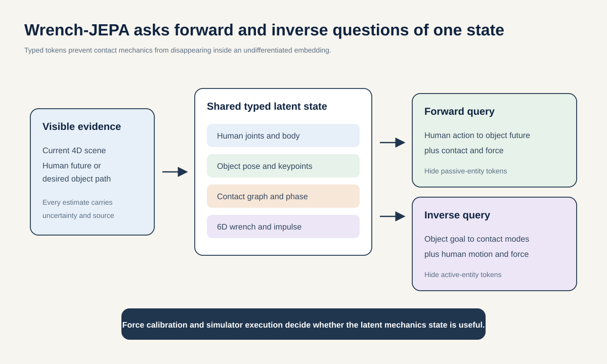

### SMART research question

Within five GPU-gated calendar days after the counterfactual and feasibility gates pass, can one masked human-object model, evaluated on subject-disjoint and object-disjoint real sequences plus held-out simulated embodiments, improve at least one of inverse human-motion minMPJPE and forward object ADE by at least 10 percent while remaining noninferior on the other, with the 95 percent confidence interval excluding more than 2 percent degradation? It must also improve contact F1 by at least 5 percentage points and simulated object-goal success by at least 20 percentage points over the strongest matched separate models while retaining at least 90 percent of their motion diversity.

The claim passes only if both directions meet the noninferiority test and the improvement survives a harmonized train-on-one, test-on-the-other transfer between at least two real human-object datasets without target-dataset labels. Metric wrench accuracy is claimed for simulated data unless new instrumented human-object force data are collected.

### Why this is not simply Masked Visual Actions for humans

[Masked Visual Actions](https://arxiv.org/abs/2607.19343) already shows active and passive entity completion, including object-goal-to-robot inference. [Causal-JEPA](https://arxiv.org/abs/2602.11389) already treats object-level JEPA masking as a latent intervention. [InterPhys](https://arxiv.org/abs/2605.01036) already couples human-object dynamics with differentiable contact forces. The publishable boundary is therefore narrower:

- contact is an explicit time-varying graph, not an incidental visual overlap;
- each contact carries a metric 6D wrench or impulse distribution;
- one model answers both human-to-object and object-to-human queries;
- generated inverse actions must execute under held-out bodies, objects, and physical parameters;
- real biomechanical calibration is tested against measured ground forces, even though hand-object wrench labels remain simulated.

If a model with wrench tokens does not execute better than the same model without them, the wrench bottleneck is decorative and the central claim fails.

### Method

Use a canonical state at 30 Hz:

$$
X_t = [H_t, O_t, C_t, W_t, P, U_t].
$$

`H` contains human joints or SMPL parameters and velocities. `O` contains object keypoints, SE(3) pose, and velocity. `C` is a sparse contact graph between body, object, and environment sites. `W` contains force, torque, impulse, and duration. `P` contains mass, inertia, friction, gravity, body scale, and strength when known. `U` records uncertainty and provenance for every estimated field.

Tokenize each family separately and join them with typed attention. Start from the repo's skeleton tokenizer and EMA target path. Following [ControlNet](https://arxiv.org/abs/2302.05543), keep the original motion branch frozen during warmup and add residual condition paths with exactly zero-initialized output gates. A unit test must verify identical outputs before training. This initialization preserves the old function at step zero; it does not guarantee preservation after the gates learn.

Train four query patterns with the same encoder:

1. **Forward query:** reveal current state and human future; hide object future, contacts, and wrenches.
2. **Inverse query:** reveal current state and desired object path; hide human future, contacts, and wrenches.
3. **Completion query:** hide one sensing modality, such as depth or force, while leaving aligned modalities visible.
4. **Intervention query:** reveal a changed mass, friction, support, or strength token and predict the changed future.

The target is not one averaged trajectory. A hierarchical decoder first samples a contact graph, then a conditional flow or diffusion model samples continuous human, object, and wrench trajectories. A cached feasibility energy from idea 3 ranks samples. MuJoCo supplies broad rigid-contact rollouts. OpenSim or Moco supplies slower musculoskeletal corrections for selected human motions. Both are offline teachers in the first paper.

### Data and experiment

| Layer | Data | Supervision | Claim it can support |
|---|---|---|---|
| Human kinematics | AMASS Core11 | Joints, body parameters, and world metadata, but no force | Identity-separated kinematic pretraining |
| Human kinetics | AddBiomechanics | Kinematics-pass motion, measured ground reaction force, and derived dynamics | Human-ground dynamics and force calibration |
| Human-object motion | [GRAB](https://arxiv.org/abs/2008.11200), [BEHAVE](https://arxiv.org/abs/2204.06950), [InterCap](https://arxiv.org/abs/2209.12354) | Body and object pose, geometry-derived or dataset-specific contact proxies, RGB or RGB-D where available | Real kinematics, proxy contact, and cross-dataset transfer, but not measured wrench |
| Counterfactual interaction | MuJoCo or MJX | Exact parameters, contact impulses, controls, success | Causal parameter and executable-action tests |
| Biomechanical validation | A source-held-out AddBiomechanics partition plus OpenCap validation data or another independent laboratory | Measured ground reaction force and calibrated motion | Human-ground force calibration only |

All windows from one source, subject, session, trial, object instance, and synthetic seed remain in one split. Hold out object instances in the main test and object categories in a harder test. Lock the test manifest and hashes before architecture selection.

Baselines must include separate forward and inverse Transformers with matched parameters, a shared model without wrench tokens, a shared model with shuffled wrench tokens, a dense-mask MVA-style model, and compatible human-object generators such as [OMOMO](https://arxiv.org/abs/2309.16237) and [InterDiff](https://arxiv.org/abs/2308.16905).

Primary metrics are object translation ADE/FDE, object rotation geodesic error, human MPJPE without Procrustes alignment, contact F1, top-K executable contact-mode recall, simulated goal success, wrench error where ground truth exists, and the quality-diversity frontier. Report mean error as well as best-of-K error so indiscriminate sample spraying cannot win.

### Schedule and kill gates

- **Day 1:** launch matched forward and inverse baselines, conversion tests, and typed-token smoke runs in parallel.
- **Day 2:** require valid joint limits in at least 95 percent of stochastic inverse samples.
- **Day 3:** require at least 10 percent improvement in one primary trajectory endpoint and at least 5 contact-F1 points.
- **Day 4:** require at least 20 percentage points more goal success in held-out MuJoCo objects, with at least 90 percent of baseline diversity.
- **Day 5:** run the real cross-dataset transfer and sealed replication. If this fails, report a simulator-bounded method and do not claim broad human-object generalization.

### Direct reuse from this repo

Reuse the 64-frame window convention, validity masks, identity manifests, fixed batch plans, hashes, EMA target encoder, mask audits, anatomical reflection map, and AmbientPose estimator interface. Do not reuse the GAVD label-aware group loss. The new pretraining claim must be self-supervised or physically supervised, not condition-label supervised.

The repo-level delta is an explicit metric wrench bottleneck and a bidirectional execution test. The tracked deck already proposes body, object, contact, and dynamics tokens, so the ingredient list itself is not novel.

## 2. Paired Counterfactual Mechanics: force the model to notice what physics changed

### The idea in one sentence

Create pairs of scenes that look the same and begin the same, but differ in exactly one hidden physical variable, then require the latent prediction to change in the correct way.

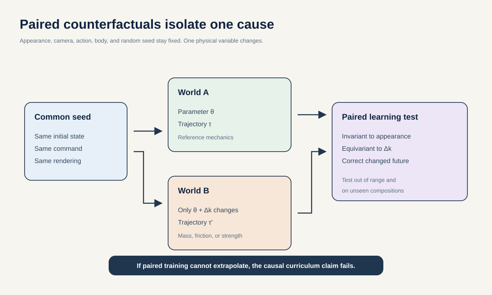

### Plain-language summary

Many AI systems can predict motion that looks realistic without learning why the motion happened. For example, a model may associate heavy objects with slow movement because that pattern appeared in its training data, while never learning that greater mass actually changes the force needed to move an object. Ordinary datasets make this hard to test because mass, movement, body shape, camera view, and many other details often change together. A model can therefore make a correct-looking prediction for the wrong reason and then fail when it encounters a new weight, surface, person, or combination of conditions.

Paired Counterfactual Mechanics addresses this problem by creating matched “twin” examples. Both examples begin with the same person or robot, pose, action, object, camera, and random simulation details. Only one physical property changes—for example object mass, friction, gravity, ground stiffness, support geometry, body-mass distribution, or available joint torque. The model is trained to predict the specific changes in movement, contact, momentum, and force caused by that intervention. Some pairs replay exactly the same action to reveal the direct mechanical effect; others allow the person or controller to adapt, revealing a compensatory strategy. Keeping these cases separate prevents the model from confusing the laws of mechanics with one controller's chosen response.

For the AI community, this provides a clean way to test whether a world model has learned cause and effect rather than visual correlation. It creates a training resource and benchmark for extrapolating beyond familiar parameter ranges, combining physical changes that were seen only separately, and transferring knowledge across human and robot bodies. It also supplies the controlled causal training data needed by Wrench-JEPA and other action-conditioned world models. For biomechanics, it offers a computational laboratory for studying how load, strength, support, friction, and contact alter motion and force—questions that can be expensive, difficult, or unsafe to isolate in people. The simulations do not replace real measurements: claims about human movement must still be checked against held-out experiments such as changed walking grade, carried load, or support condition. Used this way, the method could help researchers form and test biomechanical hypotheses while giving AI researchers a much stricter test of physical understanding.

### SMART research question

Within four GPU-gated calendar days, does paired counterfactual pretraining reduce held-out trajectory, contact, momentum, and force error by at least 15 percent relative to an equal-sized unpaired domain-randomization baseline on both out-of-range single-parameter interventions and unseen two-parameter compositions, while retaining equal in-distribution prediction accuracy?

The claim also requires at least 80 percent correct direction of effect on a real held-out physical intervention, such as grade, carried load, or support condition. A target-speed change is a separate task-command test, not a hidden physical-parameter intervention. If real intervention data cannot be secured, the paper must explicitly remain a simulation study.

### Related work and exact novelty

[GoalForce](https://arxiv.org/abs/2601.05848) makes force, goal force, and mass explicit conditioning channels. [SimDiff](https://arxiv.org/abs/2509.20927) changes physical conditions such as gravity and wind. [PISA](https://arxiv.org/abs/2503.09595) uses segmentation, flow, and depth rewards for physics-aware video optimization. [How Far Is Video Generation from World Model?](https://arxiv.org/abs/2411.02385) shows why interpolation performance can coexist with weak physical extrapolation.

The new contribution is a paired identification protocol for biomechanical world models. Each pair shares the seed state, action class, renderer, body identity, camera, and random noise. Exactly one causal quantity changes. Evaluation then leaves the training range and composes factors that were never changed together during training.

### Method

For seed state $s_0$, command $a$, and parameter vector $\theta$, simulate:

$$
\tau = F(s_0,a;\theta), \qquad
\tau' = F(s_0,a;\theta + \Delta_k),
$$

where $\Delta_k$ changes only factor $k$. Native MuJoCo factors include object mass and inertia, friction, gravity, ground compliance, support geometry, body mass distribution, and actuator torque limits. Task commands such as target speed or desired object path form a separate axis. Musculotendon strength belongs only to OpenSim or Moco counterfactuals with an explicit muscle model.

There are two distinct counterfactual meanings and they must not be mixed:

- **Fixed-action counterfactual:** replay the same control. This identifies direct mechanics.
- **Reoptimized-behavior counterfactual:** let a controller adapt to the new world. This identifies a model-dependent compensatory strategy.

Train three objectives. The state representation should respond predictably to the changed physical parameter, and its decoded trajectory, contact, and force should satisfy the new dynamics. If a rendered-video branch is included, require its physical code to ignore renderer, camera, clothing, and background while retaining the changed mechanics. A state-only model may not claim visual nuisance invariance. Add a matched negative where the parameter token is shuffled, preventing the model from ignoring it.

### Experiment

Generate training pairs in MuJoCo using human-like and robot embodiments. Use Moco only on a smaller subset where muscle or joint-load interpretation matters. Keep all variants of one seed in one split.

This extends proposal 10 in the tracked portfolio. That proposal injects controlled deficits; this study binds minimal pairs to an explicit intervention variable and evaluates out-of-range and composed causal effects against an equal-data unpaired control.

Test four increasingly hard regimes:

1. interpolation within trained ranges;
2. one factor outside the training range;
3. two factors combined although trained only separately;
4. transfer to measured real interventions.

Compare paired training against ordinary domain randomization, the same simulator samples with pair IDs removed, action-conditioned JEPA, a parameter-blind model, and an oracle given the true parameter. Metrics include rollout MPJPE, object ADE, momentum and energy error, contact timing, GRF error, parameter retrieval, and intervention direction.

### Data roadmap

The study needs three kinds of data, and they serve different purposes. Recorded motion supplies realistic human poses and actions. Force-measured biomechanics data supplies realistic body scales, contacts, and force ranges. Simulation supplies the actual counterfactual labels, because an ordinary human dataset cannot show the same person performing the exact same action twice while only gravity, friction, or strength changes. Real measurements therefore ground and test the simulator-trained model; they must not be presented as exact fixed-action counterfactual truth.

The following is the recommended minimum data plan for the first full study. Counts should be frozen before the first model result is inspected.

| Data source | Amount to use | Role in the study | Important boundary |
|---|---:|---|---|
| [AMASS Core11 manifest](../../manifests/amass/amass_core11_conversion.csv) | Use all 8,854 motions from 189 identities as a source pool; draw 20,000 non-overlapping 2-second seed clips—16,000/2,000/2,000 for training, validation, and test—with no more than four clips from one motion | Supplies varied human poses, velocities, and action starts for simulation | Preserve the manifest's existing 151/19/19 identity split. The data represents about 29.2 hours at 30 Hz but contains no force labels. Use it only after the referenced tensors and conversion fingerprint are materialized and bound to the experiment. |
| [AddBiomechanics version 1](https://addbiomechanics.org/download_data.html), excluding Camargo | Use all remaining 251 participants and about 47.45 hours with measured ground reaction force | Fits plausible human size, mass, contact, and force distributions; checks whether simulated forces occupy realistic ranges | This is grounding data, not evidence for isolated causal effects. Keep entire source datasets, laboratories, people, sessions, and trials together. Target a 70/15/15 percent train/validation/internal-test division—approximately 176/38/37 people and 33.2/7.1/7.1 force-measured hours—with exact counts allowed to move to preserve whole sources. |
| [MuJoCo](https://mujoco.readthedocs.io/en/stable/overview.html) with licensed models from [MuJoCo Menagerie](https://github.com/google-deepmind/mujoco_menagerie) | 296,000 two-second rollouts in the core plan below | Creates the matched interventions and exact state, contact, momentum, energy, and wrench labels | Use one human-like body and one robot family for training, then a genuinely unused body and controller for transfer. Record the simulator version and hash every model file. |
| [OpenSim Moco](https://journals.plos.org/ploscompbiol/article?id=10.1371/journal.pcbi.1008493) | Start with 300 measured motions from 30 AddBiomechanics participants; solve each at baseline and three strength levels, for 1,200 cached solves | Adds a small, interpretable muscle-strength and joint-load experiment | This is required only for a musculotendon-strength claim. Split the 30 people 20/5/5 for training, validation, and test; never place an optimization inside a minibatch. If fewer than 90 percent of trials solve under the predeclared checks, report the failures and remove the strength claim. |
| Sealed [Camargo locomotion dataset](https://www.sciencedirect.com/science/article/pii/S0021929021001007) | All 22 participants and 10.10 force-measured hours; withhold the entire source from AddBiomechanics development | Final human test for adaptation to ramp grade, stairs, and support geometry | Do not use it to choose parameters, checkpoints, thresholds, or simulator ranges. Walking speed is a task command, while grade and stair geometry are physical interventions; report them separately. |
| Sealed [solid-ground versus sand dataset](https://data.mendeley.com/datasets/jgdpjrf584/2) | All 20 participants | Independent human replication for a changed, yielding surface | This tests the direction of an adaptive human response to surface mechanics, not an identical replayed action. Keep it untouched until the model and analysis are frozen. |

The simulation budget should be built in stages rather than generated as one undifferentiated pool. A **pair** contains a baseline rollout and one rollout with a single changed parameter. A **quartet** contains baseline, factor A alone, factor B alone, and A and B together.

| Experimental step | Amount | What it establishes |
|---|---:|---|
| Simulator and label audit | 2,000 pairs = 4,000 rollouts; 250 pairs for each of the eight factor families | Finds unstable contacts, unit errors, ineffective interventions, and failed force or integration checks before expensive generation |
| Main paired training set | 80,000 pairs = 160,000 rollouts; 10,000 pairs per factor family | Trains the causal representation. Use 60,000 fixed-action pairs for direct mechanics and 20,000 reoptimized-behavior pairs for adaptation, always labeled as separate tasks. |
| Development set | 10,000 pairs = 20,000 rollouts | Selects checkpoints and loss weights using unseen seed states, motions, controllers, and body instances, but only parameter values inside the training range |
| Sealed interpolation test | 10,000 pairs = 20,000 rollouts | Checks that the causal training does not reduce ordinary in-range accuracy |
| Sealed one-factor extrapolation test | 16,000 pairs = 32,000 rollouts; 2,000 pairs per factor, evenly split below and above the training range | Tests the primary claim that the learned effect continues in the correct direction beyond familiar parameter values |
| Sealed two-factor composition test | 10,000 quartets = 40,000 rollouts | Tests combinations never shown together in training while exposing each single-factor effect and the combined effect for the same seed |
| Sealed embodiment-transfer test | 10,000 pairs = 20,000 rollouts; half human-like and half robot | Tests new morphology and control. Neither the body instance nor its controller may appear in training or development data. |

This totals 80,000 training pairs, 10,000 development pairs, 36,000 final-test pairs, and 10,000 four-way composition cases. Including the audit, the simulator produces 296,000 rollouts, or about 17.8 million states at 30 Hz and two seconds per rollout. The size is large enough to leave at least 2,000 extrapolation pairs for every factor, but still small enough to regenerate and audit. Scale beyond it only if learning curves from the first 25, 50, and 100 percent of the training set are still improving materially.

Define a safe numerical interval for every physical parameter before generation. Use the middle 60 percent for training and in-range evaluation, reserve the lower and upper 20 percent for extrapolation, and use only middle-range values in the two-factor test so that composition and range extrapolation are not confused. Object mass and inertia belong to manipulation scenes; ground compliance and support geometry belong to locomotion scenes; factors should not be forced into actions where they have no meaningful effect.

Every baseline and intervention derived from the same initial state must share one `seed_id` and stay in one split. Store the `pair_id`, changed parameter and values, embodiment, high-level command, low-level control, controller version, fixed-action or reoptimized label, simulator and asset hashes, and all state, contact, and force targets. Neighboring windows, repeated trials, and multiple views do not count as independent samples. The equal-data controls must receive exactly the same 160,000 training rollouts and number of optimizer updates; only the pairing information and training objective may differ.

The primary study should remain state-based. If a visual-world-model claim is added, render a stratified 10 percent of every synthetic split with three identical camera paths per counterfactual set: 29,600 physical rollouts become 88,800 video clips. Camera, lighting, clothing, and background must be matched within a pair and varied across pairs. This visual branch is optional and should not delay the mechanics result.

For both human datasets, calculate uncertainty across participants, not frames or short windows. The 80 percent direction criterion should count a small set of predeclared intervention–outcome relationships, with every relationship supported by a participant-level confidence interval. These datasets can test whether the direction transfers to people; their 22- and 20-person cohorts are not large enough to support clinical subgroup claims.

The two public human tests support claims about adaptive locomotion under grade, stair, and surface changes. They do **not** validate hand-object mass, friction, or fixed-action robot effects. A broad real-world claim for those factors requires a separate instrumented collection. A practical minimum is 100 fixed robot seed-action programs, five conditions per program—baseline, two mass levels, and two friction levels—and five repeated trials, for 2,500 trials with synchronized object pose and force or torque measurements. Without that dataset, keep those claims explicitly simulation-only.

The four-day experiment begins only after the public files are downloaded, the AMASS tensors are materialized, the source- and identity-level manifests are frozen, the simulation assets and controllers pass the audit, and any Moco solves are cached. Data acquisition and human or robot collection are prerequisite work, not hidden inside the four-day training claim.

### Schedule and kill gates

- **Day 1:** freeze parameter ranges and separate fixed-action from reoptimized counterfactuals before the first rollout wave.
- **Day 2:** require force balance and numerical integration checks within 5 percent on at least 95 percent of retained simulations.
- **Day 3:** run paired and equal-data unpaired training in parallel and require an out-of-range gain.
- **Day 4:** test two-factor compositions, a new embodiment, and real intervention direction. If fewer than 80 percent are correct, remove the real-world causal claim.

The fatal test is simple: if paired training does not improve strict parameter extrapolation over unpaired simulation at matched data and compute, it did not teach a stronger physical abstraction.

## 3. Force-Calibrated Feasibility Energy: estimate whether motion is physically grounded

### The idea in one sentence

Return an interpretable, calibrated probability that a motion can be reconciled with observation, contact, and dynamics, while showing exactly which constraint failed.

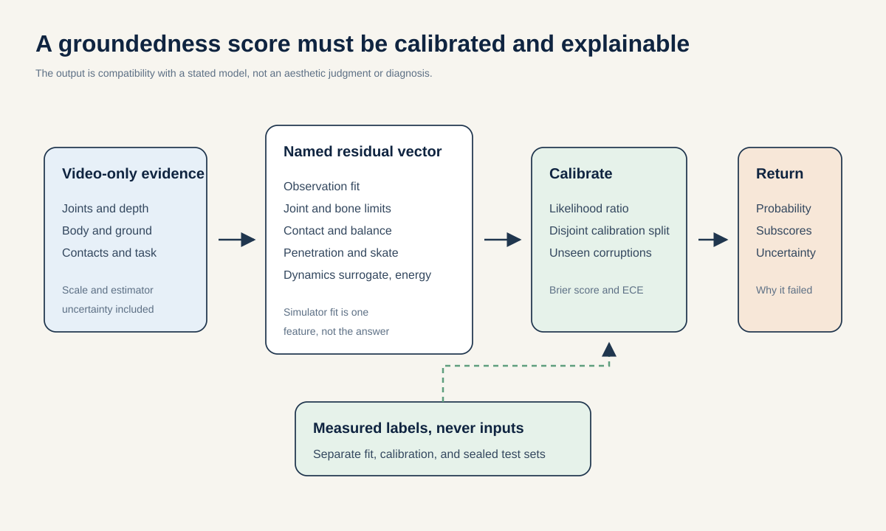

### SMART research question

Within four GPU-gated calendar days, can a decomposable feasibility model reach Spearman correlation of at least 0.60 with measured-force or inverse-dynamics residuals, AUROC of at least 0.80 for real estimator failures versus matched valid motion, expected calibration error at most 0.05, and at least 15 percent lower Brier score than a kinematics-only classifier on held-out sources and two entirely unseen corruption families?

External replication on a second laboratory dataset is required for the broad claim. The output is physical compatibility under a stated body and environment model. It is not a diagnosis, fall-risk score, or universal truth value.

### Why a new metric is still needed

Simulator projection and plausibility scoring already exist. [PhysDiff](https://arxiv.org/abs/2212.02500) uses physics projection during diffusion. [Measuring Physical Plausibility Using Simulation](https://arxiv.org/abs/2502.04483) evaluates center-of-mass displacement and stability time. [Locomotion Embodiment](https://arxiv.org/abs/2503.17267) distills simulator feasibility into a value function. [PP-Motion](https://arxiv.org/abs/2508.08179) learns a physics and perception fidelity metric.

The new boundary is a calibrated likelihood-ratio energy whose parts are biomechanically named, whose hard negatives are appearance-matched minimal perturbations, and whose final ordering is checked against measured force plates across datasets and simulators.

### Method

The primary score has a strict video-only input contract. It may use video-derived pose, masks, depth, estimated contacts, body priors, and acquisition metadata available before force measurement. It may not ingest force-plate channels, inverse-dynamics targets derived from those channels, or dynamics-pass kinematics. For each clip, compute:

$$
r_{video} = [r_{obs}, r_{bone}, r_{joint}, r_{contact}, r_{balance},
r_{penetration}, r_{\mathrm{dyn}}, r_{energy}, r_{uncertainty}].
$$

The dynamics surrogate is inferred only from kinematics and declared body and environment priors. Measured GRF and measurement-derived torque are outcomes against which this score is trained and tested, never input components. A separately named instrumented diagnostic may consume force, but it cannot be evaluated against the same force channel or reported as the primary video result.

The system returns all components plus

$$
E(x) = -\log \frac{p(r_{video}\mid\text{physically acceptable},z)}
{p(r_{video}\mid\text{minimal corruption},z)},
\qquad
P_{feasible}(x) = \mathrm{calibrate}(-E(x)).
$$

Conditioning variable $z$ includes body morphology, activity, speed, support surface, and measurement uncertainty. This prevents a single global threshold from treating every body and task as identical.

OpenSim or Moco fits selected training clips offline and provides kinematics-conditioned root residual, effort, and tracking teachers. MuJoCo provides broad contact perturbations. A small amortized critic learns to approximate the slow optimization. Force-plate and derived inverse-dynamics outcomes supervise critic fitting on a training partition, a separate validation partition fits the probability calibrator, and sealed source-held-out plus external-laboratory partitions are touched only for final evaluation.

Use at least six predeclared corruption families: foot slide, ground float, penetration, segment-length drift, temporal phase swap, center-of-mass shift, impossible acceleration, and momentum-contact mismatch. Reserve two whole families for zero-shot testing. Include hard positive examples of unusual but measured valid motion so the model does not equate rarity with impossibility.

### Leakage-safe experiment

The main dataset can begin with AddBiomechanics, but split jointly by original source, laboratory, participant, session, and trial. Adjacent windows and all reprocessed versions remain together. Use kinematics-pass inputs when force is the target. Dynamics-pass kinematics may already contain force-plate information and are excluded from force-prediction inputs.

Strong baselines are center-of-mass support heuristics, foot-skate and penetration rules, one-class kinematics models, a matched S-JEPA energy retrained on the same manifest, simulator projection distance, and GaitDynamics residuals on strictly non-overlapping data. [OpenCapBench](https://openaccess.thecvf.com/content/WACV2025/html/Gozlan_OpenCapBench_A_Benchmark_to_Bridge_Pose_Estimation_and_Biomechanics_WACV_2025_paper.html) motivates reporting biomechanical errors in addition to ordinary pose error.

Run a cross-simulator test: calibrate using one body or simulator family and evaluate ranking under another. Also perturb scale, focal length, mass, and ground plane within uncertainty. A score that changes wildly under plausible gauge choices is not ready for monocular video.

### Schedule and kill gates

- **Day 1:** freeze the split manifest, six corruption families, two held-out families, and heuristic baselines.
- **Day 2:** require offline projection to converge on at least 90 percent of validation clips, with failures logged rather than discarded silently.
- **Day 3:** require Spearman correlation at least 0.60 and AUROC at least 0.80 on real estimator failures.
- **Day 4:** require expected calibration error at most 0.05 and Brier improvement at least 15 percent on unseen corruptions, then run external-lab replication and test monotonic improvement when the energy reranks generated motion.

If calibration collapses on a new morphology, dataset, or simulator, keep the residual vector as a useful diagnostic but withdraw the general groundedness claim.

This makes proposals 03 and 10 in the tracked portfolio testable. Their residual-energy idea becomes a leakage-safe video score with force-labeled calibration, unseen-corruption tests, and an untouched external laboratory endpoint.

## 4. Contact-Mode Generative S-JEPA: generate different valid ways to cause the same outcome

### The idea in one sentence

Generate a distribution over contact plans first, then generate SMPL or joint motion, object keypoints, and forces consistent with each plan.

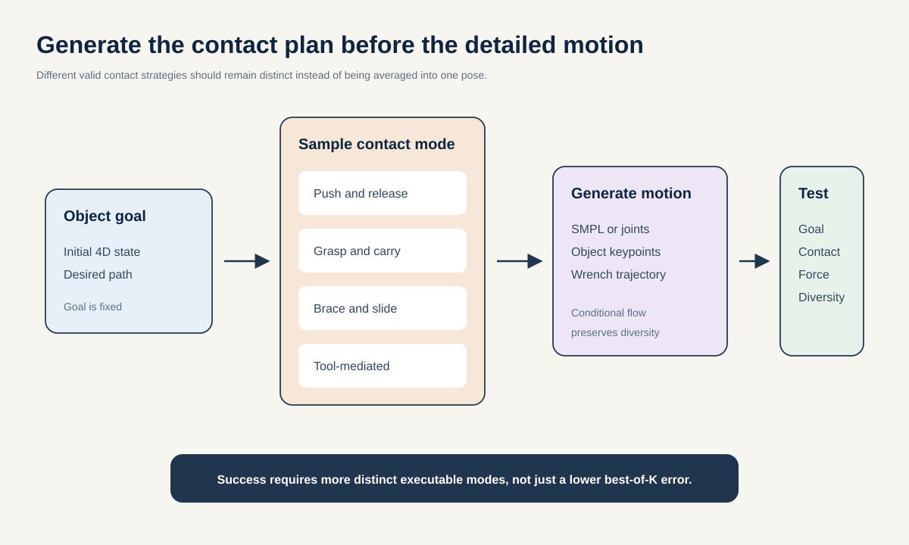

### SMART research question

Within five GPU-gated calendar days after the Wrench-JEPA contact schema is stable, can a hierarchical contact-mode generator recover at least 20 percent more distinct executable solution modes for held-out object goals than a matched conditional motion-diffusion baseline, while maintaining contact precision, improving top-20 goal success by at least 15 percentage points, and reducing physical residuals by at least 30 percent without losing more than 10 percent of unguided diversity?

The evaluation set must contain goals with at least two independently verified solutions. Best-of-K trajectory error alone is not sufficient.

### Related work and novelty boundary

[OMOMO](https://arxiv.org/abs/2309.16237) generates human motion from object motion. [InterDiff](https://arxiv.org/abs/2308.16905) jointly diffuses human and object motion. [CG-HOI](https://arxiv.org/abs/2311.16097) uses learned contact guidance. [InterPhys](https://arxiv.org/abs/2605.01036) predicts continuous force parameters before motion. Recent [human-centric world modeling](https://arxiv.org/abs/2607.23517) also separates continuous body state from discrete interaction state.

The new object is not generic stochastic SMPL generation. It is a calibrated distribution over full spatiotemporal contact graphs and continuous wrench trajectories that realize the same external goal. Distinct modes include push, pull, brace, regrasp, switch hands, use two hands, use a foot, and tool-mediated contact.

### Method

Factor the inverse model as

$$
p(H,C,W\mid O_{goal},s_0)
= p(C\mid O_{goal},s_0)
  p(W\mid C,O_{goal},s_0)
  p(H\mid C,W,O_{goal},s_0).
$$

The contact graph $C$ is discrete and time-indexed. A graph tokenizer learns a compact contact-mode code. Conditional flow matching or diffusion generates the continuous wrench and human trajectory within that mode. The decoder emits both SMPL/SMPL-X parameters for research use and a release-safe joint-plus-rotation representation so the core model is not inseparable from restrictive body-model assets.

At inference, draw several contact modes, sample continuous solutions within each, and rerank with idea 3. To prevent physics guidance from collapsing the distribution, optimize and report a quality-diversity Pareto curve. Use a mode-entropy floor and compare against a shuffled contact-code control.

### Experiment

Construct a controlled simulated suite in which several contact strategies are known to succeed for each object goal. Add real motion and geometry-derived or dataset-specific contact proxies from GRAB, BEHAVE, and InterCap. Hold out people, object instances, and goal geometries.

Compare against deterministic JEPA decoding, ordinary conditional diffusion, a flat mixture model, object-trajectory-conditioned OMOMO, contact-guided CG-HOI, and an oracle contact-mode condition. Report:

- per-sample and top-K executable goal success;
- number and recall of distinct verified contact modes;
- contact precision, recall, and timing;
- mean ADE and minADE, not minADE alone;
- energy score or likelihood on repeated simulated outcomes;
- penetration, foot skate, torque, GRF, and wrench residuals;
- sample diversity within and across contact modes.

### Schedule and kill gates

- **Day 1:** launch deterministic and conditional-diffusion baselines on identical tokens and splits.
- **Day 2:** require top-20 generation to improve minADE at least 15 percent without degrading mean ADE more than 10 percent.
- **Day 3:** require noncollapsed contact-mode use and a better proper score than a flat stochastic decoder.
- **Day 4:** require physics reranking to cut residuals at least 30 percent while retaining 90 percent of diversity.
- **Day 5:** test more executable modes on held-out objects. Without that result, report a motion generator, not a mechanics-conditioned contact-mode generator.

The repo-level delta is the discrete contact-mode variable, proper distributional scoring, and executable multimodal evaluation. The deck already motivates generative keypoints and contact-aware decoding.

## 5. Cross-Embodiment Biomechanical Action Alphabet

### The idea in one sentence

Describe what an action does at contact, rather than how one particular body actuates it, so a human demonstration and a robot execution can share the same action token.

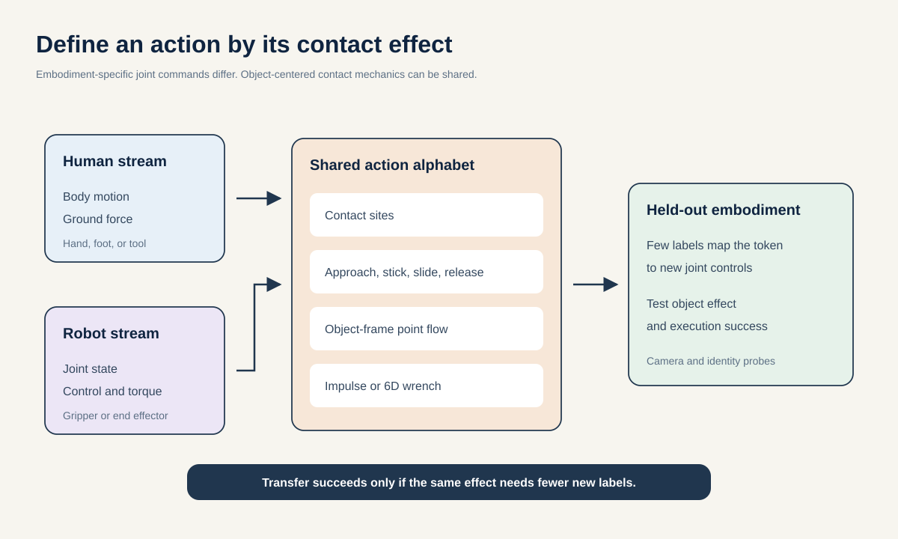

### SMART research question

Within eight GPU-gated calendar days after the contact schema is stable, can action tokens defined by contact phase, effector-object motion, and impulse or wrench reduce the labeled demonstrations needed to adapt from human plus one robot embodiment to a held-out robot by at least 50 percent at matched task success, and improve low-label execution success by at least 15 percentage points over latent-action, keypoint-delta, and 3D point-flow baselines?

The shared object-effect token must reduce camera, clothing, dataset, and identity predictability to the chance-calibrated nuisance baseline after conditioning on task. Morphology remains in a separate embodiment token because it is required for dynamics. Success requires low morphology leakage from the shared token without erasing morphology from the full state.

### First-principles motivation

A knee angle and a robot joint angle are not directly comparable. Their effects can be. Both a hand and a gripper can establish contact at an object site, apply an impulse in an object-centered frame, and produce a goal displacement. This suggests an action alphabet with four parts:

1. effector and object contact sites;
2. contact phase, such as approach, impact, stick, slide, roll, release;
3. desired object-frame displacement or point flow;
4. impulse or 6D wrench distribution over the phase.

An embodiment-specific decoder maps that shared token to human joint motion, muscle or torque estimates, or robot controls.

### Related work and novelty boundary

[Genie](https://proceedings.mlr.press/v235/bruce24a.html) learns discrete latent actions from unlabeled video. [LAPA](https://proceedings.iclr.cc/paper_files/paper/2025/hash/45d74e190008c7bff2845ffc8e3facd3-Abstract-Conference.html) maps video-derived latent actions to robot controls with limited labels. [DexWM](https://arxiv.org/abs/2512.13644) uses 3D hand-keypoint deltas across human and robot data. [PointWorld](https://point-world.github.io/) represents cross-embodiment state and action as 3D point flow. [GEN-1.5](https://generalistai.com/blog/gen-1.5) motivates short human-to-robot adaptation, but is not a reproducible baseline.

The proposed novelty is to identify the action by its contact mechanics, then test that it transfers across morphology and actuation with few paired labels. Generic vector quantization, skeleton motion, or point flow without impulse is not enough.

### Method and experiment

Learn a shared JEPA latent from partially paired streams:

- human motion and object contact from GRAB, BEHAVE, and InterCap;
- robot state, action, and object motion from a released manipulation dataset whose coordinate and license contracts can be harmonized;
- matched-goal MuJoCo rollouts in which different bodies pursue the same object-space target, without pretending these are exact paired trajectories;
- measured human-ground forces from AddBiomechanics as a units and calibration anchor for the human-ground branch only, not for hand-object or gripper impulses.

Borrow the missing-modality principle from SleepFM: each batch hides one available view of the action, such as human kinematics, robot controls, object flow, contact, force, or video, and predicts its latent from the others. Unlike a generic multimodal foundation model, every alignment must pass through the same contact phase and object-centered effect.

Evaluate human-to-robot retrieval, action-token cycle consistency, held-out-embodiment few-shot adaptation, simulator execution, and conditional nuisance probes for camera, clothing, identity, morphology, and dataset. Strong baselines are Genie-style latent actions, LAPA, keypoint deltas, point flow, and a fully supervised embodiment-specific policy.

### Schedule and kill gates

- **Day 1:** freeze a public modality-by-dataset table and exact coordinate, timing, and contact schema.
- **Day 2:** require the alphabet to reconstruct object effect and contact phase across two training embodiments.
- **Day 4:** require few-shot adaptation to reach the same success with at most half the labels of the strongest baseline.
- **Day 6:** require at least 15 percentage points more execution success at a fixed small label budget.
- **Day 8:** run held-out embodiment and object-category transfer, with camera and identity probes controlled.

This is the highest-risk proposal. If nuisance information remains easily decoded or label efficiency does not improve, the shared alphabet claim fails even if within-embodiment prediction is good.

## 6. Gauge-Aware 4D Biomechanics: metric depth that admits what is unknown

### The idea in one sentence

Fuse segmentation, depth, camera motion, body motion, and physical constraints into a posterior over possible metric scenes, rather than treating one monocular estimate as truth.

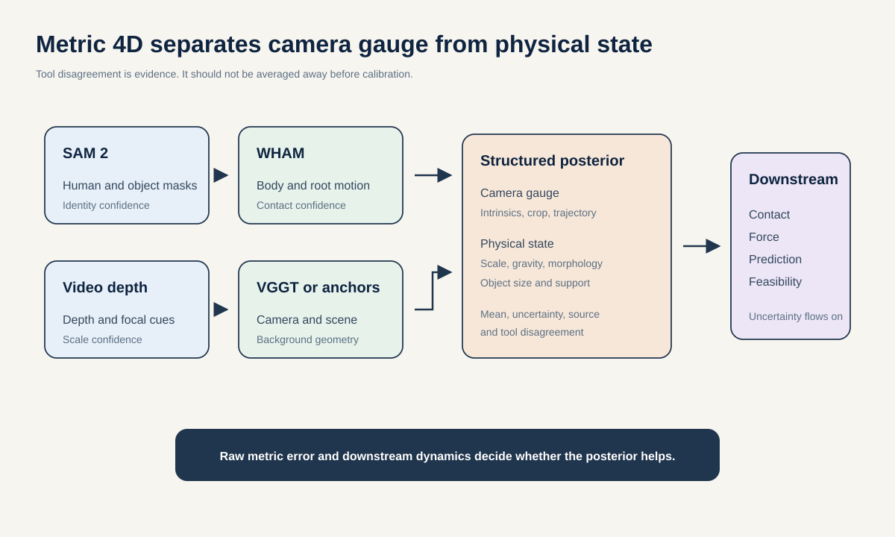

### SMART research question

Within five GPU-gated calendar days, can uncertainty-aware fusion reduce raw world-space human and object trajectory error by at least 10 percent over WHAM plus the strongest single depth estimator on a held-out RGB-D dataset, while achieving raw metric depth AbsRel at most 0.20, temporal scale drift at most 5 percent over 10 seconds, and uncertainty expected calibration error at most 0.05?

The downstream test is force and contact prediction under controlled focal-length, crop, camera-motion, and subject-size shifts. If raw metric criteria fail, the method must be described as scale-aware, not metric.

### Related work and novelty boundary

[AVDC](https://arxiv.org/abs/2310.08576) combines generated video, depth, segmentation, flow, and 3D action recovery. [PointWorld](https://point-world.github.io/) predicts metric 3D point flow from calibrated RGB-D. [V-JEPA 2.1](https://arxiv.org/abs/2603.14482) improves dense and depth-sensitive JEPA features. Adding a depth head is therefore not a contribution.

The new contribution is a posterior that separates two kinds of uncertainty. Observation-gauge variables describe camera coordinates, intrinsics, crop, and camera trajectory. Physical latent variables describe metric scale, gravity, body morphology and height, object size and mass, and support geometry. The first group can be reparameterized without changing the event. The second group changes the dynamics and must remain identifiable and influential. Anthropometry, rigid-object shape, non-slipping contacts, background geometry, occasional measured depth, and known-size objects update this posterior. Its uncertainty then propagates into Wrench-JEPA and the feasibility energy.

### Method

Run SAM 2 for person and object masks, Video Depth Anything for depth, VGGT on selected mostly static frames for camera geometry, and WHAM for body and root motion. Estimate the camera primarily from background pixels so a moving person does not define the world frame.

Never collapse the tool outputs into one pseudo-label. Store each raw estimate, confidence, provenance, and disagreement. A probabilistic factor graph or learned set encoder combines:

- 2D reprojection consistency;
- temporal depth consistency;
- rigid object geometry;
- constant segment lengths and a body-height prior;
- foot-ground contact and non-slip constraints;
- floor normal and gravity;
- sparse RGB-D or known-size object anchors when available.

A ControlNet-style adapter can condition the skeleton JEPA on the posterior mean and uncertainty. Keep the original path frozen during warmup, use zero-initialized residual output gates, and verify exact initialization equivalence before training. Require invariance to equivalent camera reparameterizations, equivariance to rigid coordinate-frame changes, and sensitivity to physical scale, morphology, gravity, and object size. Do not call those physical quantities gauges or force them to be invariant.

### Experiment

Use BEHAVE and InterCap RGB-D for raw metric tests, then OpenCap validation data or an independently collected calibrated video-plus-force laboratory dataset for the downstream force test. Audit at least 500 frames manually before large training. Measured GRF is a sealed downstream outcome, never an input to the posterior in this endpoint.

Report raw metric AbsRel, RMSE, delta-1, temporal scale drift, object-centroid 3D MAE, world MPJPE without scale alignment, contact F1, and downstream GRF or torque error. Report scale-aligned metrics only as secondary diagnostics. Ablate every tool, every physical factor, confidence weighting, and cross-tool disagreement.

### Schedule and kill gates

- **Day 1:** complete the 500-frame audit and freeze the raw-metric benchmark.
- **Day 2:** require mask IoU at least 0.85, depth AbsRel at most 0.20, scale drift at most 5 percent, and object-centroid MAE at most 15 cm on validation.
- **Day 3:** require confidence ECE at most 0.05 and a measurable gain from disagreement features.
- **Day 4:** require at least 10 percent trajectory gain over the best single-tool pipeline.
- **Day 5:** test a new RGB-D dataset and a force or contact endpoint. Otherwise, keep the method as a calibrated perception front end, not a world-model result.

This turns proposal 12 in the tracked portfolio from a cross-view feature study into an identifiability test. The added hypothesis is that separating camera gauge from physical scale improves raw metric 4D reconstruction and a sealed kinetic endpoint.

## 7. Value-of-Information Biomechanics Agent: teach Qwen when a tool is worth calling

### The idea in one sentence

Train a Qwen controller to buy only the measurements that are expected to reduce physical uncertainty enough to justify their cost.

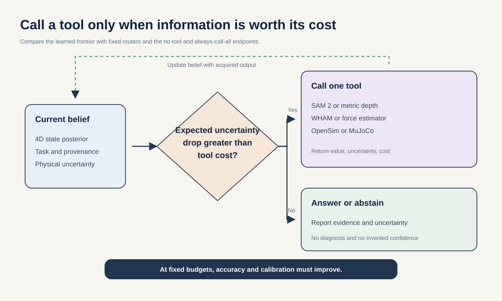

### SMART research question

Within five GPU-gated calendar days after cached tool outputs exist, can a counterfactual tool-acquisition policy trace a better accuracy-calibration-cost frontier than fixed-cascade and supervised-router baselines at two preregistered cost budgets, while keeping invalid calls below 2 percent and reducing selective risk by at least 20 percent at 80 percent coverage? Qwen3-VL is one policy implementation. The no-tool and always-call-all systems are endpoint references, not baselines that can both be strictly dominated in cost.

At one fixed accuracy operating point, the target is at least 40 percent lower tool cost than always-call-all. At one fixed cost, the target is at least 10 percent lower final physical error than the fixed cascade.

### Why generic tool use is not enough

Qwen-Agent already supports tool calls. [ReTool](https://arxiv.org/abs/2504.11536) and [ToolRL](https://arxiv.org/abs/2504.13958) already use reinforcement learning for tool invocation. The research question is therefore not whether Qwen can call SAM 2, depth, WHAM, or a simulator.

The new question is whether an agent can estimate the counterfactual value of a measurement. For example, depth is unnecessary when scale does not affect the task, but essential before a force estimate. OpenSim may be worth minutes for a high-stakes ambiguous clip, while a cheap kinematic critic may suffice for an obvious estimator failure.

### Method

Treat routing as a partially observed decision process. The belief state contains the current 4D posterior, uncertainty, provenance, task, and prior tool results. Available actions are:

- `segment_video` using SAM 2;
- `estimate_depth` using video depth or VGGT;
- `lift_body_motion` using WHAM;
- `estimate_ground_forces` using a learned dynamics model;
- `fit_musculoskeletal_model` using cached or asynchronous OpenSim;
- `simulate_counterfactual` using MuJoCo;
- `score_feasibility` using idea 3;
- `abstain_with_reason`.

Start with cached deterministic outputs so RL cannot change tools during training. Randomize which outputs are initially visible, acquisition prices, latency, and realistic tool failure profiles. Because every candidate result is cached, reveal each tool in turn and compute a counterfactual value label: reduction in hidden physical error and uncertainty minus normalized acquisition cost. This randomized acquisition protocol and its value labels are the intended benchmark contribution.

Train a small Qwen3-VL model with supervised traces, then GRPO or another outcome-based method in a strict sandbox. The reward is based on hidden joint, depth, contact, and force measurements; calibration; schema validity; latency; GPU cost; and useful abstention. It must not use an LLM judge as the physics reward.

Prevent three reward pathologies explicitly. An always-abstain policy fails the risk-coverage curve. An always-call-all policy fails the cost frontier. A fabricated-confidence policy fails a proper scoring rule.

### Experiment

Freeze at least 500 benchmark tasks, with at least 20 percent out-of-distribution cameras, occlusions, bodies, activities, or tool combinations. Keep all clips from one source and person together. Hold out some tool compositions and change tool schemas at test time.

Compare no tools, every tool, a hand-written cascade, a supervised router, outcome-only RL, explicit value-of-information RL, and an oracle that sees the error reduction of every tool. Report final physical error, task success, Brier score, ECE, risk-coverage curve, tool precision and recall, invalid calls, loops, latency, and dollar or GPU cost.

### Schedule and kill gates

- **Day 1:** freeze tasks, deterministic schemas, cached outputs, cost model, and safety policy.
- **Day 2:** launch prompting and supervised baselines with a full trace audit.
- **Day 3:** run sandboxed RL and adversarial tests for loops, null output, fabricated confidence, and cost avoidance.
- **Day 4:** require frontier improvement over fixed and supervised routers at the two frozen budgets, with invalid calls below 2 percent; report distance from both endpoint references.
- **Day 5:** run blind human-authored tasks with changed wording and tool schemas.

No agent output should be described as a diagnosis. The safe product is an auditable measurement assistant that returns sources, uncertainties, residuals, and reasons for abstention.

The deck already states that Qwen should decide when an expensive tool is worth calling. The new research object is the randomized acquisition benchmark and counterfactual value label. Qwen is an enabling policy, not the novelty claim.

## How the seven ideas fit together

These are not seven names for the same model. They occupy different layers of one research stack.

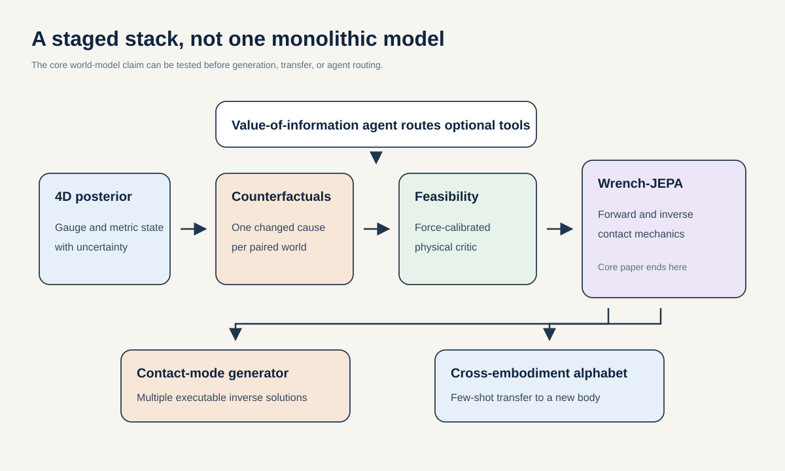

1. **Gauge-Aware 4D Biomechanics** turns video into a physical-state posterior with uncertainty.
2. **Paired Counterfactual Mechanics** supplies controlled changes in the dynamics.
3. **Force-Calibrated Feasibility Energy** supplies a real-measurement-anchored critic.
4. **Wrench-JEPA** learns bidirectional forward and inverse dynamics.
5. **Contact-Mode Generative S-JEPA** represents multiple valid inverse solutions.
6. **The Cross-Embodiment Action Alphabet** transfers the same contact effect to new bodies.
7. **The Value-of-Information Agent** decides when the expensive layers should run.

The core paper should contain 2, 3, and 4 only if resources permit. Layer 1 can use ground-truth 3D during the core model study and become a separate monocular paper. Layers 5 through 7 are extensions, not prerequisites.

## Ground-truth and provenance hierarchy

The project should use three explicit evidence tiers in every manifest and figure.

| Tier | Examples | Permitted role |
|---|---|---|
| A: measured | Force-plate forces and moments, marker trajectories, calibrated RGB-D depth, IMU and EMG signals | Final validation anchor |
| B: measurement-derived | Inverse-dynamics torque, center of pressure, contact timing, calibrated joint angles | Validation after method and uncertainty are stated |
| C: model-generated | WHAM pose, monocular depth, SAM masks, MuJoCo contacts, OpenSim muscle force, GaitDynamics output, feasibility score | Pseudo-label, prior, teacher, or hypothesis only |

EMG measures electrical activation, not muscle force. OpenSim muscle force is a model estimate, not a sensor measurement. A MuJoCo contact impulse is exact for the simulated world, not for the corresponding real video.

Every stored field should include:

- source tool and version;
- source dataset and original identity;
- coordinate frame and units;
- measured, derived, or generated tier;
- confidence or posterior uncertainty;
- processing hash;
- known teacher-training overlap;
- licensing and redistribution status.

## The evaluation contract

### Split before modeling

- Group AddBiomechanics by original source, laboratory, participant, session, and trial.
- Keep adjacent windows, repeated gait cycles, and all regenerated forms together.
- Keep every counterfactual variant of one simulation seed together.
- Hold out human identities and object instances for all human-object tests.
- Add object-category and embodiment holdouts for the strongest claim.
- Fit body scale, floor plane, score calibration, reward weights, and tool thresholds on training or validation only.
- Freeze the test manifest and its hash before comparing architectures.

### Matched controls

Every representation-learning proposal, where applicable, should include the raw-input baseline, random-encoder floor, matched-capacity model, equal-compute schedule, provenance probe, and relevant shortcut controls. Perception and tool-routing studies need task-specific endpoint controls instead. The central Wrench-JEPA study additionally needs:

- wrench tokens removed;
- wrench tokens shuffled within activity;
- contact graph removed;
- true contact but shuffled force;
- one shared model versus two separate forward and inverse models;
- the same architecture trained on unpaired simulation;
- physics critic replaced with simple foot-slide and center-of-mass rules;
- estimated metric state versus ground-truth state.

### Metrics by claim

| Claim | Required primary metrics | Metrics that are not enough |
|---|---|---|
| 3D perception | Raw metric AbsRel/RMSE, world MPJPE, scale drift, calibration | Scale-aligned depth or PA-MPJPE alone |
| Forward dynamics | Object ADE/FDE, rotation error, contact F1, force/impulse error | Pixel realism alone |
| Inverse action | Executable goal success, contact-mode precision and recall, mean and min trajectory error | Best-of-K pose error alone |
| Physical feasibility | Video-only score versus held-out GRF/torque residuals, Brier score, ECE, cross-dataset AUROC | Foot skating alone or force used as both input and target |
| Counterfactual reasoning | Out-of-range and composed intervention error, direction of effect | Random in-range interpolation |
| Generative quality | Proper score, coverage, precision, diversity, executable success | FID or one attractive sample |
| Agentic routing | Accuracy-cost Pareto frontier, calibration, risk-coverage, invalid calls | Tool-call match to one trace |

Normalize GRF by body weight and joint moments by body weight times height where appropriate. Report center-of-pressure error in centimeters. Cluster bootstrap confidence intervals at the subject or source level, never at the frame level. Show per-source points. Treat seed replication as model uncertainty, not as extra people.

### Claims ladder

The paper should advance one rung only when the required evidence exists.

1. **Runs:** the pipeline executes and artifacts are bound.
2. **Represents:** a frozen feature predicts a preregistered target above raw and random controls.
3. **Predicts:** it improves on held-out identities and sources.
4. **Grounds:** dynamics predictions agree with held-out measured force or other kinetic evidence. Calibrated 3D alone establishes geometric accuracy, not physical grounding.
5. **Intervenes:** it extrapolates to held-out and composed physical changes.
6. **Acts:** inverse samples execute and reach the object goal.
7. **Transfers:** the effect survives a new dataset, object category, and embodiment.

The existing GAVD work supplies rung-1 engineering evidence and historical in-corpus diagnostics. Its incomplete state-hash chain, raw and random control results, and negative held-out StrokePIG $R^2$ do not clear rung 2. The proposed flagship targets rungs 4 through 6. That gap is large, which is why the plan begins with measurement and counterfactual data rather than a larger language model.

## Recommended paper packages

### Package A: the five-GPU-day feasibility paper

**Working title:** *Force-Calibrated Feasibility Energy for Auditing Human Motion Models*

Build idea 3 on AddBiomechanics with external validation on OpenCap validation data or another independent laboratory. Compare raw Core11 with a fingerprint-bound S-JEPA retrain or adapter on the same identity-safe metric data, a modern motion generator, and controlled estimator failures. Before any physics claim, expose `coordinates_m` and world-frame fields through the loader instead of validating them and returning only normalized coordinates. This is feasible, useful to biomechanics, and publishable even if the S-JEPA representation offers no advantage.

Minimum claim:

> A decomposable score calibrated to measured force detects physical incompatibility across sources and unseen corruption mechanisms better than kinematic heuristics and uncalibrated simulator distance.

### Package B: the ten-GPU-day flagship paper

**Working title:** *Wrench-JEPA: A Bidirectional Biomechanical World Model for Human-Object Interaction*

Combine ideas 1, 2, and 3. Train on identity-separated motion, real human-object kinematics and contacts, and paired simulated wrench counterfactuals. Validate the human-ground component with force plates and the human-object component with held-out real kinematics plus simulated execution.

Minimum claim:

> Making contact wrench an explicit latent bottleneck improves bidirectional prediction and executable inverse planning under unseen objects and physical parameters.

Do not claim that masking itself is novel. [Causal-JEPA](https://arxiv.org/abs/2602.11389), [IA-JEPA](https://arxiv.org/abs/2605.15466), Masked Visual Actions, and GoalForce already occupy that space. The novelty is the wrench bottleneck, bidirectional biomechanics, and force-calibrated execution test.

### Package C: an eight-GPU-day high-upside follow-on

**Working title:** *Contact Is the Action: A Cross-Embodiment Mechanics Alphabet*

After Wrench-JEPA works, test idea 5 with human and robot embodiments. This could become the largest conceptual contribution, but it should not be the first bet because the required alignment and held-out-robot study are substantial.

## Integrated 10-day GPU-gated execution plan

This is a compute-only compression of the original 24-week roadmap. It assumes the agentic workflow makes all implementation, experiment administration, and standard analysis immediately available, while eight H100 GPUs on Stanford HAIC are continuously schedulable. The prior observed rate is about 3 hours for a 100-epoch S-JEPA variant. The plan treats one such variant as one H100-equivalent job and reserves additional 6 to 12 hour waves for the new human-object and generative models.

The gates remain serial because the next model choice depends on the prior result. They are now GPU gates rather than multi-week engineering phases. The table assumes data and external validation sets are already ready. If a new data collection, institutional review, or license negotiation is required, the compute-only clock no longer applies.

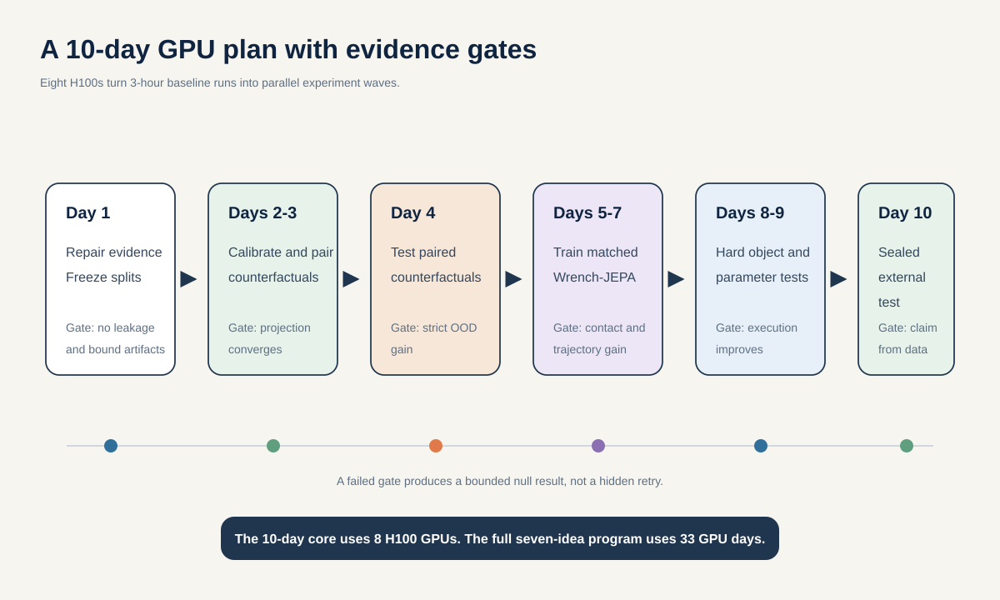

| Calendar | Research track | GPU use | Gate |
|---|---|---|---|
| Day 1 | Freeze claims, splits, corruption families, and counterfactual ranges | One 3-hour wave: raw, random, heuristic, and matched baseline jobs | Every row has identity, source, units, tier, and hash |
| Days 2-3 | Calibrate feasibility energy and generate paired counterfactuals | Parallel 3-hour light waves; cache OpenSim/Moco outputs and MuJoCo minimal pairs | No subject, trial, or dynamics-pass leakage; projection converges on at least 90 percent of validation clips |
| Day 4 | Replicate surviving feasibility and paired-training results | Three-seed wave plus out-of-range and two-factor evaluation | Score calibration and strict out-of-range gain clear preregistered gates |
| Days 5-7 | Train matched Wrench-JEPA forward and inverse arms | Reserve the eight H100s for 6 to 12 hour heavy-model waves and ablations | Contact and trajectory gain over strongest matched baseline |
| Day 8 | Run held-out object, parameter-composition, and execution tests | Parallel simulator evaluation and diversity checks | Executable goal success gain survives hard holdouts |
| Day 9 | Run harmonized cross-dataset transfer and force-calibration evaluation | Replication and evaluation wave | No broad claim without real transfer or held-out kinetic agreement |
| Day 10 | Perform sealed analysis and reproduce the selected result | Final rerun from clean environment | Claim is reduced or expanded strictly from sealed outcomes |

For the remaining proposals on the same eight-GPU pool, reserve days 11 to 15 for Gauge-Aware 4D Biomechanics, days 16 to 20 for Contact-Mode Generative S-JEPA, days 21 to 25 for the Value-of-Information Agent, and days 26 to 33 for the Cross-Embodiment Action Alphabet. They can share spare short waves only after the core path has a frozen manifest and a passing gate; otherwise, serial allocation is more interpretable.

### Compute-aware simplifications

- Begin with 11 to 22 joints and object keypoints. Add meshes only after the causal test works.
- Use MJX-JAX for batched gradient experiments only where its feature set suffices. Use MJX-Warp for throughput, not gradients.
- Cache OpenSim or Moco outputs. Do not place a full musculoskeletal optimization inside every minibatch.
- Start with Video Depth Anything Small. Larger checkpoints and SMPL assets have tighter use restrictions and higher compute.
- Use Wan2.2 only after trajectories are fixed, and re-estimate pose and depth from rendered video to quantify renderer drift.
- Train the Qwen router on cached tool results before allowing live calls.

## Risks that could invalidate the whole direction

1. **No paired human-object force data.** Real hand-object wrench claims are impossible without new instrumentation. Keep those labels simulated and validate real contact kinematics only.
2. **Simulator mismatch.** A score may learn one body's conventions. Cross-simulator and cross-morphology evaluation is mandatory.
3. **Depth-scale error.** Force scales with mass and acceleration. A small metric error can become a large dynamics error. Propagate the gauge posterior.
4. **Pseudo-label consensus is not truth.** WHAM, depth, and SAM can share image failure modes. Agreement is evidence of consistency, not correctness.
5. **Rare valid motion looks anomalous.** Include measured atypical motion as hard positives and condition on task and morphology.
6. **Contact labels are temporally ambiguous.** Evaluate timing tolerance explicitly and use continuous contact probability where appropriate.
7. **Generative metrics reward sampling volume.** Always pair best-of-K with mean quality, precision, proper scores, and executable mode count.
8. **Clinical overclaim.** GAVD folder labels and visual clips do not validate diagnosis, prognosis, fall risk, or treatment response.
9. **License incompatibility.** SMPL, SMPL-X, GRAB, BEHAVE, InterCap, WHAM assets, and some depth checkpoints carry restrictions. Maintain a release-safe joint representation and verify every asset before redistribution.
10. **Repository lineage drift.** New results are not interpretable until experiment fingerprints, feature widths, notebooks, and documentation agree.

## Adversarial review and final revision record

The first-pass concepts were deliberately challenged against the newest related work and against the actual repository evidence. The final agenda incorporates the following changes.

| First-pass weakness | Why it was weak | Revision made |
|---|---|---|
| “Causal Contact JEPA” | Causal-JEPA already uses object masking as a latent intervention. | Renamed Wrench-JEPA and made metric contact wrench, execution, and real force calibration the contribution. |
| “Masked Biomechanical Actions” | Masked Visual Actions already establishes forward and inverse entity completion. | Required explicit contact graph and 6D wrench tokens, cross-embodiment execution, and held-out physical parameters. |
| “Simulator-grounded score” | Physics projection and simulation plausibility metrics already exist. | Replaced it with a decomposable likelihood-ratio energy calibrated to real force plates and tested across simulators. |
| “Generative S-JEPA” | Human and object motion diffusion is crowded, and JEPA alone is not generative. | Made the modeled object a distribution over executable contact modes and forces, with proper scores and mode coverage. |
| “Movement foundation model” | The label was broad, data were not jointly paired, and the contribution was unclear. | Replaced it with a contact-and-impulse action alphabet and a fixed few-shot cross-embodiment test. |
| “Add a depth model” | Modern world models already use depth and 3D point flow. | Separated observation gauge from physical scale, gravity, morphology, and object size, then tested raw metric downstream effects. |
| “Qwen tool agent” | Generic tool RL is already crowded, and the deck already proposes cost-aware calls. | Made a randomized acquisition benchmark with counterfactual value labels, then required frontier gains over fixed and supervised routers at frozen budgets. |
| “Differentiate through simulation” | OpenSim/Moco is too slow for ordinary minibatches, and MuJoCo gradient support depends on backend and contact features. | Made simulators cached offline teachers first, with a learned critic and only targeted differentiable experiments later. |
| “Build on the reported S-JEPA result” | The clinical study is transductive, current lineages conflict, and the AMASS run bundle is incomplete in the checkout. | Grounded the agenda in reusable code and controls, not in a claimed representation win. |

The diagrams were also constrained to one main message each, short labels, a shared visual grammar, and no crossing connectors. Each diagram is rendered and inspected at full size before release. Dense methodological detail remains in the text rather than inside the figures.

## Final recommendation

Start with the Force-Calibrated Feasibility Energy. It converts “looks physically plausible” into a testable measurement and can falsify later generative claims. In parallel, build paired MuJoCo counterfactuals and the typed wrench schema. Proceed to full Wrench-JEPA only if both prerequisites pass their day-4 gates.

The most important conceptual bet is this:

> A useful physical representation of movement is organized around where momentum is exchanged, how much is exchanged, and which alternative contact plan could produce the same goal. Skeleton coordinates describe the result. Contact wrenches constrain a candidate mechanism and quantify external momentum exchange, but do not uniquely identify neural control or muscle activation.

That hypothesis is narrow enough to fail, broad enough to matter to world models, and concrete enough to help biomechanics researchers measure, generate, and audit human movement.

## Reference index

### Core world models and conditioning

- Abdelfattah and Alahi, [S-JEPA](https://sjepa.github.io/), ECCV 2024.
- Assran et al., [V-JEPA 2](https://arxiv.org/abs/2506.09985), 2025.
- Zhou et al., [DINO-WM](https://arxiv.org/abs/2411.04983), 2024.
- Zhang et al., [ControlNet](https://arxiv.org/abs/2302.05543), ICCV 2023.
- [Causal-JEPA](https://arxiv.org/abs/2602.11389), 2026.
- [IA-JEPA](https://arxiv.org/abs/2605.15466), 2026.
- [V-JEPA 2.1](https://arxiv.org/abs/2603.14482), 2026.

### Physics and inverse action

- [GoalForce](https://arxiv.org/abs/2601.05848), CVPR 2026.
- [Masked Visual Actions](https://arxiv.org/abs/2607.19343), 2026.
- [How Far Is Video Generation from World Model?](https://arxiv.org/abs/2411.02385), 2024.
- [PISA](https://arxiv.org/abs/2503.09595), 2025.
- [SimDiff](https://arxiv.org/abs/2509.20927), 2025.
- [MuJoCo documentation](https://mujoco.readthedocs.io/en/stable/overview.html) and [MJX documentation](https://mujoco.readthedocs.io/en/stable/mjx.html).
- Dembia et al., [OpenSim Moco](https://journals.plos.org/ploscompbiol/article?id=10.1371/journal.pcbi.1008493), PLOS Computational Biology 2020.

### Human motion, objects, and biomechanics

- Yuan et al., [PhysDiff](https://arxiv.org/abs/2212.02500), ICCV 2023.
- Diller and Dai, [CG-HOI](https://arxiv.org/abs/2311.16097), CVPR 2024.
- Wang et al., [PhysHOI](https://arxiv.org/abs/2312.04393), 2023.
- [InterDiff](https://arxiv.org/abs/2308.16905), ICCV 2023.
- [OMOMO](https://arxiv.org/abs/2309.16237), SIGGRAPH Asia 2023.
- [InterPhys](https://arxiv.org/abs/2605.01036), 2026.
- Taheri et al., [GRAB](https://arxiv.org/abs/2008.11200), ECCV 2020.
- Bhatnagar et al., [BEHAVE](https://arxiv.org/abs/2204.06950), CVPR 2022.
- Huang et al., [InterCap](https://arxiv.org/abs/2209.12354), GCPR 2022.
- [AddBiomechanics data](https://addbiomechanics.org/download_data.html) and [Nimble data guide](https://nimblephysics.org/docs/working-with-addbiomechanics-data.html).
- [GaitDynamics](https://www.nature.com/articles/s41551-025-01565-8), Nature Biomedical Engineering 2026.
- [OpenCap validation](https://journals.plos.org/ploscompbiol/article?id=10.1371/journal.pcbi.1011462) and [OpenCapBench](https://openaccess.thecvf.com/content/WACV2025/html/Gozlan_OpenCapBench_A_Benchmark_to_Bridge_Pose_Estimation_and_Biomechanics_WACV_2025_paper.html).

### 4D perception and generation

- Ravi et al., [SAM 2](https://github.com/facebookresearch/sam2), 2024.
- Shin et al., [WHAM](https://github.com/yohanshin/WHAM), CVPR 2024.
- [Video Depth Anything](https://github.com/DepthAnything/Video-Depth-Anything), CVPR 2025.
- [VGGT](https://github.com/facebookresearch/vggt), CVPR 2025.
- [AVDC](https://arxiv.org/abs/2310.08576), ICLR 2024.
- [PointWorld](https://point-world.github.io/), CVPR 2026.
- [Wan2.2](https://github.com/Wan-Video/Wan2.2), 2025-2026.

### Multimodal and agentic learning

- [SleepFM](https://www.nature.com/articles/s41591-025-04133-4), Nature Medicine 2026.
- Bruce et al., [Genie](https://proceedings.mlr.press/v235/bruce24a.html), ICML 2024.
- [LAPA](https://proceedings.iclr.cc/paper_files/paper/2025/hash/45d74e190008c7bff2845ffc8e3facd3-Abstract-Conference.html), ICLR 2025.
- [DexWM](https://arxiv.org/abs/2512.13644), 2025-2026.
- [Qwen3-VL](https://github.com/QwenLM/Qwen3-VL) and [Qwen-Agent](https://github.com/QwenLM/Qwen-Agent).
- [ReTool](https://arxiv.org/abs/2504.11536) and [ToolRL](https://arxiv.org/abs/2504.13958), 2025.
- [GEN-1.5](https://generalistai.com/blog/gen-1.5), company report, 2026.
