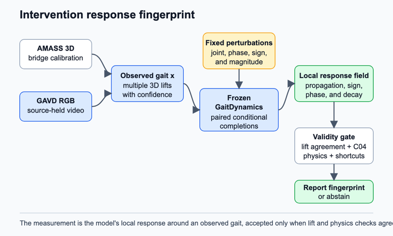

# Intervention response fingerprint

## Claim

A frozen normal-gait world model can characterize an observed walk through its repeatable local response to standardized virtual perturbations, not only through passive prediction error.

## Gap

A world model predicts how a state changes. Current gait uses of generative models mostly ask whether an observed motion is surprising. Zero-shot gait classification with a motion diffusion model already correlates scalar denoising error with Parkinson gait scores, so another anomaly score would not create a new instrument ([paper](https://openreview.net/forum?id=L5xyzjMCwd)). GaitDynamics can inpaint gait coordinates and generate conditioned modifications, but it does not use the response to a fixed perturbation bank as a gait measurement ([full preprint](https://pmc.ncbi.nlm.nih.gov/articles/PMC11957236/)). GaitEncoder predicts an intervention outcome in a compact clinical latent space, but it does not estimate a local response field around each observed walk ([full text](https://www.medrxiv.org/content/10.64898/2026.07.07.26357479v1)). GoalForce queries a video model with physical goals, but its response is validated on synthetic object interactions rather than observed human gait ([paper](https://arxiv.org/pdf/2601.05848)).

A clinician cannot infer this stress test from a class probability. It should reveal which unedited joints and phases change when one small motion variable is altered, and how quickly the completion returns toward the learned gait distribution.

## Question

Does the local response of a normal-motion model to the same small virtual perturbations contain stable information about an observed gait, or is that response determined only by the lift, walking speed, perturbation magnitude, and the model's population prior?

## The bet

The bet is that passive surprise collapses different coordination structures into one number. Two walks can have similar likelihood under a normal prior yet produce different conditional responses when knee flexion, hip adduction, ankle dorsiflexion, or pelvis trajectory is changed at a fixed gait phase. I may be wrong because GaitDynamics was not trained as a causal simulator and may pull every input toward the same average motion.

## Decisive experiment

Define a response operator around motion (x). For perturbation δ, run GaitDynamics with the same diffusion noise seeds on (x) and (x+δ). Clamp the edited coordinate and observed high-confidence coordinates. Inpaint the remaining joint-time values. The response is the change in the unedited output divided by the perturbation magnitude. Summaries include propagation to other joints, sign symmetry, phase specificity, and decay away from the edited interval.

First validate on held-out AMASS motion with known synthetic edits. Then test a locked set of GAVD source videos with two lift routes. The bet survives only if response fingerprints are more repeatable across lifts than passive surprise, differ from raw finite differences, and retain source-video-held-out association with supported `gait_pat` labels after the shortcut controls. It is falsified if lift identity, speed, or edit norm explains the response as well as the observed motion does.

## What a null result teaches

A null result would show that conditional sensitivity from a pretrained motion diffusion model is not person-specific enough to act as a gait instrument. It would place a boundary on claims that generative priors reveal control or coordination. It would also redirect the program toward C14's conditional coordination graph, which asks a weaker question using only masked prediction.

## Method

The base is public `GaitDynamicsDiffusion.pt`. It remains frozen. GaitDynamics represents 1.5-second windows in Rajagopal OpenSim coordinates. Rajagopal coordinates describe a musculoskeletal model without arms, so the perturbation bank uses only lower-body and pelvis variables. `GaitDynamicsRefinement.pt` provides an optional predicted force-consistency witness. Its outputs are model predictions, never measured forces.

AMASS supplies clean SMPL+H 3D motion. SMPL+H is a parametric body representation with articulated hands. We retarget locomotion windows into Rajagopal coordinates, then project them through sampled cameras, occlusion, timing changes, and pose noise. The full 348-video GAVD cache supplies the target RGB. A new pose manifest records source video, frame interval, 2D confidence, lift method, and split. WHAM is the primary SMPL lift; a second route measures ambiguity. An AMASS-trained phase head aligns perturbations and abstains when lift phases disagree.

For each window, use four perturbation sites, two signs, and two magnitudes. Reuse common noise seeds so diffusion randomness cancels in paired differences. A small low-rank response summarizer converts the resulting joint-by-joint response tensor into stable features. It trains on AMASS corruptions only. A capacity-matched linear head then measures association with GAVD labels under source-video-held-out folds.

*Figure 1. Each observed gait receives the same virtual perturbation bank. Paired frozen-model completions form a local response field, which is accepted only when it survives lift, physics, and shortcut checks.*

## Evidence

The primary comparison is response fingerprint versus passive GaitDynamics surprise under identical lifts and windows. Measurements are cross-lift repeatability correlation, sign-symmetry error, response-map distance under repeated noise seeds, and source-video-held-out macro average precision over supported observational labels. The result must hold within camera-view, speed, and pose-confidence strata.

Three required ablations are: remove conditioning on the observed walk while keeping the perturbation; replace GaitDynamics with a smooth interpolation operator; and randomize perturbation phase while preserving edit norm. Additional baselines are raw finite differences, MDM surprise, C04 feasibility and typicality scores, a random response summarizer, and the local S-JEPA horizon atlas.

## Shortcut audit

The most dangerous shortcut is that bad lifts react strongly to every edit. The control is a corruption-matched AMASS envelope plus two lift routes. The second danger is speed: slower clips expose longer apparent relaxation. Time-normalize phase and match cadence before comparison. The third is edit energy. Use equal-norm positive and negative edits at two magnitudes and report linearity. Background, duration, centroid drift, foreground area, view, confidence, and missing-joint rate enter a shortcut-only model that the response fingerprint must beat.

## Compute and schedule

The local calibration anchor is one H100 for 3 hours per 100 JEPA epochs, assumed single-GPU. Three 10-epoch response summarizers cost `1 x 3 h x 10/100 x 3 = 0.90 H100-hours`. The 72-hour pilot reserves `4 H100 x 4 h = 16 H100-hours` for pose and lift extraction and `8 H100 x 3 h = 24 H100-hours` for paired diffusion queries. Total pilot budget is `0.90 + 16 + 24 = 40.90 H100-hours`. Day 1 benchmarks actual frozen-model throughput. No cross-hardware conversion is assumed.

Day 1 builds the manifest subset and benchmarks paired sampling. Day 2 validates response recovery on AMASS. Day 3 produces lift-repeatability and shortcut results on locked GAVD sources. Abandon on day 4 if the motion-identity effect is no larger than the lift-method effect. Days 4 to 6 extract the full corpus. Days 7 to 9 run the response bank. Days 10 to 11 fit locked probes and ablations. Days 12 to 14 aggregate source folds and inspect response maps. The full run is capped at `4 x 8 + 8 x 24 + 0.90 = 224.90 H100-hours`: 32 for extraction, 192 for queries, and 0.90 for summarizers. If throughput misses the day-1 gate, cut to two perturbation sites and one magnitude before reducing source coverage.

## Contribution, split

Machine learning contribution: a standardized local response operator that turns a frozen motion prior into an active, uncertainty-aware measurement. Clinical and biomechanics contribution: an anatomical map of model-implied motion coupling that can characterize observed gait without claiming diagnosis, measured force, or real intervention response.

## Nearest prior work

GaitDynamics is the nearest prior because it uses one diffusion model for inpainting and conditioned gait modification. This proposal treats paired local sensitivity across standardized perturbations as the measured object and tests whether it is stable enough for source-held gait characterization.

## Risks

1. **Pseudo-causality.** Readers may interpret model sensitivity as patient response. Mitigation: use “model-response fingerprint” throughout and prohibit treatment or motor-control claims.
2. **Retargeting dominance.** Rajagopal conversion may determine the response. Mitigation: synthetic AMASS recovery, alternate lifts, and a retargeter-only Jacobian baseline.
3. **Query cost.** The perturbation bank may exceed the schedule. Mitigation: benchmark on day 1, share noise seeds, batch windows, and predeclare the two-site scope cut.
