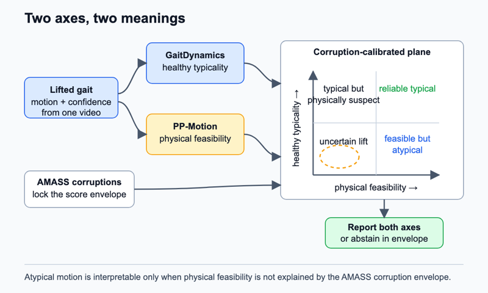

# Physical feasibility versus healthy typicality

## Claim

Physical feasibility and healthy-motion typicality can be measured as separate axes, allowing a gait system to distinguish an atypical walk from an unreliable monocular reconstruction.

## Gap

Generative surprise is often treated as abnormality, but a high error can also come from a poor pose lift, unusual camera geometry, or detector failure. Zero-shot gait classification with diffusion models reports a clinical association from one surprise score but does not separate observation error from motion atypicality ([paper](https://openreview.net/forum?id=L5xyzjMCwd)). GaitDynamics provides a public normal-gait diffusion prior in metric OpenSim coordinates ([full preprint](https://pmc.ncbi.nlm.nih.gov/articles/PMC11957236/)). PP-Motion provides a public learned evaluator trained from simulator-derived minimum-correction labels ([paper](https://arxiv.org/pdf/2508.08179)). PhyMotion independently shows that recovered human motion can be checked through kinematic, contact, balance, and inverse-dynamics proxies, where inverse dynamics estimates causes that could produce a motion rather than measuring force ([paper](https://arxiv.org/pdf/2605.14269)).

These works supply scores but not the key validity test for observed clinical video. A physically impossible lift and a feasible but atypical gait should not receive the same interpretation. If the two concepts cannot be separated after realistic corruption, physical scoring cannot validate world-model gait judgments.

## Question

Do simulator-derived feasibility and normal-motion typicality define stable, separable axes for in-the-wild gait, or do both collapse into a common measure of monocular reconstruction quality?

## The bet

The bet is that four regimes exist. Clean typical gait is feasible and typical. A detector or lift failure is infeasible and atypical. Some observed pathological presentations are feasible but atypical. A smooth but physically inconsistent reconstruction can appear typical to a motion prior while failing feasibility. I may be wrong because PP-Motion and GaitDynamics both inherit generated-motion and retargeting biases that make their scores nearly collinear.

## Decisive experiment

Build a two-dimensional calibration plane on held-out AMASS. One axis is GaitDynamics typicality under fixed conditional denoising queries. The second is the frozen PP-Motion score. Apply controlled corruptions with known intent: camera and lift noise, bone-length jumps, foot sliding, time warps, joint-angle violations, and feasible speed or stride changes. Lock score normalization before opening GAVD labels.

The decisive observation is independent motion along both axes. Physical corruptions should move feasibility more than matched feasible style changes. Camera and lifting failures should occupy the corruption envelope. GAVD sequences outside that envelope may then be described as feasible yet atypical, atypical and infeasible, or uncertain. The bet is falsified if a one-dimensional model explains the two scores after controlling pose confidence, speed, and corruption strength.

## What a null result teaches

A null result would show that current public physical evaluators do not provide an independent validity axis for monocular gait. That finding would prevent PP-Motion or similar scores from being used as biomechanical evidence on GAVD. It would also force C13 and C03 to report only lift-stable model behavior, without physical interpretation.

## Method

The normality base is public `GaitDynamicsDiffusion.pt`, frozen throughout. It models 1.5-second windows in Rajagopal OpenSim coordinates. Typicality is a corruption-normalized conditional denoising residual computed at fixed noise levels and with fixed random seeds. It is not presented as likelihood. The feasibility base is public `pp-motion_pretrained/checkpoint_latest.pth`, also frozen. PP-Motion expects 60-frame, 25-joint SMPL motion and returns a physical-perceptual score.

PP-Motion is the first implementation because its official repository and checkpoint are accessible and it accepts motion directly. A PhyMotion-style GVHMR-to-MuJoCo stack requires more components and becomes a later sensitivity analysis. PP-Motion's unstated code and weight license remains a release constraint.

AMASS supplies clean 3D SMPL+H motion. Each sequence is converted separately into GaitDynamics and PP-Motion inputs before projection, corruption, relifting, and rescoring. This produces a calibrated map of score movement caused by observation error alone. GAVD supplies all 348 confirmed-decodable source videos and 1,874 sequences. A new pose manifest stores 2D confidence and lift provenance. Source-video-held-out folds prevent clips from one video appearing on both sides of evaluation.

A small monotone calibration head maps raw scores into AMASS corruption percentiles. It cannot rotate the two axes or use GAVD labels. A separate capacity-matched probe tests whether two axes retain more supported `gait_pat` information than either score alone.

*Figure 1. Frozen normality and feasibility models place each lifted gait on two calibrated axes. AMASS corruptions define the uncertainty region before any GAVD label analysis.*

## Evidence

The primary comparison is a two-axis model versus the best one-dimensional projection under held-out AMASS corruptions and source-video-held-out GAVD. Measurements include correlation after controlling lift error, variance each axis explains beyond the other, stability across lift routes, and macro average precision from locked score summaries. The label result is supporting evidence, not the claim.

Three required ablations are: replace PP-Motion with jerk and joint-limit heuristics; randomize PP-Motion outputs within motion-quality strata; and remove the AMASS corruption calibration. Additional comparisons are pose-confidence-only, raw lift residual, GaitEncoder distance, MDM surprise, and human-readable examples from each quadrant.

## Shortcut audit

The leading shortcut is lift quality. Both scores may fall when joints jitter or depth flips. Build matched corruption strata and require separation within each stratum. Speed is the second threat, so match cadence and path length and test time-warped copies. Smoothness is the third: compare PP-Motion against acceleration, jerk, foot sliding, and joint-range metrics. Duration, centroid drift, foreground area, view, missing joints, and pose confidence feed a shortcut-only baseline. The two-axis measurement must add information beyond it.

## Compute and schedule

The local anchor assumes one H100 and 3 hours for 100 JEPA epochs. Three 25-epoch calibration heads cost `1 x 3 h x 25/100 x 3 = 2.25 H100-hours`. The 72-hour pilot reserves `4 H100 x 4 h = 16 H100-hours` for pose and lift extraction, `4 H100 x 4 h = 16 H100-hours` for frozen scoring and corruptions, and 2.25 for calibration. Total is `16 + 16 + 2.25 = 34.25 H100-hours`. Frozen throughput is measured on day 1 rather than inferred from other GPU types.

Day 1 verifies both checkpoint interfaces and scores clean AMASS. Day 2 runs the corruption grid. Day 3 locks axes and evaluates a GAVD subset. Abandon on day 4 if score collinearity exceeds 0.9 within corruption strata or if PP-Motion is matched by jerk. Days 4 to 6 build the full pose manifest. Days 7 to 9 score full GAVD and alternate lifts. Days 10 to 11 run ablations. Days 12 to 14 aggregate folds and inspect quadrants. The full cap is `4 x 8 + 8 x 8 + 2.25 = 98.25 H100-hours`. If extraction slips, keep all source videos but score one locked window per sequence.

## Contribution, split

Machine learning contribution: a corruption-calibrated disagreement test that separates two meanings commonly collapsed into generative error. Clinical and biomechanics contribution: an explicit quality-control axis that prevents an impossible reconstruction from being described as atypical gait. Neither axis is a diagnosis or measured kinetics.

## Nearest prior work

PP-Motion is the nearest scoring prior. It evaluates generated 3D motion with a learned physical-perceptual score. This proposal pairs it with a frozen healthy-gait world model and asks whether their disagreement remains identifiable after monocular observation shift.

## Risks

1. **Shared bias.** Both models may respond to smoothness. Mitigation: jerk-matched controls and a deterministic physics sensitivity analysis.
2. **Coordinate mismatch.** Separate retargeters may create artificial disagreement. Mitigation: validate both routes on the same AMASS windows and model retargeting error explicitly.
3. **Weak semantics.** Quadrants may not align with GAVD labels. Mitigation: keep the claim about separability and validity, not classification accuracy.
