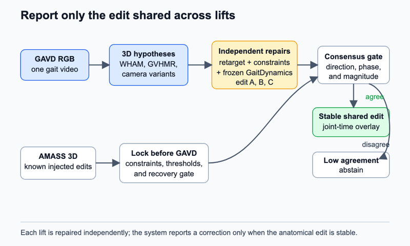

# Multi-lift minimum normalizing edit

## Claim

A frozen normal-gait prior can return a stable, anatomically explicit minimum edit for an observed walk, while abstaining when monocular depth makes that edit unidentifiable.

## Gap

An anomaly score says that motion differs from a learned distribution but not what would have to change. Zero-shot gait classification with diffusion models already uses denoising error as a scalar and anatomical signal ([paper](https://openreview.net/forum?id=L5xyzjMCwd)). GAITGen separates motion and pathology latents and recombines them to generate impaired gait, but its processed data and checkpoints remain unreleased and its output is not a minimum normalizing edit ([paper](https://openaccess.thecvf.com/content/WACV2026/papers/Adeli_GAITGen_Disentangled_Motion-Pathology_Impaired_Gait_Generative_Model_--_Bringing_Motion_WACV_2026_paper.pdf)). GaitEncoder measures distance from a compact clinical gait space and predicts some intervention outcomes, but it does not solve a constrained correction for noisy monocular video ([full text](https://www.medrxiv.org/content/10.64898/2026.07.07.26357479v1)). GaitDynamics provides the missing public normal-gait inpainting checkpoint ([full preprint](https://pmc.ncbi.nlm.nih.gov/articles/PMC11957236/)).

The unsolved issue is identification. A correction obtained from one 3D lift may fix camera depth, phase alignment, or body-model mismatch rather than gait. A useful counterfactual must agree across plausible lifts and preserve observed quantities that should not change.

## Question

Does the smallest normal-prior edit remain anatomically consistent across plausible 3D reconstructions of the same gait video, or is a monocular normalizing counterfactual fundamentally underdetermined?

## The bet

The bet is that some deviations produce a shared correction direction even when absolute depth and joint angles vary. Consensus will be strongest for phase-local lower-body patterns and weakest for severe occlusion or nonstandard devices. I may be wrong because GaitDynamics only knows laboratory-style, mostly unimpaired motion and may repair every target toward the same training-set mode.

## Decisive experiment

Inject known, phase-local deviations into held-out AMASS gait. Project each sequence through several cameras and pose corruptions. Recover multiple 3D hypotheses, then solve the minimum edit independently for each. The solver succeeds only if it recovers the inverse of the injected change more accurately than raw nearest-neighbor projection and if the edit direction agrees across lifts.

Lock the solver and apply it to GAVD. The primary target-domain observation is cross-lift agreement, not label accuracy. Supported `gait_pat` labels test whether stable edit signatures carry descriptive information under source-video-held-out folds. The bet is falsified if the edit follows camera, lift model, cadence, or pose confidence more strongly than the underlying AMASS motion identity.

## What a null result teaches

A null result would establish that one in-the-wild video cannot support a unique model-based gait correction with current lifting tools. That is valuable because it rules out visually appealing but unsupported counterfactual explanations. The system could still use edit disagreement as an abstention signal and fall back to C14's 2D coordination graph.

## Method

The base is public `GaitDynamicsDiffusion.pt`, frozen throughout. The model inpaints 1.5-second Rajagopal OpenSim motion windows. `GaitDynamicsRefinement.pt` may score predicted force consistency, but its output is only a learned prior. No predicted force is treated as a GAVD measurement.

For a retargeted motion (x), solve for edit (e) that minimizes a weighted joint-angle and trajectory norm plus the GaitDynamics conditional denoising residual. Constraints preserve high-confidence 2D reprojection, cadence, walking direction, pelvis travel, bone lengths, and unedited gait phases. Confidence weights prevent missing joints from acting like zeros. The edit budget is normalized by AMASS joint variability so one degree at the ankle and pelvis displacement are comparable.

AMASS supplies metric SMPL+H motion and known synthetic deviations. The bridge retargets clean SMPL+H to Rajagopal coordinates, projects it to 2D, adds GAVD-like occlusion and jitter, and relifts it. GAVD supplies 348 confirmed-decodable videos and 1,874 sequences. The missing pose manifest is created with source IDs, frame bounds, 2D confidence, lift checkpoint, camera estimate, and immutable split.

WHAM `wham_vit_w_3dpw.pth.tar` is the primary lift. GVHMR `gvhmr_siga24_release.ckpt`, when its SMPL-X assets are compatible, is the independent lift. Camera and depth perturbations around each recovered body add further hypotheses. An AMASS-trained phase head aligns each hypothesis and abstains when phase estimates disagree. A small SMPL-to-Rajagopal retargeter is the only trained motion component. Edit consensus uses phase-aligned cosine agreement, normalized magnitude dispersion, and sign consistency. Low consensus triggers abstention.

*Figure 1. Several 3D hypotheses from one video are repaired independently by the same frozen normal-gait prior. Only the shared anatomical edit is reported; disagreement produces abstention.*

## Evidence

The primary source-domain measurement is recovery of known AMASS edits. Report joint-angle error, phase error, support overlap, and edit-direction cosine similarity on held-out identities and cameras. The primary GAVD measurement is edit agreement across lifts. Secondary evidence is source-video-held-out macro average precision from the consensus edit signature and blinded inspection of joint-time overlays.

Three required ablations are: remove the 2D reprojection constraint; replace GaitDynamics with the nearest AMASS neighbor; and optimize from one lift only. Additional baselines are MDM surprise, GaitEncoder distance, raw lift disagreement, C17 repair-set dispersion, and equal-norm random edits. Report performance within view and pose-confidence strata.

## Shortcut audit

The leading shortcut is walking speed. A normal prior may “repair” slow gait by accelerating it. Cadence, pelvis travel, and window duration are constrained, with a separate speed-release ablation. The second shortcut is lift preference. Compare within-video hypotheses and require motion-identity effects to exceed lift-method effects. The third is phase error, controlled by multiple phase initializations and cyclic-shift tests. A shortcut-only model receives duration, centroid drift, foreground area, view, pose confidence, missing joints, and retargeting residual. It must not explain consensus edits.

## Compute and schedule

The local anchor assumes one H100 and 3 hours per 100 JEPA epochs. Three 25-epoch retargeters cost `1 x 3 h x 25/100 x 3 = 2.25 H100-hours`. The 72-hour pilot reserves `4 H100 x 4 h = 16 H100-hours` for two lift routes and `8 H100 x 3 h = 24 H100-hours` for frozen repair optimization. Total is `2.25 + 16 + 24 = 42.25 H100-hours`. Day 1 measures actual query throughput.

Day 1 creates a locked pose subset and tests retargeting. Day 2 runs known-edit recovery on held-out AMASS. Day 3 measures cross-lift edit agreement on GAVD. Abandon on day 4 if single-lift edits outperform consensus recovery or lift identity explains more variance than AMASS motion identity. Days 4 to 6 create the full pose manifest. Days 7 to 9 run repairs. Days 10 to 11 run constraints and baselines. Days 12 to 14 aggregate source folds and inspect overlays. Full compute is capped at `4 x 8 + 8 x 8 + 3 x 8 + 2.25 = 122.25 H100-hours`: extraction, repair queries, controls, and retargeters. If optimization misses its gate, reduce hypotheses per video before reducing source coverage.

## Contribution, split

Machine learning contribution: a consensus-constrained counterfactual that reports whether a normalizing edit is identified across observation hypotheses. Clinical and biomechanics contribution: an anatomical joint-time description of model-proposed change with an explicit uncertainty gate. It is not treatment advice or evidence that the proposed change is physically achievable.

## Nearest prior work

Zero-shot Gait Classification with Diffusion Models is the nearest clinical measurement prior because it interprets motion diffusion error anatomically. This proposal solves an explicit constrained edit, tests recovery on known deviations, and requires agreement across monocular lift hypotheses.

## Risks

1. **Mode collapse.** Every input may receive the same average correction. Mitigation: motion-conditioned nulls, edit diversity checks, and known AMASS deviations.
2. **Optimization artifacts.** The solver may exploit weak coordinates. Mitigation: reprojection, cadence, bone-length, phase, and confidence constraints with removal ablations.
3. **Clinical overreading.** A normalizing edit can sound prescriptive. Mitigation: label it model-proposed, report uncertainty, and prohibit treatment claims.
