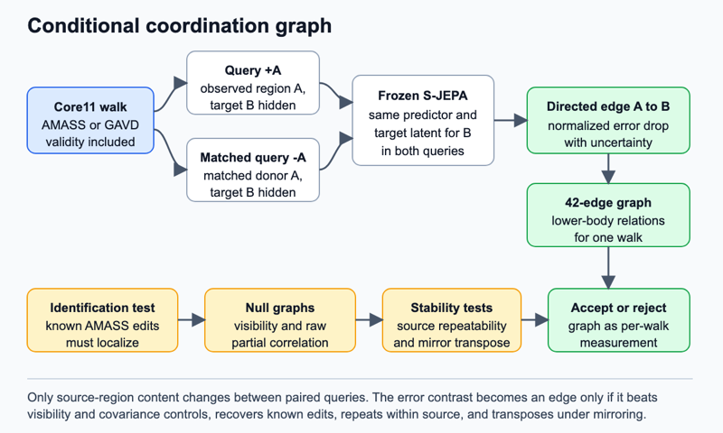

# Conditional coordination graph

## Claim

A frozen skeleton predictor can become a directed, per-walk map of which body regions help predict which others, revealing coordination that its pooled embedding loses.

## Gap

A world model predicts how a system changes. A joint-embedding predictive architecture, or JEPA, predicts hidden internal vectors called latents instead of reconstructing coordinates. S-JEPA applies this idea to skeletons by masking joints and predicting their latent representations, but evaluates the learned encoder through pooled action classification ([S-JEPA](https://www.ecva.net/papers/eccv_2024/papers_ECCV/papers/04755.pdf)). GaitEncoder likewise represents a stride as one clinical latent and measures distances or intervention outcomes in that space ([GaitEncoder](https://www.medrxiv.org/content/10.64898/2026.07.07.26357479v1)). CARE-PD probes and adapts pooled motion representations for Parkinsonian gait assessment ([CARE-PD](https://arxiv.org/pdf/2510.04312)).

These methods do not expose the conditional relations used by the predictor. A pooled vector cannot say whether observing the pelvis helps predict the right foot less than the left foot in one walk. That omission matters here because local frozen-encoder probes already failed: on the strict 90-frame GAVD cohort, raw Core11 reached 0.4231 mean macro-F1 while two frozen AMASS encoders reached 0.2339 and 0.2451, within the random-encoder range.

## Question

Is conditional predictability among lower-body regions specific to an observed walk, or do anatomy, cadence, and missing joints determine nearly the same graph for everyone? Either answer is useful. A walk-specific graph creates an anatomical measurement. A universal graph rules out this low-compute route.

## The bet

Mask response is more informative than the pooled encoder. The same clip supplies both terms of each edge, so a ratio of paired prediction errors can cancel the clip-wide noise scale that damages absolute features. I expect unilateral phase and excursion changes to alter edges near the affected limb while leaving matched control edges stable. I may be wrong because gait is strongly periodic and a partial-correlation graph on raw coordinates may recover the same structure.

## Decisive experiment

`CoordGraph-72` first tests identification on held-out AMASS. Apply three controlled changes: a unilateral shank phase lag, reduced knee excursion on one side, and pelvis drift. Each change has a magnitude-matched temporal shuffle. Edges touching the changed region must move more than unaffected edges after camera projection, joint dropout, and detector-like noise.

Then compute graphs on a locked GAVD subset. The graph must repeat across disjoint windows from the same source and transpose under a left-right skeleton swap. The bet is falsified if a raw partial-correlation graph matches its corruption localization, repeatability, and source-video-held-out label association within the three-seed spread.

## What a null result teaches

A null would show that the local S-JEPA stores generic anatomy and cadence but not a stable per-walk dependency structure. It would explain why changing the readout of the pooled encoder is unlikely to rescue transfer. The program should then favor active perturbation in C13 or explicit depth testing in C05.

## Method

The base is the frozen local checkpoint `outputs/repaired-jepa-seed7-v2/seed-7_standard_sjepa_best.pt`. Its Core11 input contains the pelvis plus bilateral hip, knee, ankle, heel, and forefoot points in 64-frame windows at 30 Hz. Seven regions partition these points: pelvis, left and right thigh, shank, and foot. This gives 42 possible directed edges. Inverse dynamics, which infers a cause or action from a transition, is not used.

For an edge from region A to region B, hide B in both queries. Query one contains the observed A tokens. Query two replaces them with same-region tokens from a phase-, cadence-, and confidence-matched donor clip. Token positions, counts, validities, all other context, and B's target stay fixed. The edge weight is `(error_donor_A - error_observed_A) / error_scale_B`. Positive weight means the observed A helps predict B beyond a matched substitute. The frozen target encoder supplies B's latent target. The frozen predictor supplies both errors. A small shared calibration head, trained only on corrupted AMASS, aggregates paired errors and estimates uncertainty. No GAVD label updates the graph.

AMASS provides clean SMPL+H motion, where SMPL+H is a parametric three-dimensional body model with hands. The existing converter maps it to Core11. Sampled cameras, occlusion, timing changes, and GAVD-matched confidence patterns create the transfer bridge. The target side uses the new full-video pose manifest, then the existing `gavd6 gavd convert-core11` contract. One split is assigned per source video.

*Figure 4. Two token-balanced queries differ only in whether source region A is visible. Their error contrast for hidden region B defines one directed edge. Repeating the query across region pairs produces an uncertainty-aware coordination graph.*

## Evidence

The primary comparison is the 42-edge graph against pooled prediction error from the same checkpoint, using identical windows and capacity-matched probes. Evidence has three parts: localization of known AMASS changes, within-source versus between-source graph repeatability, and macro one-versus-rest average precision for GAVD `gait_pat` categories with support in every source-held fold. Thin categories remain descriptive. Binary abnormality is not a headline.

Required baselines are raw partial correlation, raw Core11, a random encoder, the C01 horizon-error atlas, and passive MDM surprise. Three ablations are decisive: remove token balancing, replace latent error with missing-joint rate, and mirror the skeleton while requiring the graph to transpose.

## Shortcut audit

Missingness is the main threat. Prostheses, occlusion, and poor views can weaken all edges into one region. Invalid tokens are excluded symmetrically from both queries, and a visibility-only graph must fail where the latent graph succeeds. GAVD missingness masks are transplanted onto AMASS to test whether they reproduce group differences without altered motion. Every graph uses the same number of fixed-length windows. Cadence is stratified. A shortcut-only model receives duration, view, centroid drift, foreground area, confidence, and per-region missing rate on the same folds.

## Compute and schedule

The anchor is one H100 for 3 hours per 100 JEPA epochs, assumed single-GPU from the Slurm launcher. Three 25-epoch calibration heads cost `1 x 3 h x 25/100 x 3 = 2.25 H100-hours`. Pilot pose extraction costs `4 x 6 h = 24 H100-hours`; paired inference costs `8 x 2 h = 16 H100-hours`. `CoordGraph-72` totals 42.25 H100-hours.

Day 1 implements balanced queries and measures the AMASS noise floor. Day 2 trains calibration heads and runs controlled changes. Day 3 extracts the locked GAVD subset and tests repeatability. Abandon on day 4 if raw partial correlation localizes changes equally well or visibility alone matches the graph. Days 4 to 6 create the full pose manifest. Days 7 to 9 compute graphs and swaps. Days 10 to 14 fit locked probes and aggregate folds. The full cap is `80 extraction + 80 inference + 6.75 heads = 166.75 H100-hours`. If day 1 overruns, reduce seven regions to five; if extraction slips, retain all sources but one fixed window per sequence.

## Contribution, split

Machine learning contribution: a token-balanced query that turns masked latent prediction into a directed dependency measurement with identification tests. Clinical and biomechanics contribution: an anatomical graph showing which observed lower-body relations are unusual, with no diagnosis, severity, or causal motor-control claim.

## Nearest prior work

S-JEPA is closest. It uses masked latent prediction to learn a pooled action representation. It does not treat controlled mask contrasts as a per-sequence measurement or test whether they recover known coordination changes.

## Risks

1. **No arms.** Core11 cannot test arm-leg coupling. Mitigation: restrict the claim to lower-body coordination and report an arm-inclusive raw-coordinate analysis as context.
2. **Edge variance.** Each edge subtracts two errors. Mitigation: shared masks, fixed windows, bootstrap intervals, and the AMASS noise floor.
3. **Thin labels.** Several GAVD categories have few source videos. Mitigation: lock supported labels before fitting, repeat grouped splits, and make identification and repeatability primary.
