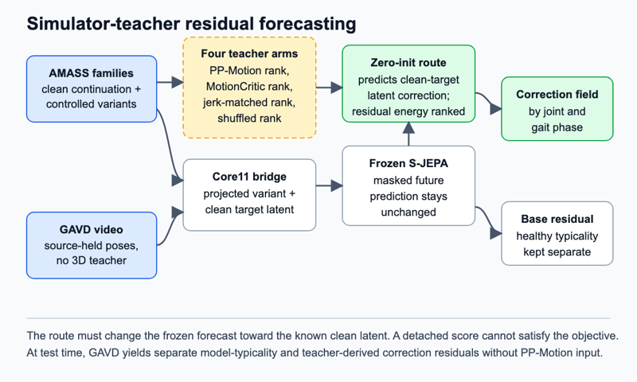

# Simulator-teacher residual forecasting

## Claim

A simulator-informed fidelity teacher can train a localized residual on a frozen gait predictor, carrying information beyond perception and smoothness into monocular video while preserving healthy typicality.

## Gap

A world model predicts system change. A joint-embedding predictive architecture, or JEPA, predicts hidden latent vectors rather than coordinates. S-JEPA learns this objective for skeletons without physical supervision ([S-JEPA](https://www.ecva.net/papers/eccv_2024/papers_ECCV/papers/04755.pdf)). PP-Motion learns one fidelity score from human comparisons and simulator-derived corrections over 46,761 better-worse motion pairs ([PP-Motion](https://arxiv.org/pdf/2508.08179)). ControlNet adds conditions through zero-initialized routes on a fixed base ([ControlNet](https://arxiv.org/html/2302.05543v3)). GoalForce applies that pattern to physical goals, but studies synthetic object interaction rather than observed gait ([GoalForce](https://arxiv.org/pdf/2601.05848)).

PP-Motion requires 60 frames of 24 joint rotations from SMPL, a parametric three-dimensional body model, plus root translation. GAVD provides monocular video and nonmetric tracks. The unknown is whether PP-Motion's added simulator supervision can reach a nonmetric skeleton predictor without collapsing into human preference, jerk, or pose-noise detection.

## Question

Does PP-Motion transfer gait information beyond both its perceptual-only ancestor and matched smoothness, or is its added physical supervision absent from the residual? Either answer determines whether simulator-informed distillation is defensible.

## The bet

The useful signal is the pattern of latent correction required by physically poor but kinematically matched futures. I expect PP-Motion training to emphasize stance, foot contact, and root support beyond both MotionCritic and jerk. I may be wrong because its combined score may mainly reproduce human preference or smooth generated motion.

## Decisive experiment

`SimTeacher-72` creates 60-frame AMASS families with one context and clean continuation. Variants contain foot skating, ground penetration, root-support mismatch, joint-limit excursions, or smooth magnitude-matched changes. Four residual routes share architecture and data. Arm P uses PP-Motion gaps. Arm M uses the released perceptual-only MotionCritic. Arm J uses jerk gaps matched to Arm P's loss and gradient norms. Arm S permutes PP-Motion ranks within corruption type and magnitude.

The frozen base predicts masked future latents. Each route must predict the known clean-target correction. Its residual norm also obeys its teacher ranking, so a score-only shortcut cannot satisfy the loss without changing the forecast. The bet survives if Arm P reduces clean-latent error on physical corruptions beyond Arms M and J while tying them on smooth controls. It is falsified if Arm P matches either control's correction field and held-out error.

## What a null result teaches

A null would show that PP-Motion transfers perception or smoothness, not identifiable physical content, through this bridge. That constrains learned motion critics used as physics rewards. Keep PP-Motion as a frozen sensitivity analysis rather than distilling it.

## Method

The frozen base is `outputs/repaired-jepa-seed7-v2/seed-7_standard_sjepa_best.pt`, trained on 64-frame Core11 motion at 30 Hz. Core11 contains the pelvis and five bilateral lower-body joint pairs. The target encoder supplies clean future latents. The predictor sees corrupted context and masked future. Inverse dynamics infers causes from transitions and is not used.

The adaptation is a low-rank copy of the predictor route attached through zero-initialized linear maps. It emits one latent correction per masked joint-time patch. For variant `x_bad`, the target is `z_clean - p_base(x_bad)`. A ranking loss orders mean correction energy within each family. This coupling prevents a detached scalar from satisfying the teacher. The base remains fixed, so base error measures typicality and route energy measures teacher-derived correction.

AMASS supplies registered SMPL+H motion, a three-dimensional body model with hands. One path converts it to Core11 and adds cameras, occlusion, timing changes, confidence loss, and joint dropout. A second preserves SMPL axis-angle rotations and root translation in PP-Motion's public `[batch, 60, 25, 3]` interface. At test time both critics are absent. The complete GAVD pose manifest feeds only Core11 tracks through the student.

*Figure 5. PP-Motion and three controls rank AMASS variants. A zero-initialized route must convert each ranking into a clean-target latent correction. GAVD yields separate typicality and correction residuals without a three-dimensional critic.*

## Evidence

Primary evidence is held-out AMASS identification: clean-latent correction error by corruption type, teacher-ranking concordance, and anatomical concentration of route energy. Transfer asks whether base error and route energy provide complementary, repeatable GAVD information. A capacity-matched probe reports macro one-versus-rest average precision for supported `gait_pat` labels under source-video-held-out folds and label budgets of 5, 10, and 25 per class. Binary abnormality is excluded.

Baselines are the frozen base, raw Core11, scalar PP-Motion on available lifts, and deterministic jerk, foot-slide, penetration, and joint-limit measures. Three ablations are MotionCritic, jerk-matched, and within-stratum shuffled teacher arms. A detached scalar teacher head is a score-only baseline.

## Shortcut audit

The main shortcut is denoising. A branch could learn corruption severity rather than physics. Corruption type and magnitude are balanced across teacher ranks, and a diagnostic probe tries to recover corruption parameters from route energy. Results repeat within jerk, acceleration, confidence, and corruption deciles. On GAVD, a shortcut model receives duration, view, cadence, centroid drift, foreground area, confidence, and missing rate. Source-video folds prevent scene duplication but cannot guarantee participant separation because GAVD has no participant identifier.

## Compute and schedule

The anchor is one H100 for 3 hours per 100 JEPA epochs, assumed single-GPU. Four arms across three seeds for 25 epochs cost `1 x 3 h x 25/100 x 4 x 3 = 9 H100-hours`. Teacher scoring and retargeting reserve `4 x 3 h = 12 H100-hours`; pilot pose extraction reserves `4 x 4 h = 16 H100-hours`. `SimTeacher-72` totals 37 H100-hours.

Day 1 verifies interfaces and score spread on controlled gait. Day 2 builds matched families. Day 3 trains short routes. Abandon on day 4 if PP-Motion lacks within-family spread or Arm P ties M or J. Days 4 to 6 complete the pose manifest. Days 7 to 10 train full routes. Days 11 to 12 run GAVD probes and shortcuts. Days 13 to 14 aggregate. The cap is `32 extraction + 48 scoring + 36 routes + 24 transfer + 2.70 probes = 142.70 H100-hours`. If day 2 slips, retain foot slide, penetration, and one smooth control. If extraction slips, use one window per sequence.

## Contribution, split

Machine learning contribution: a score-to-residual objective that forces a frozen critic's ranking to alter localized forecasts, with controls identifying what transferred. Clinical and biomechanics contribution: a joint-by-phase disagreement between model typicality and model-implied physical correction. It is not measured force, diagnosis, or treatment advice.

## Nearest prior work

GoalForce is closest because it attaches a zero-initialized physical route to a frozen world model. It does not separate simulator, perception, and smoothness signals or carry a teacher into a domain where that teacher cannot run.

## Risks

1. **Mixed supervision.** PP-Motion may differ because of human preference, not physics. Mitigation: require gains beyond MotionCritic and jerk.
2. **Domain and retargeting mismatch.** Generated-action training or SMPL conversion may define ranks. Mitigation: require held-out gait score spread, deterministic contact agreement, and two conversion routes.
3. **Teacher licensing.** The public repository states no license. Mitigation: publish the protocol and student code, not PP-Motion weights, and retain deterministic substitutes.
