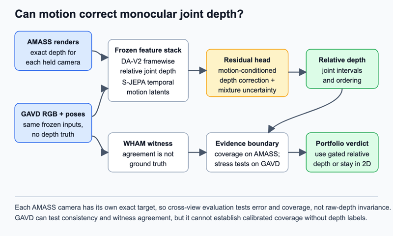

# Motion-conditioned depth residual

## Claim

Temporal gait structure can correct a frozen monocular depth estimate and attach calibrated uncertainty to relative joint depth, or provide decisive evidence that this program must remain two-dimensional.

## Gap

Monocular depth estimates distance from one camera without stereo or a range sensor. Depth Anything V2 Small produces relative rather than metric depth ([repository](https://github.com/DepthAnything/Depth-Anything-V2)). VideoMDM shows that motion priors and depth-aware reprojection can improve three-dimensional motion learned from two-dimensional video, but it reports aggregate generation and lifting error rather than per-clip depth reliability ([VideoMDM](https://arxiv.org/html/2606.13364v1)). GAVD demonstrates severe view sensitivity: its SlowFast baseline reaches 0.91 to 0.97 accuracy on predominantly front or back views but 0.56 to 0.66 on side views ([GAVD](https://arxiv.org/pdf/2407.04190)).

No current component says when temporal motion resolves a lower-body joint's depth. A plausible point estimate can swap which ankle is nearer. Calibration means that an interval advertised at 80 percent coverage contains the true value about 80 percent of the time. GAVD has no depth truth, so calibration can only be established on held-out three-dimensional data, never inferred from agreement with another model.

## Question

After controlling camera view and image-depth cues, does one second of walking motion reduce relative joint-depth error and uncertainty, or is the remaining ambiguity determined by viewpoint? A positive answer permits uncertainty-gated three-dimensional analyses. A negative answer sets a useful two-dimensional boundary for the portfolio.

## The bet

Framewise relative depth often averages across two plausible limb orderings. Walking is near-periodic, so preceding and following poses constrain which limb passes in front. I expect temporal motion to improve signed left-right ankle and knee ordering near crossings, even when its gain in mean depth error is modest. I may be wrong because a strong image model already uses appearance and occlusion, or because noisy GAVD tracks erase the temporal cue.

## Decisive experiment

`Depth-72` renders held-out AMASS identities from camera azimuth and elevation bands excluded from training. Depth Anything V2 supplies a frozen per-frame relative-depth map. A motion-conditioned head receives joint samples from that map plus frozen S-JEPA latents and predicts a residual distribution. A matched one-frame head sees the same depth samples and parameter count without temporal context.

The test uses each camera's own exact AMASS depth. It does not require raw depth to remain unchanged when the camera moves. The bet survives if the temporal head improves depth error and limb-order accuracy over both Depth Anything and the one-frame head, while its 50, 80, and 95 percent intervals remain calibrated on unseen identities, backgrounds, and cameras. It is falsified if the gain disappears in held-out camera bands or a view-only model matches it.

## What a null result teaches

A null would show that motion does not rescue monocular depth at the precision this gait program needs. C03 must then express edits in image-plane or view-conditioned coordinates. C04 must treat physical feasibility as lift-dependent. C13 must drop depth-sensitive perturbations. Lift disagreement becomes a hard abstention gate rather than an optional safeguard.

## Method

The frozen bases are `depth-anything/Depth-Anything-V2-Small-hf` and the local `outputs/repaired-jepa-seed7-v2/seed-7_reflection_equivariant_best.pt`. A joint-embedding predictive architecture, or JEPA, predicts hidden latent vectors instead of coordinates. A world model predicts state changes; this JEPA learns which motion parts predict others. The local checkpoint encodes 64-frame Core11 skeletons: pelvis plus bilateral hip, knee, ankle, heel, and forefoot. Inverse dynamics infers causes from transitions and is not used.

AMASS supplies registered SMPL+H motion, where SMPL+H is a parametric three-dimensional body model with hands. Randomized mesh textures, lighting, backgrounds, cameras, occlusions, frame rates, and joint dropout create rendered training clips. Exact camera-space joint depth is transformed per frame to robust person-relative coordinates using the body's median and interquartile range. Depth Anything predictions receive the same normalization. This removes global scale and shift while preserving joint ordering and relative separation.

The only trained component is a two-layer residual head. It reads frozen temporal S-JEPA latents, normalized Depth Anything joint samples, 2D coordinates, and confidence. It emits a two-component Gaussian mixture for the correction to each joint's framewise depth. A held-out AMASS validation split fits conformal interval scaling. GAVD never fits or recalibrates coverage. On GAVD, the same head runs on the new pose manifest and RGB depth maps. WHAM root-relative depth is an independent witness, not a label.

*Figure 6. Exact AMASS depth supervises a temporal correction to frozen image depth. Held-out cameras test both error and interval coverage. GAVD receives predictions and witness checks, but no unsupported calibration claim.*

## Evidence

Primary evidence is the change from frozen Depth Anything to the residual-corrected prediction on held-out AMASS: normalized absolute error, signed limb-order error, mixture negative log-likelihood, and empirical interval coverage. Cross-view robustness compares these measurements across paired renderings of the same motion, always against view-specific truth.

Target-domain evidence is weaker. Report agreement and disagreement with WHAM within GAVD view strata, changes in prediction entropy and witness disagreement across the 11 sequences whose view label changes, and a source-identity probe. Baselines are Depth Anything alone, WHAM, the one-frame head, raw Core11, and a matched random encoder. Three ablations remove temporal context, shuffle motion latents within camera stratum, and train without GAVD-matched corruption.

## Shortcut audit

The largest shortcut is camera and background. Training and test splits hold out identities, source backgrounds, and camera bands together. A view-only model receives azimuth, elevation, box geometry, and 2D joints. A scene-only model receives background depth around the person box, box area, centroid drift, duration, and foreground area. The motion head must beat both within every test band. On GAVD, folds group source videos and comparisons repeat within view. Depth latents are shuffled only among clips from the same view, so the null keeps the camera distribution.

## Compute and schedule

The anchor is one H100 for 3 hours per 100 JEPA epochs, assumed single-GPU. Two 25-epoch heads across three seeds cost `1 x 3 h x 25/100 x 2 x 3 = 4.50 H100-hours`. Pilot rendering, depth, pose, and WHAM extraction reserve `4 x 3 h = 12 H100-hours`. `Depth-72` totals 16.50 H100-hours.

Day 1 builds the held-camera AMASS panel and benchmarks frozen models. Day 2 trains temporal and one-frame heads. Day 3 tests calibration and GAVD witness agreement. Abandon on day 4 if temporal context improves neither error nor limb ordering, if 80 percent coverage falls outside 0.70 to 0.90 after AMASS-only calibration, or if a view-only model matches it. Days 5 to 7 run extraction. Days 8 to 10 train arms. Days 11 to 12 run ablations and shortcuts. Days 13 to 14 issue the portfolio's 3D or 2D verdict. The cap is `16.50 pilot + 96 extraction + 22.50 arms + 6.75 ablations = 141.75 H100-hours`. If rendering slips, reduce textures before camera coverage. If WHAM slips, retain a 20-source witness panel.

## Contribution, split

Machine learning contribution: a distribution-valued temporal correction to frozen image depth with camera-held calibration and an explicit target-domain evidence boundary. Clinical contribution: none directly. The output is a depth-reliability flag that permits or forbids later gait measurements; it is not a pathology or severity estimate.

## Nearest prior work

VideoMDM is closest because it combines a motion prior with depth-aware two-dimensional supervision to improve three-dimensional motion. It does not estimate calibrated per-joint depth uncertainty or ask whether motion adds information beyond a frozen image-depth model under unseen cameras.

## Risks

1. **Render gap.** Synthetic RGB may not resemble GAVD. Mitigation: randomize appearance, fit corruption statistics before training, and keep target-domain claims witness-based.
2. **Witness dependence.** WHAM and Depth Anything may share failures. Mitigation: establish truth only on AMASS and report witness-to-witness agreement before interpreting GAVD.
3. **Normalization hides metric failures.** Relative depth cannot support forces or metric step length. Mitigation: restrict the output to ordering and normalized separation, with a visible nonmetric label.
