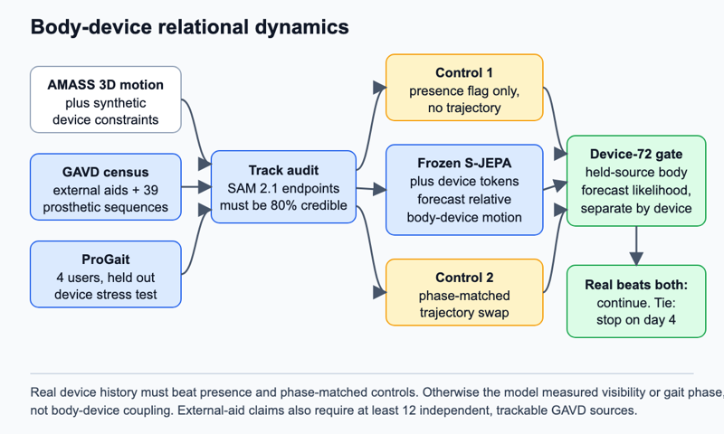

# Body-device relational dynamics

## Claim

An assistive device can be modeled as part of the moving state when its trajectory improves future body prediction beyond device presence, gait phase, and scene context.

## Gap

A world model predicts how a system changes. Latent prediction forecasts hidden model features rather than pixels or coordinates. S-JEPA, a skeleton joint-embedding predictive architecture, predicts masked latents but has no device slot ([S-JEPA](https://www.ecva.net/papers/eccv_2024/papers_ECCV/papers/04755.pdf)). Inverse dynamics infers the action behind a transition; it is not used. Masked Visual Actions represents robot and object trajectories as entities in a joint video distribution, but evaluates manipulation rather than human mobility ([Masked Visual Actions](https://arxiv.org/html/2607.19343v1)). SAM 2 provides promptable video segmentation and public tracking checkpoints, not semantic device labels ([SAM 2](https://github.com/facebookresearch/sam2)). ProGait provides 412 clips from four transfemoral prosthesis users, with segmentation, pose, and gait annotations, and shows that ordinary perception often loses the prosthetic limb ([ProGait](https://arxiv.org/html/2507.10223v1)).

Existing gait pipelines therefore treat a cane, walker, or prosthesis as background, an occluder, or a categorical cue. None asks whether the device trajectory contains predictive information about subsequent lower-body motion after the visible device and gait phase are controlled.

## Question

Is an assistive device a coordinated part of the observed dynamical system, or does its value end once the model knows that the device is present and where the person is in the gait cycle? A positive answer means body-only state is incomplete. A negative answer licenses a simpler presence-conditioned body model.

## The bet

The useful signal is relative timing. A cane tip or walker frame contacts the ground in relation to limb support, while a prosthetic segment changes the motion transmitted between hip and floor. I expect recent device motion to reduce uncertainty about future pelvis and leg motion beyond a phase-matched device control. I may be wrong because the device can be nearly determined by body points already visible, and thin-object tracking may be too noisy.

## Decisive experiment

`Device-72` starts with a census, not model training. Inspect all 348 GAVD sources for canes, crutches, or walkers; keep the 39 prosthetic sequences from eight sources separate. Prompt SAM 2.1 on each confirmed device and audit 200 sampled frames. An external-aid claim requires at least 12 independent, trackable source videos. Fewer permits only a prosthesis study.

Four matched self-supervised arms then forecast future lower-body latents: body history only; body plus device type and presence; body plus the real recent device trajectory; and body plus a phase-matched trajectory from another cycle or source. The last control preserves device type, view, speed, and gait phase while breaking the current body-device relation. The bet survives only if real trajectories reduce held-out forecast negative log-likelihood beyond presence and the phase-matched control by more than the three-seed spread. The gate uses no gait label.

## What a null result teaches

A null separates perception from dynamics. It would show that preserving the device in segmentation may improve pose recovery, as ProGait reports, while object trajectories add no forecast state after body pose and phase are known. Future pipelines should keep a device-presence flag, mask scene pixels, and spend model capacity elsewhere.

## Method

The frozen base is `outputs/repaired-jepa-seed7-v2/seed-7_standard_sjepa_best.pt`, trained on 64-frame Core11 motion at 30 Hz. Core11 contains the pelvis and bilateral hip, knee, ankle, heel, and forefoot points. The frozen tracker is SAM 2.1 `sam2.1_hiera_large.pt`. First-frame boxes and corrective prompts are recorded in the manifest so tracking is reproducible.

Each mask becomes device-specific keypoints plus confidence. A cane or crutch uses its upper endpoint and ground tip. A walker uses its front corners and mask centroid. A prosthesis uses a mask axis and its distal endpoint, kept separate from pose-detector ankle estimates. Coordinates are expressed relative to pelvis scale and direction, so RGB scene features never reach the predictor.

The adaptation is a rank-8 cross-attention route that inserts device tokens into the frozen predictor. A zero-initialized joint head predicts means and variances for future Core11 latents and device keypoints. Only this route and head train. Unlabelled real clips support ordinary past-to-future training with source-held splits.

AMASS supplies the clean bridge through registered SMPL+H bodies, a parametric three-dimensional body model with hands. Synthetic canes attach to wrist trajectories and ground contacts; walkers follow pelvis progression with double-support updates; prosthetic variants restrict one knee and define a distal rigid segment. These simulations initialize the token interface. They never count as evidence. Real GAVD and ProGait tracks must reproduce the direction of the gain.

*Figure 7. Real device history enters a low-rank route on a frozen body predictor. It must improve held-source body forecasts over presence-only and phase-matched trajectory controls. The idea stops if tracking or relational gain fails.*

## Evidence

The primary measurement is held-source negative log-likelihood of future body latents at 0.25, 0.5, and 1.0 seconds. Secondary measurements are future keypoint error, device-to-pelvis timing residual, and gain repeatability by device type. Results are reported separately for external aids and prostheses.

Baselines are body only, presence only, phase-matched trajectory swap, static per-clip device position, raw-coordinate forecasting, and a matched random encoder. Three ablations remove synthetic initialization, replace trajectories with mask area and confidence, and swap a trajectory across clips matched on device type, view, speed, and phase.

## Shortcut audit

Presence and scene are the sharpest shortcuts. The presence arm is therefore the main null, not a courtesy baseline. Numeric tracks are pelvis-relative; background pixels never enter. Every comparison matches device type, view, duration, cadence, pose confidence, device-track confidence, foreground area, and missing-joint rate. ProGait's parallel bars are a strong cue, so evaluation stays within recording layout and holds out participants. GAVD folds hold out source videos, but cannot guarantee participant separation because the release has no participant identifier.

Gait phase is the second shortcut. A simple periodic device track may reveal phase without any device-specific coupling. The phase-matched control preserves periodic timing, and a phase-only Fourier baseline must fail where real trajectories succeed.

## Compute and schedule

The anchor is one H100 for 3 hours per 100 JEPA epochs, assumed single-GPU. Four 25-epoch arms across three seeds cost `1 x 3 h x 25/100 x 4 x 3 = 9.00 H100-hours`. Census, SAM extraction, and audit reserve `4 x 4 h = 16 H100-hours`. `Device-72` totals 25.00 H100-hours.

Day 1 completes the census and track audit. Day 2 builds synthetic initialization and phase-matched controls. Day 3 trains short arms. Abandon on day 4 if credible tracking is below 80 percent, the external-aid census misses its 12-source gate, or real-trajectory gain lies within seed spread. Days 5 to 7 complete extraction. Days 8 to 10 train full arms. Days 11 to 12 run ablations. Day 13 evaluates ProGait participant-held folds. Day 14 writes the positive or negative result. The full cap is `40 extraction + 36 arms + 6.75 ablations = 82.75 H100-hours`; pilot jobs are subsets. If extraction slips, restrict the claim to prostheses; if training slips, keep three arms and drop body-only before either control.

## Contribution, split

Machine learning contribution: a body-device token interface and a phase-matched falsification test for relational predictive information. Clinical contribution: a device-to-body timing residual for hypothesis generation. Four ProGait participants and eight prosthetic GAVD sources cannot support treatment, alignment, or population claims.

## Nearest prior work

ProGait is closest because it preserves prostheses in segmentation and pose and supplies participant-held evaluation. It does not model the device as a separate predictive state or test trajectory information beyond presence and phase.

## Risks

1. **Insufficient external-aid data.** Mitigation: the day-1 census is a hard claim boundary, with prosthesis-only scope stated explicitly.
2. **Tracking error.** Mitigation: corrective prompts, blind frame audit, confidence matching, and an 80 percent gate.
3. **Synthetic coupling is wrong.** Mitigation: use simulation only for initialization and require the gain on real source-held clips with synthetic initialization ablated.
