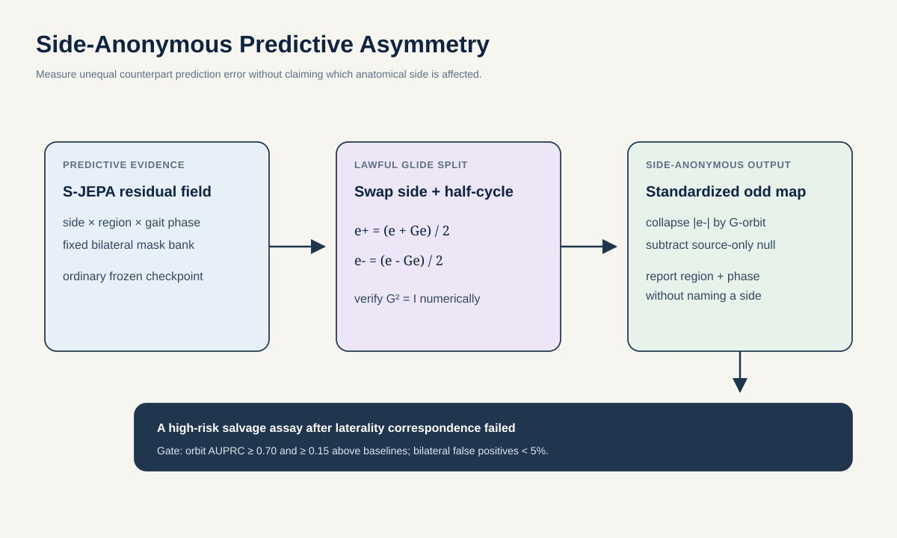

# Proposal 6: Side-Anonymous Predictive Asymmetry

## Claim

Measure where a gait predictor behaves differently across the two half-cycles without claiming which anatomical side is affected. Side-Anonymous Predictive Asymmetry is a controlled closure test of ordinary S-JEPA error after the richer laterality mechanism failed. It converts a joint-by-phase error field into a symmetric part and a source-standardized unsigned asymmetric map. The output can say `one knee near swing transition differs from its counterpart`, even when side labels are unreliable and GAVD provides no affected-side annotation.

The parity calculation itself is established mathematics and already appears in this repository. The proposed contribution is narrower: a source-robust predictive-error assay designed specifically as a salvage path after the richer laterality-correspondence mechanism failed.

## Research question

> Within two weeks, can unsigned glide-odd S-JEPA error localize the correct counterpart orbit of controlled unilateral gait edits with AUPRC of at least 0.70, at least 0.15 above raw symmetry, mirrored processing, confidence, and random-encoder baselines, while keeping false positives below 5 percent for glide-even bilateral edits? Does the validated unsigned map then add source-held GAVD characterization beyond raw gait symmetry and the full shortcut model?

No part of the question requires an affected-side label.

## First principles

Walking has approximate **glide-reflection symmetry**. The motion of one leg resembles the other leg about half a cycle later. Let \(e\) be an anatomically indexed S-JEPA prediction-error field over side, region, and phase. Define \(G\) as side swap composed with a half-cycle phase shift. The implementation must satisfy \(G^2=I\).

Split the error field into

\[
e_{+}=\frac{e+Ge}{2}, \qquad
e_{-}=\frac{e-Ge}{2}.
\]

The even field \(e_{+}\) contains error shared by counterpart motions, while \(Ge_-=-e_-\). A pure global side-label swap is a different action, \(Q\). When \(Q\) commutes with \(G\) and the entire residual field is transported consistently, it permutes orbit scores without changing them. Model-level relabel stability is tested rather than assumed.

\[
Z_{\mathrm{odd}}([c])=
\frac{m([c])-\mu_{\mathrm{null}}([c])}
{\sigma_{\mathrm{null}}([c])+\epsilon},
\qquad
m([c])=\frac{|e_-(c)|+|e_-(Gc)|}{2}.
\]

This source-null-standardized orbit score is the primary output. The global ratio \(\lVert e_-\rVert_1/(\lVert e_+\rVert_1+\epsilon)\) is auxiliary because it can become large when even energy is merely small. The assay measures predictive asymmetry, not affected-side identity.

A nonzero unilateral cell necessarily creates an equal-magnitude response at its transported counterpart because \(Ge_-=-e_-\). Localization therefore operates on unordered orbits \([c]=\{c,Gc\}\), not on a falsely one-sided target. Phase is reported modulo half a cycle.

## Method

### 1. Build a lawful residual field

Freeze `outputs/repaired-jepa-seed7-v2/seed-7_standard_sjepa_best.pt`. Estimate gait phase from AMASS contacts for the clean benchmark and from Core11 periodicity after observation corruption. Query a fixed mask bank that hides one bilateral region and phase bin at a time. For each cell, use the median cosine divergence between predicted and EMA-target latents.

Only anatomically indexed residuals enter the parity split. A pooled feature vector has no justified side-and-phase transport. Numerically test token permutations, coordinate reflection, phase shift, inverse transport, \(G^2=I\), and commutation of \(Q\) with \(G\) before any experiment.

### 2. Create matched unilateral and bilateral interventions

Use four edit families at three doses:

- knee-excursion reduction;
- swing-clearance reduction;
- lower-leg phase lag;
- shortened stance-like phase interval, validated from exact AMASS contact.

Apply each unilateral edit on either side. Build its bilateral null by group symmetrization, \(\Delta_{+}=(\Delta+G\Delta)/2\), then renormalize it to the unilateral edit's coordinate energy. Numerically require \(G\Delta_{+}=\Delta_{+}\), including the half-cycle shift. Merely editing both sides with equal norm is not a valid even null. Randomize the input side convention for half the samples. Process every motion through seen and unseen observation profiles, including view, compression, crop, confidence loss, missingness, and side-specific occlusion.

The scientific target is not unilateral-versus-bilateral accuracy alone. The collapsed odd map must place the unilateral change in the correct region-phase orbit. Opposite-side versions must agree after transport as full maps, not merely as scalar scores.

### 3. Calibrate an observation-asymmetry floor

Camera view and pose failure can be asymmetric. Estimate \(\mu_{\mathrm{null}}\) and \(\sigma_{\mathrm{null}}\) for each orbit magnitude, plus the null distribution of global odd norm, from identical clean motions passed through different outer-training source profiles. Lock a global threshold at 5 percent source-only false positives. Apply all orbit standardizers and the threshold unchanged to held identities and held profile operators.

Compare the learned map with raw glide-reflection distance, dynamic time warping, classical symmetry ratios, detector confidence, and the same residual calculation on a random encoder. If a raw method matches it, there is no S-JEPA contribution.

### 4. Characterize GAVD without inventing laterality

For each outer source fold, learn phase rules, observation floors, and any presentation head from outer-training sources only. Apply the locked assay to held-out sources. Report:

- source-standardized unsigned odd score by region and phase orbit;
- even error energy;
- the auxiliary ratio of odd to even error;
- source-profile support and phase confidence;
- the fraction of windows declared measurable.

Pool a fixed number of windows per source. Test whether `shortcut + raw Core11 + raw symmetry + predictive odd map` improves one source-pooled out-of-fold macro average precision. Do not score affected-side accuracy because GAVD has no such ground truth.

## Decisive experiment

| Question | Metric | Advance rule |
| --- | --- | --- |
| Is the transport correct? | Numerical involution and opposite-side alignment error | Below `1e-6` before learned scoring |
| Is the unilateral support found? | Localization AUPRC over unordered \(G\)-orbits | At least 0.70 and at least 0.15 above every raw, confidence, and random-encoder baseline |
| Are bilateral changes rejected? | False-positive rate at the locked odd-energy threshold | Below 5 percent for group-symmetrized, renormalized bilateral edits |
| Is the result side-anonymous? | Scalar change after global relabeling and transported orbit-map agreement | Below 2 percent relative scalar error, with map cosine similarity and ICC both above 0.90 |
| Does it survive source profiles? | Cross-profile coefficient of variation | Below 15 percent on held profile operators |
| Does S-JEPA add information? | Held-identity increment over best handcrafted symmetry score | Bootstrap 95 percent interval above zero |

Stop if raw bilateral differences or glide-reflection distance come within 0.03 AUPRC, if observation profiles create more odd energy than the smallest semantic edit, or if the phase estimator passes fewer than 70 percent of held AMASS motions.

## Baselines and falsifiers

- raw glide-reflection distance with a half-cycle shift;
- Patterson-style temporal and spatial symmetry ratios;
- phase-aligned dynamic time warping between legs;
- raw coordinate, velocity, and acceleration differences;
- confidence and missingness asymmetry;
- VisionMD-style original-and-mirrored output averaging;
- random S-JEPA residual parity;
- the reflection-equivariant local checkpoint as a manipulation control, not the primary method;
- phase-shuffled and side-permutation-broken transports;
- group-symmetrized, energy-matched bilateral edits with \(G\Delta=\Delta\);
- source-only asymmetric occlusion;
- identical edit with the side convention globally relabeled.

## Best two-week experiment and compute

Use 96 held-identity AMASS motions, eight held profile operators, four edit families, five doses, both edit sides, group-symmetrized bilateral nulls, and eight fixed masks. No representation is trained. The experiment is deliberately overcontrolled because a positive result must survive strong established symmetry methods.

- Days 1 to 3: implement and numerically prove the glide involution, pure relabel transport, orbit collapse, and group-symmetrized nulls.
- Days 4 to 6: generate unilateral, bilateral, observation-only, and compound interventions under held profiles.
- Days 7 to 9: extract ordinary-S-JEPA and random-encoder residual fields, lock source nulls, and run every classical or mirrored-processing baseline.
- Days 10 to 12: compute fold-local GAVD maps, measurable coverage, and source-held nested heads.
- Days 13 to 14: relabel audits, orbit-map agreement, source-cluster bootstrap, and blinded readable-map review.

Cap frozen feature extraction at 240,000 masked forwards or 12 H100-hours. Stop the branch if any raw or mirrored-processing baseline reaches within 0.03 orbit AUPRC. The intended contribution is a closure result about predictive error, not a new equivariance method.

## Relation to prior work and this repository

[Glide-reflection symmetry](https://openaccess.thecvf.com/content_cvpr_2017_workshops/w7/html/Wang_Measuring_Glide-Reflection_Symmetry_CVPR_2017_paper.html) already provides continuous gait symmetry scores, and [Patterson et al.](https://pubmed.ncbi.nlm.nih.gov/19932621/) review common temporal symmetry measures after stroke. [Fukino and Tachibana](https://arxiv.org/abs/2505.10869) measure gait asymmetry through inter-limb coordination. [VisionMD-Gait](https://www.nature.com/articles/s41598-025-34912-5) already mirrors and reprocesses video, restores limb identity, and averages matched outputs to reduce view-induced pose bias without erasing physiological asymmetry. [Chirality Nets](https://arxiv.org/abs/1911.00029) builds left-right reflection equivariance into pose networks. Neither asymmetry scoring, reflection handling, nor even-and-odd projection is new.

The repository's [laterality proposal](../../latent-laterality/proposal.md) already defines exact even and odd channels, and the executed SG-JEPA mechanism was matched by a fixed 50/50 uncertainty control. This proposal accepts that negative result. It drops absolute correspondence recovery and asks a weaker but falsifiable question: can the ordinary frozen predictor's orbit-local odd **error** detect controlled unilateral motion after a paired source floor, beyond classical symmetry and mirrored-processing controls?

## Contribution and limits

**Machine learning contribution:** a negative-result-driven closure assay for unsigned, orbit-local predictive-error asymmetry with explicit transport and source controls.

**Gait contribution:** an anatomical map of unequal counterpart prediction error that remains meaningful when affected-side labels are absent.

This does not identify the affected anatomical side, lesion, or diagnosis. It may conclude that raw symmetry is better than S-JEPA. That null would close this branch cleanly.
