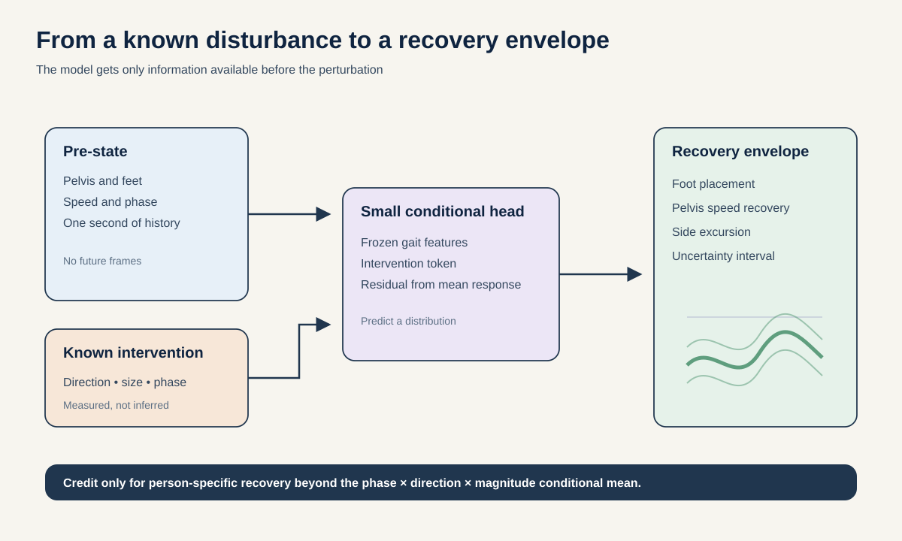
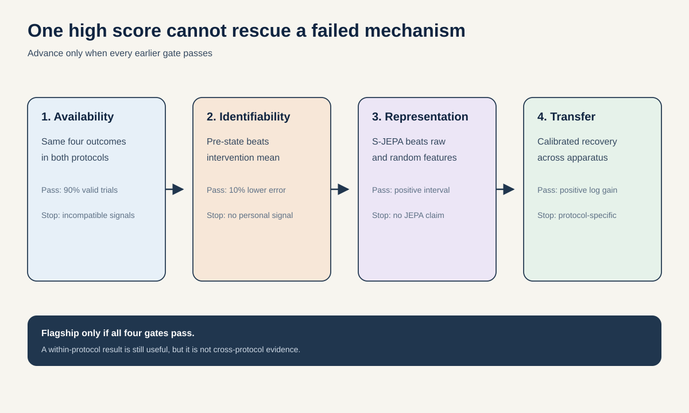

# Proposal 1: Cross-Protocol Perturbation Response Prediction

## The idea in one sentence

Give a predictive gait model the person's motion just before a known disturbance, plus the disturbance direction, size, and gait phase, and ask it to forecast the range of recovery motions that follows.

## Why this is the strongest bet

Ordinary gait video contains no measured intervention. A model can correlate motion with a label, but it cannot show that it understands how a change in the world alters the future. A walking perturbation gives a much cleaner question. The floor or pelvis is deliberately moved. The direction, size, and time are recorded. The model must predict what happens next from information available before the disturbance.

Two public datasets make a rare cross-protocol test possible. The [Georgia Tech ground-translation dataset](https://repository.gatech.edu/entities/publication/73a7c133-6535-4a88-b81e-5c39df5efb3e) varies ground-motion direction, magnitude, and onset phase. The [Stanford Dryad dataset](https://datadryad.org/dataset/doi:10.5061/dryad.cnp5hqch3) applies pelvis perturbations in four directions and two magnitudes while people walk under four balance conditions. Georgia Tech tests phase and intervention combinations. Dryad tests transfer to a different apparatus, signal pipeline, and set of balance conditions.

This is not generic perturbed-motion forecasting. [Latent Differentiable Physics](https://openaccess.thecvf.com/content/CVPR2024/html/Yue_Human_Motion_Prediction_Under_Unexpected_Perturbation_CVPR_2024_paper.html) already predicts full reactive motions under unexpected pushes. The proposed object is a **calibrated response envelope** over a small set of measurable recovery outcomes, with held-combination and cross-protocol tests.

## Research question

> Within two weeks, can an intervention-conditioned head on frozen gait features predict dimensionless foot-placement and pelvis-recovery outcomes for unseen people and held-out perturbation combinations at least 10% better than a strong phase, direction, and magnitude conditional mean, while maintaining calibrated 80% prediction intervals across two independent perturbation protocols?

The key word is “conditional.” A large perturbation may produce a large response for almost everyone. The model gets credit only for the additional person-and-state-specific structure present before the perturbation.

## The object being predicted

At time $t_0$, just before the disturbance, define:

- $x_{\mathrm{pre}}$: 1.0 second of pre-perturbation kinematics;
- $u$: disturbance direction, normalized magnitude, onset phase, and protocol ID;
- $y$: a short vector that summarizes recovery over the next two steps.

Use only outcomes that can be derived in both datasets without force plates:

1. first recovery foot placement relative to the pelvis;
2. peak pelvis-speed deviation from the pre-perturbation stride template;
3. time until pelvis speed returns and stays within a subject-specific tolerance;
4. maximum side-to-side pelvis excursion, normalized by leg length;
5. whether an extra recovery step occurs before steady stepping resumes, if both releases support an unambiguous event definition.

Every quantity is dimensionless or normalized by leg length and stride time. The primary endpoint is the first four outcomes. The optional extra-step event is added only if an identical rule can be executed on both releases.

The model predicts a distribution $p(y \mid x_{\mathrm{pre}}, u)$, not one exact future. Similar starting states can lead to different valid recovery steps. A Gaussian mixture with three components or a quantile head is sufficient. The number of components is fixed on day 2 and never tuned on test people.

## Method

### 1. Build a common kinematic interface

Map each protocol to a small common state:

- pelvis position and velocity;
- left and right heel or foot-center position and velocity;
- gait phase and stance side;
- validity flags for every channel.

Do not pretend that both datasets expose identical full-body skeletons. Georgia Tech's current public release emphasizes pelvis, feet, step placement, and whole-body angular momentum. Dryad exposes richer OpenSim kinematics. The primary model uses only the common interface. A Dryad-only whole-body extension is secondary.

### 2. Freeze representation learning

Pass the common pelvis and foot trajectories through three alternatives:

1. raw history with a parameter-matched temporal head;
2. the frozen local S-JEPA encoder after deterministic mapping into its pelvis and foot tokens;
3. a frozen local S-JEPA encoder plus a rank-8 adapter trained without outcome labels on pre-perturbation walking windows.

The trainable response model is a small intervention-conditioned predictor. An intervention token encodes direction as a unit vector, magnitude relative to body weight or protocol maximum, phase as sine and cosine, and a one-hot protocol indicator. A zero-initialized residual branch lets the model begin as the conditional-mean baseline.

### 3. Predict a residual, not the obvious response

Fit a training-fold conditional mean $m(u)$ using phase, direction, magnitude, and protocol. Predict:

$$
r = y - m(u)
$$

This residual asks whether the person's pre-perturbation state explains why their recovery differs from the average response to the same intervention. It blocks a headline result driven only by perturbation size.

### 4. Test combinations the model has not seen

Use three tests:

- **unseen person:** leave one person out;
- **unseen intervention:** hold out one direction-by-magnitude combination for all training people;
- **cross protocol:** develop on Georgia Tech, adapt only a linear units-and-offset map on a small Dryad calibration subset, then test on untouched Dryad people. Reverse this direction as a sensitivity analysis.

Georgia Tech supplies the main phase-generalization result. Dryad always targets one gait phase, so it cannot independently validate phase generalization.

## Decisive experiment

The 48-hour gate parses every Georgia Tech trial and two Dryad people, derives the four common outcomes, and runs three models:

1. $m(u)$, the intervention-only conditional mean;
2. raw pre-perturbation state plus $u$;
3. frozen S-JEPA state plus $u$.

Use leave-one-person-out evaluation. Continue only if raw state reduces standardized mean absolute error by at least 10% relative to $m(u)$ for at least three of four outcomes and the improvement is positive for a majority of people. This is an identifiability gate. If raw state cannot help, a learned representation has no defensible signal to recover.

## Full experiment

| Gate | Question | Pass condition |
| --- | --- | --- |
| Availability | Can the same four outcomes be computed in both releases? | At least 90% of trials yield valid outcomes under one locked implementation. |
| Identifiability | Does pre-state add information beyond intervention alone? | At least 10% lower standardized MAE on three of four outcomes. |
| Representation | Does frozen S-JEPA add value beyond raw state? | Positive source-person bootstrap interval for joint negative log likelihood gain. |
| Calibration | Does the predicted envelope contain the observed recovery at the advertised rate? | 80% interval coverage between 75% and 85%, with lower width than raw quantile regression. |
| Transfer | Does the structure survive a different apparatus? | Positive log-likelihood gain after only a linear protocol calibration. |

Report person-macro standardized MAE, joint negative log likelihood, energy score, interval coverage, and interval width. The main result is the joint negative log likelihood gain over `conditional mean + raw state` on unseen people and held interventions.

## Controls that can kill the claim

- phase, direction, and magnitude conditional mean;
- subject-specific steady-state variability and foot-placement predictability, which the Dryad study found highly informative;
- persistence, periodic template, linear state-space model, and gradient-boosted raw features;
- raw pelvis and foot coordinates, velocities, and accelerations;
- cadence, speed, step width, stance side, and pre-perturbation variability;
- random encoder with the same response head;
- S-JEPA features with person identities, intervention tokens, or temporal order shuffled;
- an intervention-only neural network with identical capacity;
- a version without protocol ID, to expose measurement mismatch;
- outcome leakage checks that remove all post-$t_0$ frames from preprocessing.

If S-JEPA fails to beat the raw model for a majority of people, report the raw response envelope and stop the representation claim. If cross-protocol calibration fails, the study remains a within-protocol result, not a universal balance model.

## Two-week schedule and compute

| Days | Work | Decision |
| --- | --- | --- |
| 1 to 2 | Parse trials, align events, derive outcomes, run the conditional-mean and raw gates | Stop if pre-state is not informative. |
| 3 to 4 | Freeze splits, run S-JEPA inference, train small heads | Stop if random or raw features match S-JEPA. |
| 5 to 7 | Held-combination tests and calibration | Fix the final model before cross-protocol testing. |
| 8 to 10 | Dryad transfer in both directions | Preserve protocol-specific failures. |
| 11 to 12 | Three seeds, person-cluster bootstrap, ablations | No threshold changes. |
| 13 to 14 | Figures, error cases, and claim audit | Release a null result if gates fail. |

Frozen inference and small heads should require far less than one 100-epoch S-JEPA run. The maximum learned budget is 24 H100-hours across all folds, seeds, and adapter arms. Most wall time is data alignment, which parallel coding agents can accelerate.

## Novelty boundary

The repository's earlier Intervention Response Fingerprint queried synthetic edits and asked whether a person's latent response was repeatable. This proposal predicts measured post-disturbance outcomes from real interventions and requires transfer between independent protocols. It also differs from Counterfactual Dose Axes, which recovers the amount of an imposed edit rather than the future recovery response.

[GoalForce](https://arxiv.org/abs/2601.05848) supplies the conceptual leap: explicit interventions turn a passive model into a queryable one. Here the intervention is real and known, but the output is a calibrated human response envelope rather than generated video. [GaitDynamics](https://www.nature.com/articles/s41551-025-01565-8) supplies a strong gait prior and completion baseline, but the proposal neither trains it nor claims measured forces.

## What a successful result would mean

A pass would show that pre-perturbation movement contains person-specific information about recovery, that a frozen predictive representation captures some of that information beyond raw kinematics, and that part of the relationship survives a different perturbation apparatus. It would not show fall-risk prediction, diagnosis, or a causal treatment effect.

## What a useful failure would mean

If the intervention-only mean wins, the public datasets do not support individualized response prediction at this scale. If raw state wins but S-JEPA does not, the problem is useful but the current representation is wrong. If within-protocol prediction works but transfer fails, apparatus and measurement choices dominate the learned response. Each failure closes a specific claim instead of producing an ambiguous leaderboard loss.
