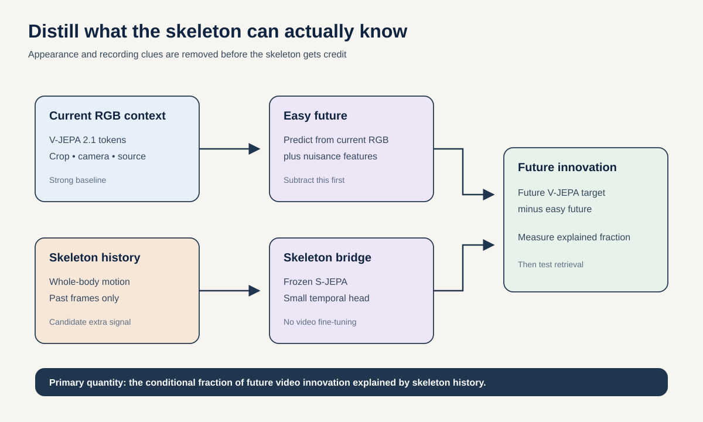
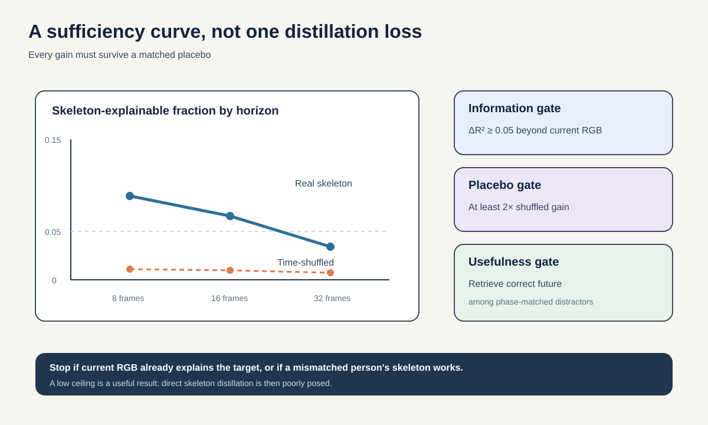

# Proposal 2: Future-Innovation Distillation

## The idea in one sentence

Use a frozen V-JEPA 2.1 video model as a teacher, then measure and distill only the part of its future representation that skeleton motion explains beyond the current RGB frame and obvious recording clues.

## Why this question matters

A large video model sees clothing, objects, background, camera motion, and body movement. A skeleton model sees almost none of that. Copying a video representation into a skeleton network can therefore produce a high loss for the wrong reason. The target may be appearance information that no skeleton could recover.

The right target is narrower. First predict the future V-JEPA latent from what is already visible in the current RGB context and from nuisance variables. The remaining error is the **future innovation**. Then ask how much of that innovation can be predicted from skeleton history.

This turns cross-modal distillation into a scientific measurement:

> Which part of a large video world model's future is actually carried by body kinematics?

The answer can be high, low, or phase-specific. A low answer is useful because it sets a ceiling on skeleton-only imitation. A high answer justifies a compact student.

## Research question

> Within two weeks, can past whole-body skeleton motion explain at least 0.05 additional out-of-source R-squared in V-JEPA 2.1 future innovations beyond current RGB latent, duration, crop, centroid, scale, camera motion, and pose quality, while producing at least twice the gain of time-shuffled or person-mismatched skeletons?

The primary dataset is GAVD because it contains real in-the-wild RGB and matching skeletons. Presentation labels are never used for training or for the headline result.

## First-principles definition

Let:

- $v_t$ be frozen V-JEPA 2.1 tokens from the observed RGB context;
- $v_{t+h}$ be teacher tokens from a future block $h$ frames later;
- $n_t$ be nuisance variables available at time $t$;
- $s_{\leq t}$ be the skeleton history.

Fit a baseline future predictor:

$$
\hat{v}_{t+h}^{\mathrm{base}} = g(v_t, n_t)
$$

Define the future innovation:

$$
e_{t,h} = v_{t+h} - \hat{v}_{t+h}^{\mathrm{base}}
$$

Now train a small skeleton predictor $q$:

$$
\hat{e}_{t,h} = q(s_{\leq t}, v_t, n_t)
$$

The skeleton-explainable fraction is:

$$
F_h = \frac{R^2(v_t, n_t, s_{\leq t}) - R^2(v_t, n_t)}{1 - R^2(v_t, n_t)}
$$

$F_h = 0$ means skeleton adds nothing. $F_h = 1$ means skeleton explains every future component the baseline missed. Negative values are retained, not clipped, because they reveal harmful distillation.

## Method

### 1. Lock one public teacher

Use the official [V-JEPA 2.1 ViT-B checkpoint](https://github.com/facebookresearch/vjepa2) with its documented 384-pixel, 64-frame preprocessing. Record the code commit, checkpoint hash, frame sampling, and token layer. The ViT-B model is selected for speed. Larger teachers are a sensitivity analysis only after the mechanism passes.

Create a causal mask: the predictor receives only frames up to $t$, while future tubelets are target tokens. Verify on synthetic clips that changing future pixels cannot alter context inputs. If the official predictor cannot produce a clean past-to-future target under this mask, use frozen encoder targets with a separately trained equal-capacity baseline and state that limitation.

### 2. Use source-held GAVD clips

Build clips only from already cached HAIC videos. Split by source video before sampling windows. Use all valid gait presentations, exercise, and style clips because the task is label-free future prediction. Give each source equal sampling weight.

Whole-body skeleton input includes every reliably observed MediaPipe body landmark, not only Core11. A Core11 student remains a required ablation. Preserve missingness flags rather than zero-filling without explanation.

### 3. Remove easy appearance and timing information

The baseline $g$ receives:

- current V-JEPA context tokens;
- clip duration and temporal position;
- first and last visible frame summaries;
- person-box position, scale, and area;
- centroid velocity and estimated camera motion;
- pose confidence and missingness;
- source resolution, frame rate, and view estimate;
- a static background embedding sampled outside the person box.

This is intentionally strong. The skeleton student must add information after the baseline already knows current appearance and recording context.

### 4. Train only small bridges

Freeze V-JEPA 2.1 and the local S-JEPA encoder. Train:

1. a linear baseline $g$;
2. a two-layer temporal head on raw skeleton history;
3. the same head on frozen S-JEPA tokens;
4. an optional rank-8 adapter on the S-JEPA predictor if the frozen version passes the 48-hour gate.

Target a 256-dimensional random orthogonal projection of person-region V-JEPA tokens. The projection is fixed before splits and preserves distance in expectation while making the head cheap. Report results at horizons of 8, 16, and 32 frames.

### 5. Turn a passed measurement into a student

If $F_h$ is positive, deploy the skeleton model without RGB and ask it to predict the teacher's future-innovation code from skeleton history alone. Evaluate retrieval: among many future teacher codes from the same source-held batch, does the predicted code retrieve the correct future more often than phase-matched or person-matched distractors?

This retrieval test prevents a small average R-squared from being presented as useful semantics.

## 48-hour gate

Use 50 GAVD clips from source-separated development folds. Cache teacher features once. Fit the nuisance baseline and raw-skeleton head at an 8-frame horizon.

Advance only if:

- raw skeleton adds at least 0.05 held-source R-squared beyond $v_t + n_t$;
- the gain is at least twice the gain from time-shuffled skeleton;
- person-mismatched skeleton gives no positive gain;
- removing person-region tokens from the teacher sharply reduces the measured effect;
- the future target changes when future motion changes but not when only the static background is replaced.

If teacher inference or causal masking is unstable, stop before training adapters.

## Full experiment and success criteria

| Test | Measurement | Required result |
| --- | --- | --- |
| Incremental information | Held-source $\Delta R^2$ beyond current RGB and nuisance | At least 0.05 at one horizon, positive at two horizons. |
| Nontriviality | Ratio to time-shuffled and person-mismatched skeleton gains | At least 2.0, with mismatched gain near zero. |
| Representation value | S-JEPA head versus equal-capacity raw skeleton head | Positive source-bootstrap interval for $\Delta R^2$. |
| Deployment value | Correct-future retrieval among phase-matched distractors | At least 10 percentage points above raw skeleton. |
| Robustness | New source videos and low-confidence pose strata | Positive gain in at least three of four quality quartiles. |
| Whole-body value | Whole body versus Core11 | Positive gain that disappears under upper-body time shuffle. |

Primary reporting is the full horizon curve for $F_h$, not one chosen horizon. Report feature-wise distributions so a mean is not dominated by a few high-variance teacher dimensions.

## Controls that can disprove the idea

- current RGB latent alone;
- nuisance variables alone and combined with RGB;
- raw 2D coordinates, velocity, acceleration, and confidence;
- Core11, whole body, and validity-only inputs;
- random S-JEPA encoder with the same head;
- teacher layer and random teacher projection controls;
- time reversal, time shuffle, phase shuffle, and person mismatch;
- skeleton from a different person matched on source, speed, and phase;
- duration, centroid, crop, foreground, background, and camera-only models;
- future mean, persistence, periodic template, and linear autoregression;
- equal compute and parameter counts for raw and S-JEPA heads.

If raw coordinates match S-JEPA, the cross-modal fact may still be real, but the local representation has added nothing. If shuffled skeleton works, the target contains source or phase leakage.

## Two-week schedule and compute

- Days 1 to 2: load and verify V-JEPA 2.1, cache 50-clip gate features, run leakage tests.
- Days 3 to 5: cache the full source-held feature set and fit baseline, raw, and S-JEPA heads.
- Days 6 to 8: run horizon, body-region, and shuffle curves.
- Days 9 to 10: train the optional rank-8 adapter only if frozen S-JEPA passes.
- Days 11 to 12: future retrieval and low-quality-pose stress tests.
- Days 13 to 14: three seeds, source bootstrap, null-result analysis, and final figures.

Teacher inference is the main GPU cost and is performed once. Cap total teacher inference at 2,000 clips and trainable work at 20 H100-hours.

## Novelty boundary

[V-JEPA 2](https://arxiv.org/abs/2506.09985) already performs action anticipation. [Human-JEPA](https://arxiv.org/abs/2608.21160) already introduces human-centered anchored forecasting. Cross-modal knowledge distillation is also established. None of those facts is the claim.

The contribution is the **conditional skeleton-explainable fraction of future video innovation**, together with matched shuffles and a deployable student only when that fraction is nonzero. This differs from the repository's Past-Only Predictive Surplus, which asks whether skeleton history predicts future skeleton targets beyond periodic motion. It also differs from Cycle-to-Cycle Innovation Map, which localizes changes between visible gait cycles. Here the target is a frozen, large video model's future representation after current RGB information has been removed.

## Interpretation

A positive result would define what a skeleton world model can inherit from a video world model without copying appearance. A negative result would be equally informative: it would show that the chosen video future is dominated by information unavailable to kinematics, so direct distillation is poorly posed. Neither outcome is a clinical classification claim.
