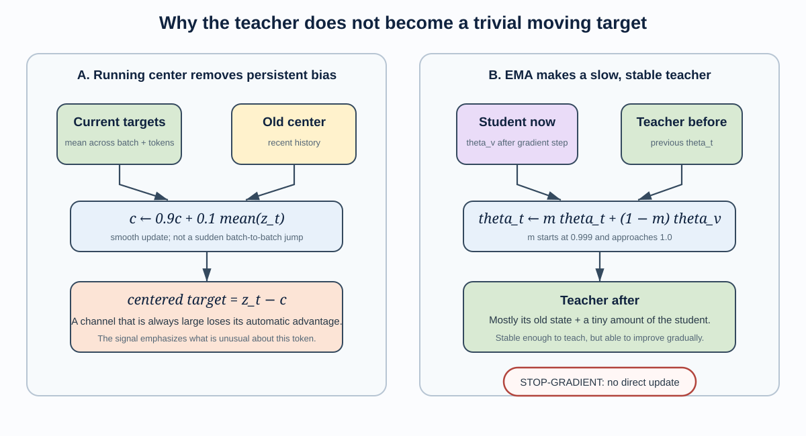

# A Step-by-Step Guide to the URTC S-JEPA Loss

This tutorial explains the loss function used in the paper **“Learning Monocular Gait Representations through Neurologically Guided Skeleton JEPA.”** It assumes no prior knowledge of self-supervised learning, softmax, cross-entropy, or exponential moving averages.

The central idea is simple:

> Hide a small piece of a walking sequence, ask the model to describe the hidden motion using the visible motion, and compare its description with a slowly changing teacher that saw the complete sequence.

The model is not asked to reconstruct exact joint coordinates. It is asked to predict a useful **internal description**, also called a **latent representation** or **embedding**, of the hidden motion.

---

## 1. The loss at a glance

We normally write softmax as the named vector operator $\operatorname{softmax}(\cdot)$. There is no universal shorter symbol: $\sigma$ is sometimes used, but it is ambiguous because it commonly means the logistic sigmoid. The clearest compact convention is to name the teacher and student distributions once.

$$
\mathbf q=\operatorname{softmax}\left(\frac{\mathbf z_t-\mathbf c}{\tau_t}\right),
\qquad
\mathbf r=\operatorname{softmax}\left(\frac{\mathbf p}{\tau_p}\right),
$$

followed by

$$
\mathcal L=-\sum_{d=1}^{D}q_d\log r_d,
$$

where

- $D=96$ is the embedding width;
- $\mathbf c$ is the EMA running center of the teacher features;
- $\tau_t=0.06$ is the teacher temperature; and
- $\tau_p=0.10$ is the predictor temperature.

The center $\mathbf c$ stores one recent-average value for each of the 96 feature channels. Subtracting it removes persistent channel bias before the teacher softmax; Section 8 gives its exact update and motivation. Here, $\mathbf q$ is the teacher’s target pattern and $\mathbf r$ is the student’s predicted pattern. The final expression is their **cross-entropy**. This notation is both shorter and easier to read than repeating the complete softmax expression inside every term of the loss.

---

## 2. A small glossary

| Symbol or term | Plain-language meaning |
|---|---|
| Token | One landmark observed over four consecutive frames |
| Hidden or masked token | A token removed from the student’s input and used as a prediction target |
| View encoder | The student encoder; it sees only visible tokens |
| Predictor | Uses the visible context to guess representations of hidden tokens |
| Target encoder | The teacher; it sees the complete sequence |
| $\mathbf p$ | The predictor’s 96-number guess for one hidden token |
| $\mathbf z_t$ | The target encoder’s 96-number description of that token |
| $\mathbf c$ | A running average of the teacher’s feature values |
| $d$ | One of the 96 learned feature dimensions |
| Softmax | Turns arbitrary scores into positive weights that sum to one |
| Temperature | Controls how flat or sharp the softmax weights are |
| Cross-entropy | Measures how poorly the predicted weights match the target weights |
| Gradient | Information telling trainable parameters how to change to reduce the loss |
| EMA | A slow, smoothed update used to make the teacher follow the student |

The 96 feature dimensions are learned by the model. They are not 96 diseases, named clinical variables, or physical coordinates.

---

## 3. Step 1 — Turn a gait sequence into tokens

Each pose frame has 33 MediaPipe landmarks. The sequence is resized to 64 frames. Four adjacent frames for one landmark are grouped into a token.

Because each landmark has three coordinates, one token initially contains

$$
4\ \text{frames}\times 3\ \text{coordinates}=12\ \text{numbers}.
$$

The 64 frames form 16 four-frame time segments, so the complete sequence contains

$$
16\ \text{time segments}\times 33\ \text{landmarks}=528\ \text{tokens}.
$$

A linear projection turns each 12-number token into a 96-dimensional model representation.

### Where do the 96 dimensions come from?

The number 96 is the model's **embedding dimension**, also called its **model width**. It is a chosen architecture setting, not a quantity calculated from the number of landmarks or medical conditions.

The conversion happens in the token-projection layer:

$$
\underbrace{\mathbf{x}}_{12\text{ input values}}
\quad\longrightarrow\quad
\underbrace{\mathbf{h}=\mathbf{W}\mathbf{x}+\mathbf{b}}_{96\text{ learned feature values}}.
$$

For one token:

1. Four frames are collected for one landmark.
2. Each frame supplies three coordinates, $x,y,z$.
3. The token therefore begins with $4\times3=12$ coordinate values.
4. A learned linear layer maps those 12 values to 96 outputs.

The layer has a weight matrix

$$
\mathbf W\in\mathbb R^{96\times12}
$$

and a 96-value bias vector. In total, that projection contains

$$
96\times12+96=1{,}248
$$

trainable parameters.

Each of the 96 outputs is a different learned weighted combination of the 12 input coordinates. The model is not simply repeating each coordinate eight times. During training, it learns 96 different ways to describe the short piece of joint motion.

For example, a learned channel could become sensitive to some mixture of position change, direction, or temporal pattern. Individual channels are not assigned those meanings in advance, however, and they should not be treated as named clinical measurements.

### Why does the rest of the model also use 96?

Once the token has been projected to 96 values, 96 becomes the common width used throughout the representation-learning system:

- the time-position embedding has 96 values;
- the joint-position embedding has 96 values;
- the view encoder outputs 96 values per visible token;
- the target encoder outputs 96 values per complete-input token;
- the predictor returns 96 values for each hidden token; and
- the running center $\mathbf c$ stores one baseline for each of the 96 channels.

The dimensions must agree so that the predicted vector and teacher vector can be compared channel by channel.

The Transformer uses four attention heads. Because $96/4=24$, each attention head operates on 24 feature values. Divisibility by the number of heads is a practical architectural requirement in this implementation.

### Why exactly 96 rather than 64 or 128?

There is no mathematical rule that requires 96. The real-data `quick` and `recommended` training profiles explicitly set `EMBED_DIM = 96`. It is therefore a **hyperparameter**: a design choice fixed before training.

Model width creates a tradeoff:

- A wider representation gives the network more capacity to store different motion patterns, but increases memory, computation, parameter count, and the opportunity to overfit a very small dataset.
- A narrower representation is cheaper and may regularize the model, but it can become an information bottleneck.

Ninety-six is a compact width that works cleanly with four attention heads, but this experiment does not include a width ablation showing that 96 is optimal. In fact, the smoke-test profile uses 32 dimensions, demonstrating that the method itself is not tied to 96. The reported substantive model simply fixes the width at 96.

The fact that the locked dataset also contains 96 sequences is a coincidence. These are two unrelated uses of the same number:

- **96 sequences** describes how many gait examples are in the full experiment cohort.
- **96 feature dimensions** describes how many learned values represent each token.

The embedding width is also unrelated to the 33 MediaPipe landmarks, the 10 literature-linked masking landmarks, the five downstream classes, or the 82 handcrafted reference features.

### Why does \(d\) run from 1 to 96 in the loss?

For one hidden token, both branches produce vectors of length 96:

$$
\mathbf z_t=[z_{t,1},z_{t,2},\ldots,z_{t,96}],
$$

$$
\mathbf p=[p_1,p_2,\ldots,p_{96}].
$$

After centering, temperature scaling, and softmax, these become

$$
\mathbf q=[q_1,q_2,\ldots,q_{96}]
\quad\text{and}\quad
\mathbf r=[r_1,r_2,\ldots,r_{96}].
$$

The symbol $d$ means **feature-dimension index**. The cross-entropy must compare the teacher and student at every corresponding position, so it adds 96 contributions:

$$
\mathcal L
=-\sum_{d=1}^{96}q_d\log r_d
=-\left(q_1\log r_1+q_2\log r_2+\cdots+q_{96}\log r_{96}\right).
$$

Thus, $d=1$ selects the first learned channel, $d=2$ selects the second, and $d=96$ selects the last. It does **not** select a frame, landmark, person, disease, or sequence.

The paper uses the mathematical convention of numbering dimensions from 1 through 96. PyTorch arrays use zero-based indexing, so the same dimensions appear in code at indices 0 through 95. The implementation's `sum(dim=-1)` means “sum across the last axis,” which is precisely this 96-value feature axis.

If the architecture used a general embedding width $D$, the loss would instead be written

$$
\mathcal L=-\sum_{d=1}^{D}q_d\log r_d.
$$

Setting $D=96$ gives the equation used in this project. It also explains the downstream 384-dimensional sequence representation: the evaluation concatenates four separate 96-value summaries, and $4\times96=384$.

### Why group frames together?

A single pose frame mainly describes body position. Four adjacent frames also provide a short glimpse of movement. The token can therefore contain information about direction and change, not only location.

---

## 4. Step 2 — Choose prediction targets

The method selects targets from 10 literature-linked landmarks: the left and right shoulders, hips, knees, ankles, and foot indices.

For each valid sample, 60% of the eligible tokens in these regions are selected uniformly. A token with missing or invalid pose data cannot become a target.

The selected tokens play two roles:

1. They are hidden from the view encoder.
2. Their teacher representations become the answers the predictor should learn to match.

This masking creates the learning problem. If the student saw the target token directly, it could simply pass its contents forward instead of learning relationships between body parts and time periods.

### Why uniform masking instead of selecting the largest motions?

Large motion is not always the most clinically meaningful gait signal. Reduced movement, rigidity, or a relatively still body region can also matter. Uniform sampling avoids assuming that “moves the most” means “contains the most important information.”

---

## 5. Step 3 — Create two views of the same walk

The same sequence enters two different branches.

### Student branch

The student receives a small sequence-wide rotation and translation. The chosen target tokens are then hidden. The view encoder must make sense of the remaining tokens, and the predictor must guess the representations at the missing locations.

### Teacher branch

The target encoder receives the original, complete sequence. It can see the motion at every target location and can also use the surrounding full-body context.

### Why transform only the student view?

The student must reach the same semantic answer even after a small change in viewpoint or position. This encourages its representation to focus less on accidental camera placement. The transform is deliberately small so it does not destroy the gait itself.

Spatial left-right flipping is disabled because laterality can matter in stroke and Parkinson’s disease.

---

## 6. Step 4 — The predictor produces \(\mathbf p\)

For each hidden target token, the predictor produces

$$
\mathbf p=[p_1,p_2,\ldots,p_{96}].
$$

These 96 values are unrestricted scores. They may be positive, negative, large, or small. At this point they do not sum to one and are not probabilities.

The predictor is answering a question like:

> “Given the visible knees, hips, opposite foot, and surrounding time segments, what internal motion pattern should appear at this hidden ankle token?”

The predictor does not need to assign human-readable meanings to its dimensions. Training only requires its pattern to agree with the teacher’s pattern.

---

## 7. Step 5 — The teacher produces \(\mathbf z_t\)

At the same hidden location, the complete-input target encoder produces

$$
\mathbf z_t=[z_{t,1},z_{t,2},\ldots,z_{t,96}].
$$

This is also a vector of unrestricted feature scores. It is better informed than the prediction because the teacher saw the token that was hidden from the student.

The target vector is calculated inside a no-gradient block. During this training step, it is treated as a fixed answer.

---

## 8. Step 6 — Center the teacher feature

Before using the teacher feature as a target, the method subtracts a running center:

$$
\mathbf z_t-\mathbf c.
$$

The center is updated after a training step using

$$
\mathbf c\leftarrow0.9\mathbf c+0.1\operatorname{mean}(\mathbf z_t).
$$

The mean is taken across target tokens and batch items for each of the 96 dimensions.

### What problem does centering address?

Imagine that dimension 17 happens to have a large value for almost every token. Without centering, softmax could repeatedly give dimension 17 most of the weight, even when it carries little information about the current motion. The student could learn the same answer for many different inputs.

Subtracting the recent average asks a more useful question:

> “Which dimensions are unusually active for this token compared with recent tokens?”

Centering does not give the feature dimensions clinical meanings. It simply removes persistent baseline preference.

---

## 9. Step 7 — Divide by temperature

The centered teacher scores are divided by $0.06$:

$$
\frac{\mathbf z_t-\mathbf c}{0.06}.
$$

The predictor scores are divided by $0.10$:

$$
\frac{\mathbf p}{0.10}.
$$

These constants are called **temperatures**. A smaller temperature makes differences between scores appear larger before softmax. The resulting distribution becomes sharper: a few dimensions receive most of the weight.

The target temperature $\tau_t=0.06$ is lower than the predictor temperature $\tau_p=0.10$, so the teacher supplies a particularly decisive signal.

### Why sharpen the teacher?

An almost uniform teacher distribution would say that every feature dimension is equally important. That provides weak guidance and is another form of uninformative behavior. Sharpening encourages the teacher to identify a smaller set of important dimensions for each token.

Centering and sharpening balance one another:

- Centering discourages the same dimensions from winning for every token.
- Sharpening discourages all dimensions from receiving nearly equal weight.

The temperature values are hyperparameters. They control optimization behavior; they are not clinical thresholds.

---

## 10. Step 8 — Softmax creates two distributions

For a vector of scores $\mathbf x\in\mathbb R^D$, the conventional component-wise definition is

$$
\left[\operatorname{softmax}(\mathbf x)\right]_d
=\frac{e^{x_d}}{\sum_{j=1}^{D}e^{x_j}},
\qquad d=1,\ldots,D.
$$

Softmax has three useful properties:

1. Every output is positive.
2. All outputs sum to one.
3. Larger input scores receive larger output weights.

The loss constructs the teacher distribution vector

$$
\mathbf q=\operatorname{softmax}\left(\frac{\mathbf z_t-\mathbf c}{\tau_t}\right)
$$

and the predicted distribution vector

$$
\mathbf r=\operatorname{softmax}\left(\frac{\mathbf p}{\tau_p}\right).
$$

When one particular component is needed, professional notation uses $q_d=[\mathbf q]_d$ and $r_d=[\mathbf r]_d$. This keeps the softmax definition separate from the cross-entropy sum.

The words “distribution” and “probability” are mathematically convenient, but the 96 positions are not literal classes. Softmax is being used to express the **relative emphasis across learned feature dimensions**.

### Why not compare the raw vectors directly?

A raw-vector mean-squared error would care about exact numerical values and scale. This softmax cross-entropy instead emphasizes the relative pattern: which dimensions the teacher treats as most important and how strongly the student agrees.

That choice fits a joint-embedding method. The desired target is a learned description of the motion, not an exact reconstruction of the input coordinates.

---

## 11. Step 9 — Cross-entropy compares teacher and student

The cross-entropy for one hidden token is

$$
\mathcal L=-\sum_{d=1}^{D}q_d\log r_d,
\qquad D=96.
$$

### What kind of loss function is this?

This objective can be described accurately in several complementary ways:

| Description | Why it applies |
|---|---|
| **Cross-entropy loss** | It compares a target distribution $\mathbf q$ with a predicted distribution $\mathbf r$ using $-\sum_d q_d\log r_d$. |
| **Soft-target cross-entropy** | The teacher usually assigns nonzero weight to several dimensions. The target is a distribution, not a single one-hot answer. |
| **Teacher–student or self-distillation loss** | A slowly updated teacher supplies the target, and the student learns to match it. Because the teacher is an EMA copy of the student family rather than an independently labeled expert, this is a form of self-distillation. |
| **Self-supervised loss** | No disease or action label creates $\mathbf q$. The complete gait sequence itself supplies the teaching signal. |
| **Masked latent-prediction loss** | The student predicts a representation of a hidden token from visible context. It predicts in learned feature space rather than reconstructing coordinates. |

Mathematically, this has the same form as categorical cross-entropy. In ordinary classification, the positions of the distribution would correspond to named classes such as “cat” or “dog.” Here, they correspond to $D=96$ learned latent channels. Calling it categorical cross-entropy describes the mathematics; it does **not** mean that the 96 channels are 96 medical categories.

The loss is also **asymmetric**. It measures how well the student distribution $\mathbf r$ matches the teacher distribution $\mathbf q$. The teacher is detached from gradient computation, so the optimization changes the student to approach the teacher, not both distributions equally toward one another.

This is not a conventional supervised classification loss, because it uses no disease label during pretraining. It is not coordinate reconstruction loss, because it never directly compares predicted and true $x,y,z$ positions. It is also not a contrastive loss: it does not require negative examples or push unrelated sequences apart.

### Why sum over every dimension from \(1\) to \(D\)?

After softmax, $\mathbf q$ and $\mathbf r$ are complete distributions over the same $D$ possible feature positions:

$$
\sum_{d=1}^{D}q_d=1,
\qquad
\sum_{d=1}^{D}r_d=1.
$$

Cross-entropy asks for the student’s average negative log-probability when feature position $d$ is weighted according to the teacher distribution. In expectation notation,

$$
\mathcal L
=\mathbb E_{d\sim\mathbf q}\left[-\log r_d\right].
$$

Expanding that expectation gives

$$
\mathbb E_{d\sim\mathbf q}\left[-\log r_d\right]
=-\sum_{d=1}^{D}q_d\log r_d.
$$

The summation is therefore not an arbitrary extra operation. It is the definition of the expected prediction cost under the teacher’s complete distribution.

Each dimension contributes one weighted question:

> How much importance did the teacher assign to this dimension, and how much probability did the student assign to it?

The sum combines all $D$ answers into one scalar loss that the optimizer can minimize. In this model, it combines all 96 channel-wise contributions.

#### Why not use only the teacher’s largest dimension?

Using only $\arg\max_d q_d$ would turn the teacher distribution into a hard, one-hot target. That would discard information about secondary dimensions. For example, a teacher distribution such as

$$
[0.55,\ 0.30,\ 0.10,\ 0.05]
$$

says more than “dimension 1 wins.” It also says that dimension 2 carries substantial importance. Soft-target cross-entropy preserves that information by summing all four weighted terms. The real loss does the same over 96 dimensions.

#### Why not leave out dimensions with small teacher weights?

Softmax couples all dimensions through a common denominator. Probability assigned to one dimension must come from the others. Omitting dimensions would remove their direct teacher-weighted terms, so the result would no longer be the cross-entropy between the complete teacher and student distributions.

Small-$q_d$ dimensions contribute less directly, which is appropriate: the teacher considers them less important for that token. They are not manually deleted from the comparison.

#### Why sum rather than average over \(D\)?

Because the teacher weights already sum to one, the weighted sum

$$
\sum_{d=1}^{D}q_d(-\log r_d)
$$

is already an average—specifically, an expectation under $\mathbf q$. Dividing it by $D$ again would merely introduce an extra factor of $1/D$, shrinking the loss and every gradient without adding information. The conventional cross-entropy therefore sums across distribution outcomes and reserves ordinary averaging for separate observations such as tokens and batch items.

This is different from averaging across target tokens and batch items. Each token produces one complete cross-entropy value by summing over its $D$ distribution components. The implementation then averages those per-token values across $M$ hidden targets and $B$ batch items so that batches with more observations do not automatically produce larger losses.

#### What signal does each dimension send during learning?

Let $s_d=p_d/\tau_p$ be the student score supplied to softmax. For a single target token, the derivative has the familiar cross-entropy form

$$
\frac{\partial\mathcal L}{\partial p_d}
=\frac{r_d-q_d}{\tau_p}.
$$

This makes the effect of summing all $D$ dimensions concrete:

- If $r_d>q_d$, the student placed too much probability on dimension $d$, so gradient descent lowers its score.
- If $r_d<q_d$, the student placed too little probability there, so gradient descent raises its score.
- If $r_d=q_d$, that dimension contributes no remaining mismatch gradient.

Every feature channel therefore receives a correction based on the difference between student and teacher emphasis. When all $D$ differences vanish, the two distributions match.

Read one term, $-q_d\log r_d$, as follows:

- $q_d$ says how important dimension $d$ is to the teacher.
- $r_d$ says how much probability the student assigned to that dimension.
- $-\log r_d$ becomes large when the student assigns a very small probability.

Therefore, the largest penalty occurs when the teacher considers a dimension important but the student assigns it almost no probability.

If the teacher assigns very little weight to a dimension, disagreement there contributes little to the loss.

### Why the logarithm?

The logarithm makes confident mistakes expensive. For example:

| Student probability $r_d$ | $-\log r_d$, approximately |
|---:|---:|
| 0.8 | 0.22 |
| 0.2 | 1.61 |
| 0.01 | 4.61 |
| 0.0001 | 9.21 |

If the teacher places substantial weight on a dimension, reducing the student’s probability from $0.01$ to $0.0001$ makes the penalty much worse.

### Why the leading minus sign?

Probabilities between zero and one have negative logarithms. The minus sign turns the result into a nonnegative quantity that should decrease as agreement improves.

---

## 12. A small numerical example

The real model uses 96 dimensions. We will use four so every number can be seen.

Suppose the centered teacher scores are

$$
\mathbf z_t-\mathbf c=[0.12,\ 0.03,\ -0.02,\ -0.07].
$$

### 12.1 Scale the teacher scores

Divide by $0.06$:

$$
[2.00,\ 0.50,\ -0.33,\ -1.17].
$$

Softmax gives approximately

$$
q=[0.734,\ 0.164,\ 0.071,\ 0.031].
$$

The teacher strongly emphasizes the first dimension.

### 12.2 Scale the prediction

Suppose

$$
\mathbf p=[0.15,\ 0.05,\ 0.00,\ -0.02].
$$

Divide by $0.10$:

$$
[1.50,\ 0.50,\ 0.00,\ -0.20].
$$

Softmax gives approximately

$$
r=[0.564,\ 0.207,\ 0.126,\ 0.103].
$$

The student chose the same leading dimension but was less confident than the teacher.

### 12.3 Calculate cross-entropy

$$
\begin{aligned}
\mathcal L={}&-[
0.734\log(0.564)
+0.164\log(0.207)\\
&+0.071\log(0.126)
+0.031\log(0.103)]\\
\approx{}&0.896.
\end{aligned}
$$

Training changes the view encoder and predictor so that the student distribution moves closer to the teacher distribution.

---

## 13. Step 10 — Average across targets and samples

The compact paper equation shows one target token. The actual implementation averages over every selected target in every batch item:

$$
\mathcal L_{\text{batch}}
=-\frac{1}{BM}
\sum_{b=1}^{B}
\sum_{m=1}^{M}
\sum_{d=1}^{96}
q_{bmd}\log r_{bmd},
$$

where:

- $B$ is the batch size;
- $M$ is the number of selected target tokens per sample;
- $d$ is one of the 96 feature dimensions.

Averaging makes the reported scale less dependent on how many examples or targets happen to appear in the batch.

### Does a perfect prediction always give zero loss?

No. If the student exactly matches a soft target, cross-entropy equals the target distribution’s entropy:

$$
H(q)=-\sum_{d=1}^{D}q_d\log q_d.
$$

That value is above zero unless the target places all probability on a single dimension. Consequently, the absolute loss should be interpreted together with target sharpness and training diagnostics, rather than as an ordinary percentage error.

---

## 14. Step 11 — Send gradients only through the student

The batch loss is differentiated with respect to the trainable view encoder and predictor. This produces gradients that tell those components how to change their parameters.

The target encoder receives no gradient. In programming terms, its output is detached from the computation graph.

### Why stop the teacher’s gradient?

If the target were allowed to move directly toward the prediction during the same optimization step, both sides could reduce disagreement without learning useful structure. Treating the target as fixed gives the student a stable direction to follow.

This does not mean the teacher never changes. It changes through a separate, much slower update.

---

## 15. Step 12 — Update the teacher by EMA

After the student’s optimizer step, the target encoder is updated using an **exponential moving average**:

$$
\theta_t\leftarrow m\theta_t+(1-m)\theta_v,
$$

where:

- $\theta_t$ means all target-encoder parameters;
- $\theta_v$ means the corresponding view-encoder parameters;
- $m$ is the EMA momentum.

In the reported training run, $m$ begins at $0.999$ and follows a cosine schedule toward $1.0$.

At $m=0.999$, the new teacher is approximately:

- 99.9% its previous state;
- 0.1% the student’s current state.

As $m$ approaches $1.0$, the teacher changes even more slowly.

### Why use a slowly moving teacher?

A teacher copied immediately from the latest student would change abruptly after every optimizer step. Its targets could become noisy and unstable. EMA creates a smoothed history of the student: stable enough to provide a target, but able to improve as the student improves.

---

## 16. Why several anti-collapse mechanisms are needed

In self-supervised learning, the model creates its own teaching signal. A trivial solution is therefore possible: every input could receive the same representation. Student and teacher would agree, but the representation would contain no useful information. This is called **representation collapse**.

The method uses a combination of defenses:

| Mechanism | Contribution |
|---|---|
| Masking | Forces prediction from context instead of copying the target token |
| Stop-gradient | Prevents the teacher from directly chasing the student’s answer |
| EMA teacher | Supplies slowly changing targets |
| Centering | Discourages the same feature dimensions from dominating every token |
| Sharpening | Discourages a flat, uniform target distribution |
| Varied tokens and views | Requires agreement across different body regions, times, and small geometric changes |

These mechanisms reduce the risk of collapse but do not mathematically prove that every learned feature is meaningful. That is why the paper also reports representation-health diagnostics such as feature standard deviation and mean pairwise cosine similarity.

---

## 17. Cross-entropy as “distance from the teacher”

Cross-entropy can be decomposed as

$$
H(q,r)=H(q)+D_{\mathrm{KL}}(q\|r),
$$

where $D_{\mathrm{KL}}$ is the Kullback–Leibler divergence from the teacher distribution to the student distribution.

During one update, $\mathbf q$ is fixed because the target is detached. Its entropy $H(q)$ is therefore fixed too. Minimizing cross-entropy is equivalent, for that update, to reducing $D_{\mathrm{KL}}(q\|r)$.

In everyday language:

> The student is trained to move its pattern of feature emphasis closer to the teacher’s pattern.

No understanding of KL divergence is required to follow the rest of the method; it is simply another mathematical view of the same matching objective.

---

## 18. Why predict representations instead of coordinates?

An alternative objective could ask the model to reconstruct the missing $x,y,z$ coordinates. That would reward exact geometric reconstruction.

This project instead predicts a contextual representation. That choice has several intended advantages:

1. **It can describe relationships.** A target embedding may reflect surrounding joints and time segments, not only one local coordinate value.
2. **It does not spend all its effort on low-level precision.** Small pose-estimation errors need not dominate the target as directly as they would in coordinate reconstruction.
3. **It encourages semantic compression.** The encoder must decide which aspects of motion are useful enough to preserve in 96 features.
4. **It matches the downstream use.** The final classifier consumes encoder representations rather than reconstructed joint coordinates.

This does not guarantee that latent prediction is superior. In this small experiment, the handcrafted feature system still achieved stronger classification results. The loss defines what the representation learner practices; evaluation determines whether that practice was useful.

---

## 19. What the loss does—and does not—teach

### The loss does teach the model to

- use visible body and time context to infer hidden motion;
- produce similar representations for the student and teacher views;
- reduce sensitivity to small sequence-wide rotations and translations;
- learn without disease labels during pretraining; and
- organize its 96 latent dimensions into repeatable prediction targets.

### The loss does not directly teach the model to

- diagnose Parkinson’s disease, stroke, cerebral palsy, or myopathy;
- estimate a calibrated probability of a medical condition;
- assign a clinical meaning to each latent dimension;
- reconstruct true three-dimensional biomechanics;
- recognize an unseen person, camera, or source video; or
- prove that the learned representation is clinically valid.

The reported pretraining uses only 12 normal sequences, all from one source video. The loss can learn only from the variation present in that limited data.

---

## 20. What happens after pretraining?

After 300 epochs, the prediction exercise ends.

1. The target encoder is frozen.
2. Complete sequences are passed through it without masking.
3. Means and standard deviations summarize its 96-dimensional token features.
4. Global and literature-linked summaries are concatenated into a 384-dimensional sequence vector.
5. A Random Forest uses that vector for the five-class downstream task.

The predictor is useful for creating the self-supervised training problem, but it is not the representation used by the final classifier.

---

## 21. The complete training step in plain language

For each batch:

1. Load centered, scaled, 64-frame pose sequences.
2. Identify valid four-frame joint tokens.
3. Uniformly choose targets from the 10 selected landmarks.
4. Apply a small rotation and translation to the student view.
5. Hide the target tokens from the view encoder.
6. Let the view encoder describe the visible context.
7. Let the predictor guess a 96-number representation for every hidden target.
8. Give the complete original sequence to the target encoder.
9. Read the teacher’s 96-number representation at the same target locations.
10. Subtract the running center from the teacher features.
11. Divide teacher and predictor scores by their temperatures.
12. Apply softmax to obtain teacher and student distributions.
13. Compute cross-entropy across 96 dimensions.
14. Average across targets and batch items.
15. Backpropagate only through the view encoder and predictor.
16. Update those trainable parameters with AdamW.
17. Slowly update the target encoder from the view encoder using EMA.
18. Slowly update the running center from the current teacher targets.

Then the process repeats with new masks and batches.

---

## 22. Common misunderstandings

### “Is $q_d$ the probability of disease $d$?”

No. $d$ indexes a learned feature dimension. Disease labels are not used in S-JEPA pretraining.

### “Does the teacher contain a separately pretrained expert model?”

No. It starts as a copy of the view encoder and becomes a slowly updated average of that encoder.

### “Why is it called a target if there are no labels?”

The target encoder creates a numerical learning target from the complete input. A target does not have to be a human annotation.

### “Does the teacher see the exact hidden motion?”

Yes. The token is hidden only from the student branch. The teacher receives the complete sequence.

### “Is a lower training loss proof of better gait classification?”

No. A lower loss shows better agreement with the teacher on the pretraining task. Downstream evaluation is still needed to determine whether the representation supports classification or other gait measurements.

### “Do centering and EMA guarantee no collapse?”

No. They are stabilization mechanisms, not a proof. Representation diagnostics and downstream tests remain necessary.

### “Why are there two temperatures?”

The teacher is made sharper with $\tau_t=0.06$, creating a decisive target. The predictor uses $\tau_p=0.10$, giving it a somewhat softer distribution while learning.

---

## 23. One-sentence interpretation of every factor

Return to the compact equation:

$$
\underbrace{\mathcal{L}}_{\text{mismatch}}
=
-\sum_{d=1}^{D}
\underbrace{q_d}_{\text{teacher weight}}
\underbrace{\log r_d}_{\text{student log-probability}},
\qquad D=96.
$$

- $\mathbf z_t$: what the complete-input teacher says about the hidden token.
- $\mathbf c$: the teacher’s recent baseline, removed to prevent persistent dimension bias.
- $\tau_t=0.06$: the teacher temperature, making its target pattern sharp.
- $\mathbf p$: what the student predicts from visible context.
- $\tau_p=0.10$: the predictor temperature, controlling its confidence.
- softmax: turns feature scores into comparable weights summing to one.
- $\log$: makes confident mistakes especially expensive.
- $\sum_{d=1}^{D}$: collects disagreement over all $D=96$ learned dimensions.
- the minus sign: turns negative log-probabilities into a loss that is minimized.

The reason the loss takes this form is therefore:

> It needs a stable, label-free way to make a masked student reproduce the complete-context teacher’s relative latent feature pattern, while discouraging constant or uniform representations.

That is the entire training objective in one sentence.
