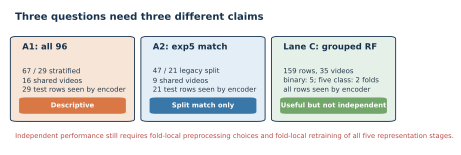
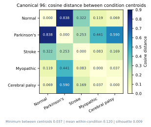
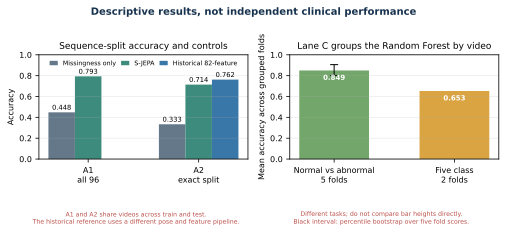

# Auditing a Normal-First Skeleton JEPA for Monocular Gait Representations

**Alex Mui, Penny Inouye, Theodore Mui, and Phil Mui**

*Aspiring Scholars Directed Research Program (ASDRP)*

## Abstract

We trained and audited a skeletal Joint-Embedding Predictive Architecture, or S-JEPA, for monocular gait video. The completed curriculum used 159 pose sequences from 35 source videos. It began with 75 normal sequences, then added Parkinson's disease, stroke, myopathic gait, and cerebral palsy in four cumulative stages. The final training diagnostics retained nonzero feature spread, but the normal reference representation drifted as new groups entered. On the canonical 96-sequence GAVD cohort, the minimum cosine distance between condition centroids was 0.037, mean within-condition distance was 0.120, and cosine silhouette was 0.009. These values do not show clean five-group geometry. A stratified sequence split produced 0.793 five-class accuracy, but every test video also appeared in classifier training and every test sequence had already been seen by the label-aware encoder. Classifier-video-grouped folds produced mean accuracy of 0.849 for normal versus abnormal and 0.653 for five classes, but the encoder still saw all evaluation sequences. The run shows that the full curriculum executes without complete representation collapse. It does not establish generalization to unseen videos, patients, or clinics.

**Index Terms:** gait analysis, joint-embedding predictive architecture, S-JEPA, VICReg, pose estimation, curriculum learning, representation audit

## 1. Introduction

Walking depends on the nervous system, muscles, joints, balance, and the surrounding environment. Parkinson's disease can alter speed, stride, cadence, and double-support time [1]. Stroke can create side-to-side timing and distance differences [2]. Cerebral palsy can produce crouch gait [3]. Late-onset Pompe disease, one type of myopathy, can reduce motor function [4]. These examples motivate gait research, but a gait video alone cannot establish a diagnosis.

A Joint-Embedding Predictive Architecture, or JEPA, learns by predicting hidden content in representation space instead of reconstructing every input value [5]. This idea has been studied in images [5], video [6], and skeleton sequences [7]. A second problem is representation collapse, where many inputs map to nearly the same vector. VICReg discourages this failure by preserving variation and reducing redundant feature dimensions [8].

Our question was concrete: can one model first learn normal gait, continue through four broader gait groups, and retain a useful, nonconstant representation? We answer that question with a completed run, geometry measurements, missingness controls, and explicit exposure audits. We do not treat a classifier score as clinical validation when source videos or representation-training rows overlap evaluation.

The main contributions are:

1. a reproducible 12-landmark prediction-target rule with executable checks;
2. a completed five-stage, normal-first curriculum over 159 sequences;
3. separate measurements of collapse, normal-reference drift, and five-group geometry; and
4. three downstream evaluation lanes whose source-video overlap and representation exposure are reported with each score.

## 2. Related work

I-JEPA introduced prediction in image representation space [5], and V-JEPA extended feature prediction to video [6]. S-JEPA applies a related teacher and predictor design to skeleton action recognition [7]. MAMP predicts motion and uses motion-aware target selection [12], while Skeleton2vec uses contextualized targets [13]. This project uses neither method's target selector. It draws prediction targets uniformly from a fixed anatomical whitelist.

GaitForeMer uses self-supervised motion forecasting for gait impairment estimation [14]. Our narrower aim is not diagnosis or severity prediction. We study a small, auditable representation-learning workflow and show where its present evidence stops.

## 3. Materials and methods

### 3.1 Data and provenance

The canonical cohort contains 96 sequences from 18 GAVD source videos [9]. The completed training run also uses 63 normal sequences cut from 17 user-supplied videos. Those added clips were selected and labeled as normal within this project. Automatic MediaPipe detections supplied their person boxes. They are not part of GAVD and did not receive an independent clinical label review.

|Training group|Sequences|Source videos|Provenance|
|---|---:|---:|---|
|Canonical normal|12|1|GAVD|
|Added normal|63|17|Project-supplied and self-annotated|
|Parkinson's disease|9|2|GAVD|
|Stroke|12|3|GAVD|
|Myopathic|47|10|GAVD|
|Cerebral palsy|16|2|GAVD|
|**Total**|**159**|**35**|Mixed sources|

GAVD boxes isolate the intended walker. MediaPipe estimates 33 landmarks and their visibility [10], [11]. The pipeline uses image-relative pose estimates. Monocular depth is a model estimate, not calibrated clinical motion capture. Internal low-visibility gaps of at most four frames are interpolated. Longer gaps and gaps at a sequence end stay missing. Every sequence is pelvis-centered, body-scale normalized, and resized to 64 frames. Missing coordinates become zero sentinels and cannot become prediction targets.

### 3.2 Fixed prediction targets

The target rule comes only from `experiments/multiple-sclerosis/mapping-data/ms-pd-mapping.md`. It expands ranges, removes duplicates, and produces the landmark indices

$$
\{11,12,23,24,25,26,27,28,29,30,31,32\}.
$$

These are the left and right shoulders, hips, knees, ankles, heels, and foot indices. The source mapping was written for multiple-sclerosis and Parkinson's feature families. Reusing its whitelist across all five folders is a project rule, not a claim that these landmarks diagnose the five conditions.

A token holds one landmark over four adjacent frames. A 64-frame, 33-landmark sequence therefore contains 528 tokens. The configured 0.60 fraction is applied to the smallest valid eligible-token count in each batch, and that common number is sampled uniformly without replacement in every sample. Samples with more valid tokens therefore realize a lower fraction. The sampler never reads displacement, velocity, acceleration, or a learned motion score. Invalid allowed tokens are skipped, and a forbidden landmark is never substituted. The target encoder can still use all 33 landmarks as context.

### 3.3 Model and objective

The view encoder processes a masked pose sequence. The target encoder processes the complete pose and is updated by an exponential moving average of the view encoder. The predictor estimates the target encoder's latent vectors at hidden locations. The masked prediction loss is

$$
\mathcal L_{\mathrm{JEPA}}=-\sum_d q_d\log r_d,
$$

where $q$ is the centered and sharpened target distribution and $r$ is the predictor distribution. The complete loss is

$$
\mathcal L=\mathcal L_{\mathrm{JEPA}}
+0.05\mathcal L_{\mathrm{VICReg}}
+0.25\mathcal L_{\mathrm{group}}.
$$

VICReg compares two geometric views. Its invariance term keeps paired views close, its variance hinge discourages constant dimensions, and its covariance term discourages redundant dimensions [8]. The group loss is separate and label-aware. It pulls representations from the same folder together and penalizes condition centroids that are closer than a margin of 1.0. It is zero during normal-only Stage 0.

### 3.4 Continuing curriculum

One model continues through every stage. The view encoder, predictor, moving-average target encoder, target center, and VICReg projector are never reinitialized. Later batches contain equal counts from every active condition, so earlier groups remain in training.

|Stage|New data|Active sequences|Epochs|Optimizer updates|
|---:|---|---:|---:|---:|
|0|75 normal|75|300|5,700|
|1|9 Parkinson's|84|75|1,425|
|2|12 stroke|96|75|1,425|
|3|47 myopathic|143|75|1,425|
|4|16 cerebral palsy|159|75|1,425|
|**Total**|||**600**|**11,400**|

The final checkpoint is `sjepa_curriculum_final_augmented.pt`. Its SHA-256 fingerprint begins `d0acc2628d134959` and its contract records all 159 sequence identifiers, all 35 video identifiers, stage lineage, loss settings, target-mask hash, and optimizer counts.

### 3.5 Three levels of evaluation

The audits ask three different questions.

1. **Training health:** Did feature spread remain nonzero? Did pairwise similarity approach one? How far did the normal reference move?
2. **Canonical geometry:** Do the frozen target-encoder representations of the canonical 96 rows form five compact, separated groups?
3. **Downstream readout:** Can a Random Forest [15], implemented with scikit-learn [16], read folder labels from frozen representations?

The all-96 lane uses a fixed stratified sequence split. Stratification preserves class proportions: normal is split 8/4, Parkinson's 6/3, stroke 9/3, myopathic 33/14, and cerebral palsy 11/5, for 67 train and 29 test sequences. It does not separate source videos. Balanced accuracy averages recall over classes [17], while macro F1 gives each class equal weight.

The exact-47/21 lane reproduces the sequence IDs used by a historical 82-feature Random Forest. Lane C uses five GroupKFold splits for the binary task and two StratifiedGroupKFold splits for the five-class task. Two is the largest fold count that can keep every label on both sides because Parkinson's disease and cerebral palsy each have only two videos. A source video cannot appear in both the Random Forest training and test portions of one fold. Grouped validation is important when samples share a source [18]. In every lane, however, the encoder was first trained on the full corpus. Lane C therefore separates videos only for the downstream Random Forest, not for representation learning.

## 4. Results

### 4.1 Training completed without total collapse, but normal gait drifted

The recommended run completed 600 epochs and 11,400 optimizer updates. Feature standard deviation ended at 0.414 and mean pairwise cosine similarity ended at 0.609. These values provide evidence against the extreme case in which every sequence maps to one identical vector. They do not prove that every feature is useful.

|Stage end|JEPA loss|VICReg loss|Feature standard deviation|Mean pair cosine|Minimum centroid distance|Normal-anchor cosine|
|---:|---:|---:|---:|---:|---:|---:|
|0|0.569|16.997|0.466|0.359|Not defined|Not defined|
|1|0.449|12.989|0.430|0.492|0.740|0.954|
|2|0.613|10.474|0.399|0.624|0.527|0.839|
|3|0.611|9.368|0.406|0.628|0.336|0.707|
|4|0.478|8.418|0.414|0.609|0.364|0.594|

Normal-anchor cosine fell from 0.954 after Stage 1 to 0.594 after Stage 4. The model retained nonzero spread, but its normal reference changed substantially as broader groups entered. The nonzero margin penalty at Stage 4 also shows that the requested training-corpus margin was not fully satisfied.

### 4.2 Canonical five-group geometry was weak

Notebook 05 pooled the final target encoder into a 96 by 384 embedding matrix for the canonical GAVD rows. Mean within-condition cosine distance was 0.120. Mean distance between condition centroids was 0.292, but the smallest centroid distance was only 0.037, between myopathic and cerebral-palsy rows. Cosine silhouette was 0.009, close to the point where within-group and nearest-other-group distances balance. The weak pair is closer than the average spread inside a condition, so the canonical rows do not form five clean clusters.

The Stage 4 minimum centroid value of 0.364 in the previous table is not a contradiction. It is a training-time measurement over the active 159-row corpus. The 0.037 value is a separate frozen target-encoder audit over the canonical 96 rows. Corpus, pooling context, and measurement time all matter.

### 4.3 Downstream scores were descriptive, not independent

|Lane and task|Accuracy|Balanced accuracy|Macro F1|Key exposure|
|---|---:|---:|---:|---|
|All-96 missingness control|0.448|0.466|0.429|16 shared test videos|
|All-96 S-JEPA readout|0.793|0.889|0.821|16 shared test videos; 29 of 29 test rows seen by encoder|
|Exact-47/21 S-JEPA readout|0.714|0.730|0.742|9 shared test videos; 21 of 21 test rows seen by encoder|
|Exact-47/21 historical 82-feature reference|0.762|Not recorded|0.728|Same video-confounded split|
|Lane C normal versus abnormal|0.849|0.874|0.826|Grouped RF; all 159 rows seen by encoder|
|Lane C five class|0.653|0.603|0.625|Two grouped RF folds; all 159 rows seen by encoder|

The all-96 S-JEPA readout exceeded the missingness-only control, but both used the same confounded sequence split. Every one of the 16 test videos was also present in classifier training. In addition, all 29 test rows had already participated in label-aware representation training. The score is useful for describing the fitted representation, not for estimating unseen-video performance.

For Lane C normal versus abnormal, the mean ROC AUC was 0.966. Accuracy ranged from 0.800 to 0.906 in a percentile bootstrap over the five fold scores. This is a descriptive summary of five dependent folds, not a strong population confidence interval. The corrected five-class lane uses only two folds and therefore reports no interval. Its pooled out-of-fold accuracy was 0.654 and pooled macro-F1 was 0.619. There is no generally unbiased variance estimate for ordinary K-fold cross-validation [19].

## 5. Discussion

The completed run answers the implementation question. The same model state continued through all five stages, every checkpoint preserved its lineage, the target whitelist remained intact, and feature spread did not vanish. The results also reveal two important weaknesses.

First, normal gait was not fully preserved. A final normal-anchor cosine of 0.594 indicates substantial movement from the Stage 0 reference. Balanced replay reduced the risk of forgetting but did not remove it.

Second, the canonical five-class structure was weak. A silhouette of 0.009 and a minimum centroid distance below mean within-condition spread do not support a claim of five well-separated gait categories. A Random Forest can still draw nonlinear boundaries, especially when video identity, pose-detector behavior, or label-aware representation training provides extra signals. The missingness-only control reaching 0.448 accuracy shows that detector behavior alone carries condition-related information, although it does not explain the entire S-JEPA score.

The data structure limits stronger conclusions. All 12 canonical normal sequences come from one video. Parkinson's disease and cerebral palsy each have only two videos. This limits the corrected five-class grouped audit to two folds, which is too little support for a stable performance claim. The 63 added normal sequences improve normal-video variety, but their labels were produced inside this project and were not independently reviewed.

An independent estimate requires a nested experiment. Each outer source-video fold must choose and freeze preprocessing rules, train all five representation stages, and fit the Random Forest using only that fold's training videos. The held-out videos must remain unseen until final scoring. Even then, two source videos for some conditions are too few for a stable clinical claim. More independent people, recording sites, camera setups, and label review are needed.

## 6. Conclusion

The full normal-first S-JEPA curriculum trained successfully on 159 sequences and avoided complete representation collapse. It did not preserve the normal reference well, and the canonical 96 rows did not form clean five-condition geometry. Current classifier results are descriptive because source videos, representation-training rows, or both overlap evaluation. The strongest supported conclusion is therefore methodological: the workflow is auditable and its weaknesses are measurable. It is not yet evidence of clinical usefulness or unseen-video generalization.

## References

[1] A. P. J. Zanardi et al., “Gait parameters of Parkinson's disease compared with healthy controls: a systematic review and meta-analysis,” *Scientific Reports*, vol. 11, 752, 2021. https://doi.org/10.1038/s41598-020-80768-2

[2] S. Lauzière, M. Betschart, R. Aissaoui, and S. Nadeau, “Understanding spatial and temporal gait asymmetries in individuals post stroke,” *International Journal of Physical Medicine and Rehabilitation*, vol. 2, no. 3, 201, 2014. https://doi.org/10.4172/2329-9096.1000201

[3] R. A. Pandey, A. N. Johari, and T. Shetty, “Crouch gait in cerebral palsy: current concepts review,” *Indian Journal of Orthopaedics*, vol. 57, pp. 1913-1926, 2023. https://doi.org/10.1007/s43465-023-01002-5

[4] T. Maulet et al., “Motor function characteristics of adults with late-onset Pompe disease,” *Neurology*, vol. 100, no. 1, pp. e72-e83, 2023. https://doi.org/10.1212/WNL.0000000000201333

[5] M. Assran et al., “Self-supervised learning from images with a joint-embedding predictive architecture,” *CVPR*, pp. 15619-15629, 2023. https://doi.org/10.1109/CVPR52729.2023.01499

[6] A. Bardes et al., “Revisiting feature prediction for learning visual representations from video,” *Transactions on Machine Learning Research*, 2024. https://openreview.net/forum?id=QaCCuDfBk2

[7] M. Abdelfattah and A. Alahi, “S-JEPA: a joint embedding predictive architecture for skeletal action recognition,” *ECCV*, pp. 367-384, 2024. https://doi.org/10.1007/978-3-031-73411-3_21

[8] A. Bardes, J. Ponce, and Y. LeCun, “VICReg: variance-invariance-covariance regularization for self-supervised learning,” *ICLR*, 2022. https://openreview.net/forum?id=xm6YD62D1Ub

[9] R. Ranjan, D. Ahmedt-Aristizabal, M. A. Armin, and J. Kim, “Computer vision for clinical gait analysis: a gait abnormality video dataset,” *IEEE Access*, vol. 13, pp. 45321-45339, 2025. https://doi.org/10.1109/ACCESS.2025.3545787

[10] I. Grishchenko et al., “BlazePose GHUM Holistic: real-time 3D human landmarks and pose estimation,” arXiv:2206.11678, 2022. https://doi.org/10.48550/arXiv.2206.11678

[11] Google, “Pose landmark detection guide,” *MediaPipe Tasks*. https://ai.google.dev/edge/mediapipe/solutions/vision/pose_landmarker

[12] Y. Mao et al., “Masked motion predictors are strong 3D action representation learners,” *ICCV*, 2023. https://doi.org/10.1109/ICCV51070.2023.00934

[13] R. Xu et al., “Skeleton2vec: a self-supervised learning framework with contextualized target representations for skeleton sequence,” arXiv:2401.00921, 2024. https://doi.org/10.48550/arXiv.2401.00921

[14] M. Endo et al., “GaitForeMer: self-supervised pre-training of transformers via human motion forecasting for few-shot gait impairment severity estimation,” *MICCAI*, pp. 130-139, 2022. https://doi.org/10.1007/978-3-031-16452-1_13

[15] L. Breiman, “Random forests,” *Machine Learning*, vol. 45, pp. 5-32, 2001. https://doi.org/10.1023/A:1010933404324

[16] F. Pedregosa et al., “Scikit-learn: machine learning in Python,” *Journal of Machine Learning Research*, vol. 12, pp. 2825-2830, 2011. https://jmlr.org/papers/v12/pedregosa11a.html

[17] K. H. Brodersen, C. S. Ong, K. E. Stephan, and J. M. Buhmann, “The balanced accuracy and its posterior distribution,” *ICPR*, pp. 3121-3124, 2010. https://doi.org/10.1109/ICPR.2010.764

[18] D. R. Roberts et al., “Cross-validation strategies for data with temporal, spatial, hierarchical, or phylogenetic structure,” *Ecography*, vol. 40, no. 8, pp. 913-929, 2017. https://doi.org/10.1111/ecog.02881

[19] Y. Bengio and Y. Grandvalet, “No unbiased estimator of the variance of K-fold cross-validation,” *Journal of Machine Learning Research*, vol. 5, pp. 1089-1105, 2004. https://www.jmlr.org/papers/v5/grandvalet04a.html
